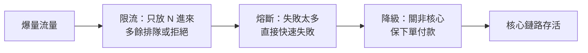
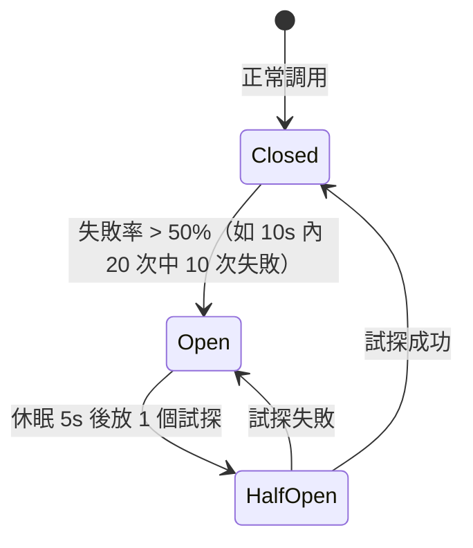

# 5.4 微服務三板斧：限流、熔斷與降級

## 一個慢服務拖垮全站

服務化之後，交易 → 庫存 → 物流一條鏈路串起五六個 RPC。雙十一零點，物流介面回應從 50ms 惡化到 5s，交易執行緒全部卡住等待，最後連商品詳情都打不開。這叫**雪崩**。

淘寶沉澱的三板斧就是為此而生：**限流（擋）、熔斷（斷）、降級（捨）**。



## 第一斧：限流

限流是「保命閥」。常見兩種算法：

| 算法 | 原理 | 特點 |
|---|---|---|
| 漏桶 | 請求先進桶，以固定速率流出 | 削平突發，速率恆定 |
| 令牌桶 | 以固定速率放令牌，拿到才能進 | 允許一定突發，更常用 |

```java
// Sentinel 限流：QPS 超過 500 直接快速失敗
@SentinelResource(value = "createOrder",
    blockHandler = "handleBlock")
public String createOrder(Long itemId) {
    return orderService.create(itemId);
}
public String handleBlock(Long itemId, BlockException e) {
    return "系統繁忙，請稍後再試"; // 限流後的兜底
}
```

Hystrix 時代寫法類似，只是註解換成 `@HystrixCommand`；Spring Cloud 新專案推薦 Sentinel 或 Resilience4j。

## 第二斧：熔斷

熔斷器有三態，和家裡的保險絲一模一樣：



```java
// Resilience4j 熔斷器配置
CircuitBreakerConfig config = CircuitBreakerConfig.custom()
    .failureRateThreshold(50)          // 失敗率 50% 跳閘
    .slidingWindowSize(20)             // 統計最近 20 次
    .waitDurationInOpenState(Duration.ofSeconds(5))
    .build();
```

熔斷後不再等待慢服務，而是立刻返回錯誤或走降級邏輯，執行緒池馬上被釋放。

## 第三斧：降級

降級是主動「丟卒保車」：大促時關掉非核心，保住下單和付款。

| 降級對象 | 大促策略 | 用戶感知 |
|---|---|---|
| 核心：下單、付款 | 永不降級，加機器硬扛 | 必須可用 |
| 重要：評價、推薦 | 超時則返回預設 | 推薦位顯示靜態內容 |
| 次要：歷史訂單圖表 | 直接關閉入口 | 暫時隱藏 |

```java
// Feign 降級：庫存服務掛了，返回兜底
@Component
public class StockClientFallback implements StockClient {
    public boolean deduct(Long itemId, int count) {
        return false; // 提示稍後重試，絕不卡死交易
    }
}
```

## 本章小結

- 雪崩根源：同步等待 + 執行緒耗盡，一個慢服務拖垮全鏈路。
- 限流擋流量（令牌桶/漏桶，Sentinel），熔斷斷開壞依賴（三態機），降級捨非核心保核心。
- 三者常組合：先限流，再熔斷，最後降級兜底。
- 服務穩住了，但數據也分化了：交易、日誌、搜索各要各的儲存，下一章談異構儲存。

## 想一想

1. 令牌桶和漏桶各適合什麼流量形狀？為什麼秒殺更常用令牌桶？
2. 熔斷器的 Half-Open 狀態有什麼用？沒有它會發生什麼？
3. 你負責大促，評價服務變慢了，你會選擇限流、熔斷還是降級？為什麼？
