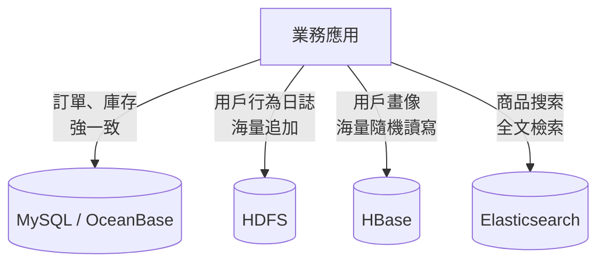
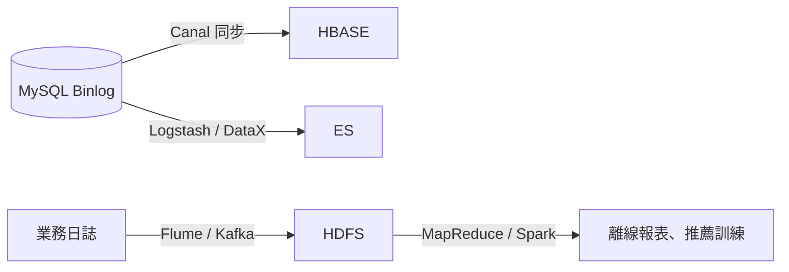
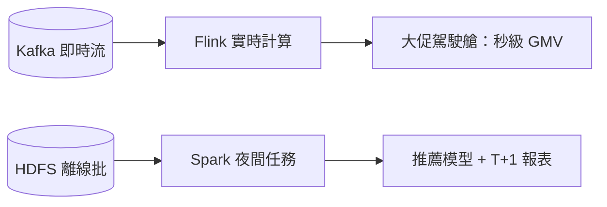

# 6.1 異構儲存：HDFS / HBase / Elasticsearch / 大數據場景

## 一個 MySQL 打天下？不行了

服務化之後，數據壓力跟著分化：交易要強一致，日誌一天幾十 TB，商品搜索要模糊查詢加排序。指望 MySQL 一種儲存全扛，大促必掛。淘寶的答案是**異構儲存**：什麼數據，用什麼庫。



## 四種儲存的脾氣

| 儲存 | 模型 | 強項 | 弱項 |
|---|---|---|---|
| MySQL / OceanBase | 關係表 + 事務 | 強一致、複雜 Join、事務 | 海量擴展貴、全文檢索弱 |
| HDFS | 分散式檔案（一次寫多次讀） | PB 級便宜存、離線計算 | 不支援隨機改、低延遲讀不行 |
| HBase | 寬列、LSM、海量 KV | 百億行毫秒級隨機讀寫 | 不支援多條件查詢、Join |
| Elasticsearch | 倒排索引 + 分詞 | 全文檢索、聚合排序 | 寫入吞吐低、強一致弱 |

選型口訣：**事務找 MySQL，日誌找 HDFS，畫像找 HBase，搜索找 ES**。

## 實戰：三段程式碼看懂差異

```bash
# HDFS：海量日誌歸檔，便宜大碗
hdfs dfs -put /logs/double11.log /data/logs/2025-11-11/
hdfs dfs -cat /data/logs/2025-11-11/* | wc -l
```

```java
// HBase：按 userId 秒查畫像，百億行也不怕
Get get = new Get(Bytes.toBytes("user_12345"));
get.addColumn(Bytes.toBytes("profile"), Bytes.toBytes("level"));
Result r = table.get(get);
```

```json
// Elasticsearch：商品搜索「紅色 連衣裙」+ 按銷量排序
GET /items/_search
{
  "query": { "match": { "title": "紅色 連衣裙" } },
  "sort": [{ "sales": "desc" }]
}
```

## 數據怎麼流過去：離線 + 即時兩條路



關鍵紀律：異構儲存之間是**最終一致**，允許秒級延遲；核心交易永遠以 MySQL 為準，ES/HBase 查不到就降級（呼應 5.4 節）。

## 大數據場景：離線、即時怎麼選

| 場景 | 代表需求 | 技術組合 |
|---|---|---|
| 離線報表 | T+1 銷售排行、財務對帳 | HDFS + MapReduce / Spark |
| 即時大屏 | 雙十一 GMV 每秒刷新 | Kafka + Flink + HBase/ES |
| 訓練推薦 | 千人千面模型 nightly 訓練 | HDFS + Spark / XDL |



記住取捨：即時鏈路貴、只服務「必須現在看」的指標；其餘一律走便宜的離線批處理，這正是 FinOps 的前身思維。

## 本章小結

- 沒有一種儲存能同時滿足事務、海量、檢索三種需求，必須異構選型。
- MySQL 保一致，HDFS 存海量日誌，HBase 扛海量 KV，ES 做全文檢索。
- 數據靠 Binlog/ETL/Flume 在儲存間流動，接受最終一致。
- 寫入和查詢解耦後，下一個瓶頸是「峰值擠在一起」，下一節用訊息佇列削峰。

## 想一想

1. 為什麼商品搜索不用 MySQL `LIKE '%連衣裙%'`？倒排索引好在哪裡？
2. HBase 和 HDFS 都是存海量數據，它們的分工有什麼本質不同？
3. 異構儲存帶來「數據不一致窗口」，你會如何向產品經理解釋並兜底？
