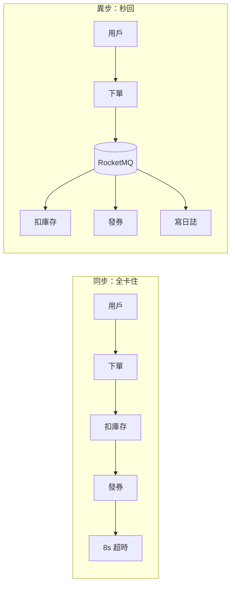

# 6.2 訊息佇列：RocketMQ / Kafka 異步解耦與削峰

## 零點的洪峰

雙十一零點，下單請求是平時的 100 倍。如果下單 → 扣庫存 → 發優惠券 → 寫日誌全是同步 RPC，再多的機器也會被打滿。訊息佇列（MQ）把「立刻要做的」和「可以等等做的」分開：**異步解耦 + 削峰填谷**。



下單只寫一條消息就返回「成功」，後續慢慢消費。洪峰被 MQ 攔下，後端按自己的節奏處理。

## 生產者與消費者：五分鐘上手

```java
// RocketMQ 生產者：下單成功發一條消息
DefaultMQProducer producer = new DefaultMQProducer("order-group");
producer.setNamesrvAddr("127.0.0.1:9876");
producer.start();
Message msg = new Message("OrderTopic", "orderCreated",
    ("orderId=" + orderId).getBytes());
producer.send(msg); // 同步發送，可靠不丟

// 消費者：優惠券服務慢慢消化
DefaultMQPushConsumer consumer = new DefaultMQPushConsumer("coupon-group");
consumer.subscribe("OrderTopic", "orderCreated");
consumer.registerMessageListener((MessageListenerConcurrently) (msgs, ctx) -> {
    for (MessageExt m : msgs) sendCoupon(m); // 發券、寫日誌
    return ConsumeConcurrentlyStatus.CONSUME_SUCCESS;
});
consumer.start();
```

Kafka 寫法類似，只是 Topic/Partition 模型更偏海量日誌流。

## 進階：順序消息與事務消息

| 需求 | 做法 | 場景 |
|---|---|---|
| 順序消息 | 同一訂單發到同一佇列（按 orderId 取模） | 先付款、後發貨，順序不能反 |
| 事務消息 | 半消息 + 回查：先發半消息，本地事務成功才提交 | 下單扣庫存：DB 和 MQ 要麼都成功 |
| 冪等消費 | 消費端按 orderId 去重表 | MQ 重投時不重複發券 |

```mermaid
flowchart TD
    P[下單服務] -->|1.發半消息| MQ[(MQ)]
    P -->|2.執行本地事務：寫DB| DB[(訂單庫)]
    DB -->|3.提交/回滾| MQ
    MQ -->|4.可消費| C[優惠券服務]
    MQ -.|超時未決：回查本地事務| P
```

## RocketMQ vs Kafka

| 維度 | RocketMQ | Kafka |
|---|---|---|
| 出身 | 阿里、電商交易 | LinkedIn、日誌流 |
| 強項 | 事務消息、順序消息、低延遲 | 超高吞吐、海量堆積、流計算生態 |
| 選型 | 訂單、支付：不能丟、要有事務 | 日誌、行為埋點、HDFS 前置 |
| 堆積能力 | 萬級佇列友好 | 分區海量堆積更強 |

淘寶實務：核心交易用 RocketMQ，日誌採集用 Kafka，兩者並存。

## 本章小結

- MQ 核心價值：異步解耦（秒回）+ 削峰填谷（洪峰變緩流）。
- 基礎用法：生產者發 Topic，消費者訂閱並行處理。
- 進階：順序消息保先後，事務消息保一致，冪等消費防重投。
- 服務多了、佇列多了，對外協議越來越亂，下一節用閘道統一。

## 想一想

1. 不用 MQ 時，零點洪峰會把哪一層先打垮？MQ 把壓力轉移到了哪裡？
2. 為什麼「發優惠券」可以異步，但「扣庫存」要更謹慎？事務消息解決了什麼？
3. 消費者重啟收到重複消息會怎樣？冪等設計要怎麼做？
