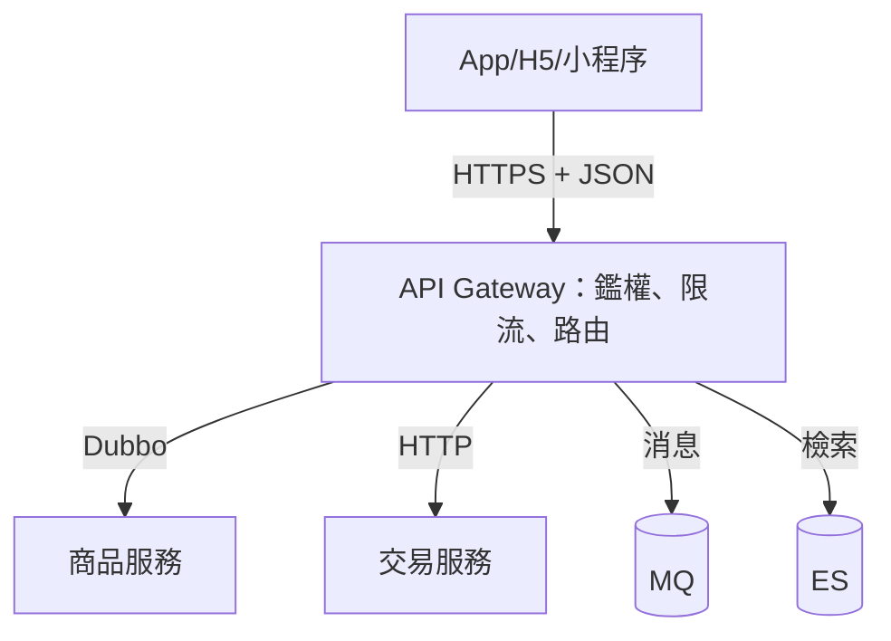
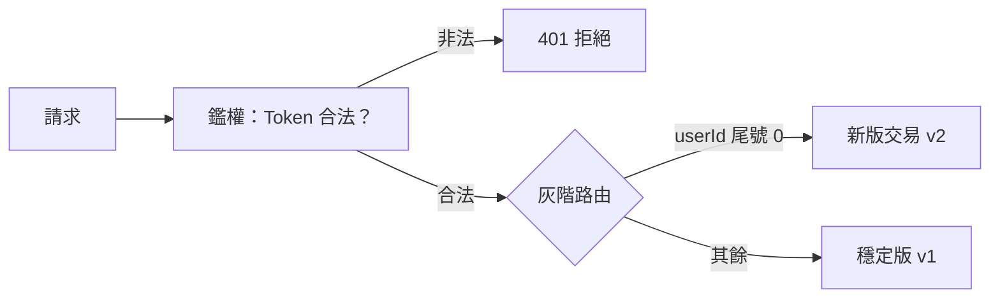

# 6.3 ESB 與 API Gateway：統一協議與路由

## 協議巴別塔

到這裡，系統裡有 Dubbo TCP、Spring Cloud HTTP、RocketMQ 消息、HBase/ES 各種客戶端。前端 App、H5、小程序各調各的，後端一改介面，前端跟著改。內部調用亂、外部接入更亂，需要一個**統一入口**。

早期答案是 **ESB（企業服務匯流排）**，後來演進為更輕的 **API Gateway**。



## ESB vs Gateway：一重一輕

| 維度 | ESB（SOA 時代） | API Gateway（微服務時代） |
|---|---|---|
| 位置 | 中央匯流排，所有邏輯走它 | 邊緣閘道，只做橫切面 |
| 功能 | 協議轉換、編排、重規則引擎 | 路由、鑑權、限流、灰階 |
| 優點 | 統一管控、適合異構系統整合 | 輕量高性能、去中心化 |
| 缺點 | 中央過重、單點瓶頸、難擴展 | 業務編排要服務自己做 |
| 代表 | Mule、WebSphere MB | Zuul、Spring Cloud Gateway、Higress |

```yaml
# Spring Cloud Gateway：統一路由 + 限流
spring:
  cloud:
    gateway:
      routes:
        - id: item-route
          uri: lb://item-service        # 負載均衡到商品服務
          predicates:
            - Path=/api/items/**
          filters:
            - StripPrefix=1
            - name: RequestRateLimiter  # 閘道層直接限流
              args:
                redis-rate-limiter.replenishRate: 1000
```

閘道只做「橫切面」：鑑權、限流（呼應 5.4）、日誌、灰階路由。業務編排（先查商品再建單）留在業務服務裡，避免 ESB 式的中央巨無霸。

## SOA vs 微服務：一句話辨析

| 維度 | SOA + ESB | 微服務 + Gateway |
|---|---|---|
| 拆分粒度 | 粗：幾個大服務 | 細：圍繞限界上下文的小服務 |
| 通訊 | ESB 中央編排 | 服務直連 + 閘道在邊緣 |
| 資料 | 常共享資料庫 | 各服務私有庫（5.1 紀律） |
| 治理 | 重流程、重規範 | 輕協議、自治 + 可觀測 |

可以這樣記：**SOA 是「中央集權」，微服務是「聯邦自治」**。淘寶從 ESB 走向 Gateway，就是從集權走向自治的縮影。

## 閘道實戰：鑑權、灰階一次收斂



```java
// 閘道過濾器：統一鑑權，業務服務不再各寫一遍
@Component
public class AuthFilter implements GlobalFilter {
    public Mono<Void> filter(ServerWebExchange exchange, GatewayFilterChain chain) {
        String token = exchange.getRequest().getHeaders().getFirst("X-Token");
        if (!authService.verify(token)) {
            exchange.getResponse().setStatusCode(HttpStatus.UNAUTHORIZED);
            return exchange.getResponse().setComplete();
        }
        return chain.filter(exchange);
    }
}
```

鑑權、限流、日誌、灰階四件事在閘道做一次，全站生效；業務服務專心做業務。這也是後來 Higress、Envoy 把閘道做成獨立層的起點。

## 本章小結

- 服務多了需要統一入口：對外收斂協議，對內路由到異構後端。
- ESB 重而中央，Gateway 輕而在邊緣；微服務時代選 Gateway。
- SOA vs 微服務：粒度、通訊、資料所有權三處不同。
- 架構很美好，但幾十個服務的部署運維已成噩夢，下一節直面運維地獄。

## 想一想

1. 為什麼 ESB 的「中央編排」在服務變多後會成為瓶頸？Gateway 如何避開？
2. 閘道適合放哪些功能？為什麼「下單編排」不該放在閘道裡？
3. 用「中央集權 vs 聯邦自治」比喻 SOA 和微服務，各有什麼代價？
