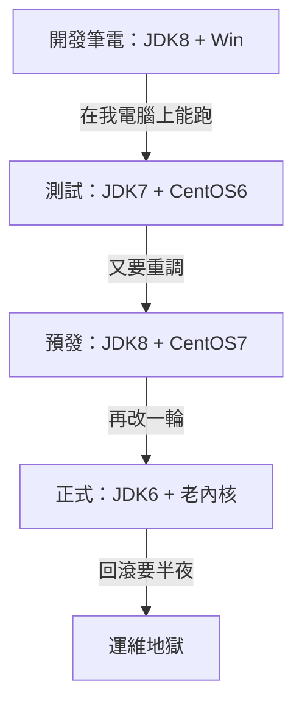
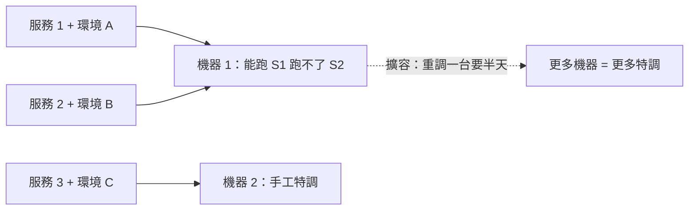
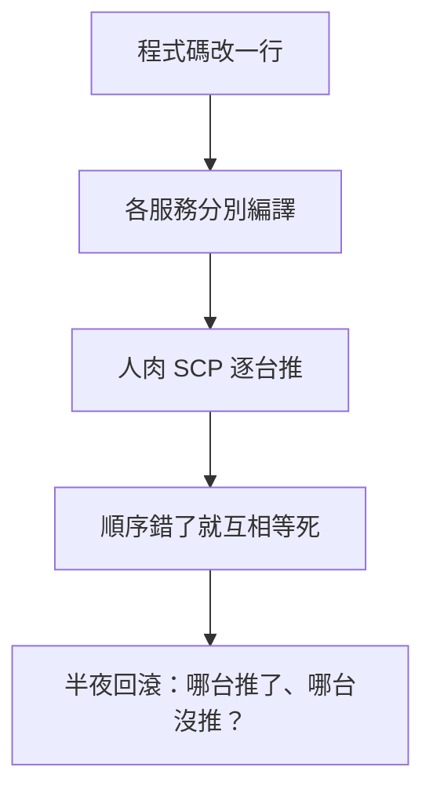

# 6.4 傳統微服務運維地獄：環境不一致與部署死胡同

## 終於跑起來，卻上不了線

前面的章節很美好：應用拆了、RPC 通了、Nacos 配了、Sentinel 加了、MQ 削峰了。但雙十一前演練，運維同學卻崩潰了：幾十個微服務，每個都要 JDK、Tomcat、Nginx、配置，測試環境好的，上預發就掛。



這就是**環境不一致**：程式碼一樣，土壤不一樣，長出來全不一樣。

## 地獄的三層火

| 痛點 | 症狀 | 代價 |
|---|---|---|
| 環境漂移 | 開發、測試、正式 JDK/依賴各不同 | 「測試過的」正式必出新 Bug |
| 部署複雜 | 幾十個服務靠 Shell 逐台推，順序還不能錯 | 發版一次 4 小時，不敢天天發 |
| 擴縮無力 | 零點要加 100 台，裝系統配環境來不及 | 洪峰來了只能眼睜睜看著掛 |

```bash
# 當年的部署日常：逐台 SSH，人肉編排
for ip in $(cat hosts.txt); do
  ssh $ip "pkill -f item-service; sleep 5"
  scp item-service.war root@$ip:/opt/tomcat/webapps/
  ssh $ip "/opt/tomcat/bin/startup.sh && tail -f logs/catalina.out"
  # 第 17 台掛了，前面 16 台要不要回滾？沒人知道
done
```

依賴地獄更隱蔽：A 服務要 Guava 19，B 服務要 Guava 28，同台機器只能裝一份，拆開部署又浪費機器。

## 為什麼走到了死胡同



傳統運維的假設是「機器是寵物，每台精心飼養」；微服務時代需要的是「機器是牛群，隨壞隨換」。靠 Shell 和文檔，永遠追不上幾十個服務的變化速度。

## 數字：地獄有多深

| 指標 | 單體時代 | 微服務無容器時代 |
|---|---|---|
| 服務數量 | 1 個 War | 50+ 個微服務 |
| 發版時間 | 30 分鐘停機發布 | 4 小時以上，還不敢回滾 |
| 擴容速度 | 加 2 台過夜生效 | 零點要 100 台，半天調不完 |
| 故障定位 | 一份日誌 | 幾十份日誌 +  hopes 拼湊調用鏈 |



更痛的是信心崩塌：團隊不敢天天發布，新功能攢成大版本再發，大版本風險更大，形成惡性循環。架構上已經是微服務，交付上還停留在手工作坊。

出路只有一條：**把「應用 + 環境」一起打包成不可變的標準單元，一次構建、到處運行**。測試測的是哪個包，正式跑的就是哪個包，不再有「土壤差異」。

## 承上啟下：Docker 為什麼必須登場

下一章 Docker 回答的正是這三問：環境如何隨應用走？幾十個服務如何一鍵啟停？擴容 100 台如何從半天變成秒級？微服務把系統拆開了，容器負責把它「裝箱運走」。

## 本章小結

- 微服務解決了開發期耦合，卻把複雜度轉移到了運維期。
- 三大痛點：環境不一致、部署複雜低效、彈性擴縮跟不上。
- 根因：應用與環境分離管理，機器被當寵物飼養。
- 破局方向：應用連同環境一起打包、不可變交付。這正是下一篇 **Docker 容器革命**的入口。

## 想一想

1. 「在我電腦上明明能跑」背後真正的技術原因是什麼？為什麼測試通過不等於正式可用？
2. 上面的 Shell 部署腳本有哪些致命缺陷？（提示：原子性、回滾、併發）
3. 如果要求「測試測什麼包、正式就跑什麼包」，部署流程要怎麼改？這和 Docker 有什麼關係？
