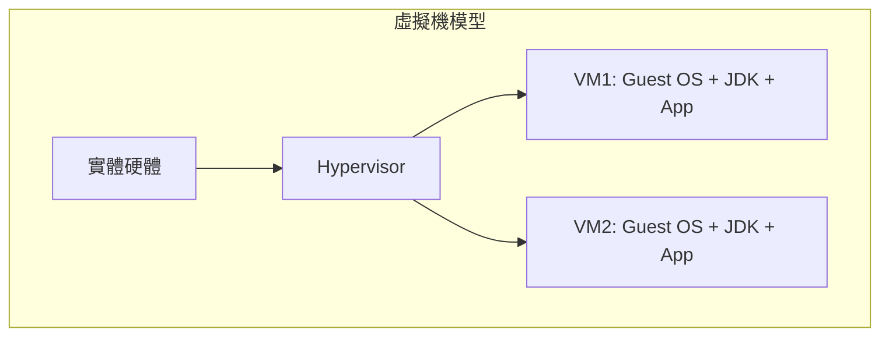
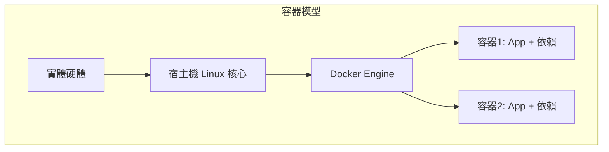
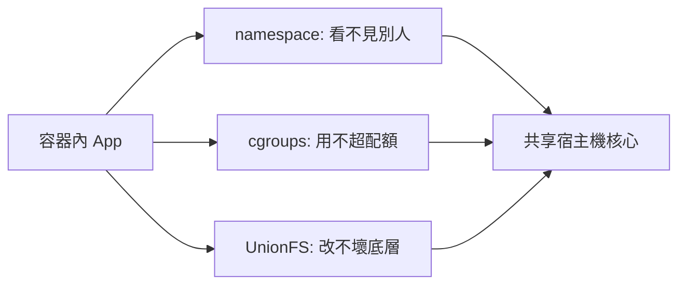

# 7.1 虛擬機 vs 容器：本質差異與隔離模型

## 6.4 回顧：部署地獄從何而來

6.4 節留下的痛點很具體：微服務拆開了，部署卻崩潰了——每台機器 JDK 版本不同、Tomcat 設定不同、依賴函式庫互相打架，「在我電腦上明明可以跑」變成上線前的口頭禪。

淘寶早期也走過這條路：一台實體機跑一個應用最穩，但雙十一前要擴容 10 倍，難道買 10 倍機器、再花一週人工裝環境？虛擬機（VM）曾是答案，但很快發現它太重了。

> 本節問題：有沒有一種隔離技術，既像虛擬機一樣隔離，又像行程一樣輕快？

## 虛擬機：各自背一整套作業系統

虛擬機靠 Hypervisor（KVM、VMware、Hyper-V）在硬體上模擬出完整硬體，再各自安裝 Guest OS。



啟動一台 VM 動輒數分鐘，吃掉數 GB 磁碟與數百 MB 記憶體，只為了跑一個幾十 MB 的微服務。這就像「每寄一本書，都先蓋一棟圖書館」。

```bash
# 看一台 VM 有多重：光是一個 Ubuntu 雲映像就近 2GB
qemu-img info ubuntu-22.04-server.img
free -h && df -h
```

## 容器：共享核心的行程隔離

容器的洞見很激進：**既然大家都是 Linux，何必每人背一套核心？共享同一個核心，只隔離「看到的視角」就好。**



容器本質上就是一個被精心「蒙住眼睛」的 Linux 行程：啟動秒級、記憶體增量只有 MB 級。

```bash
# 親手驗證：容器啟動有多快
time docker run --rm hello-world
time docker run --rm alpine echo "container boot"
ps -ef | grep docker
```

## 對比表：VM vs 容器

| 維度 | 虛擬機（VM） | 容器（Container） |
|------|--------------|-------------------|
| 隔離層級 | 硬體級，完整 Guest OS | 作業系統級，共享核心 |
| 啟動速度 | 分鐘級 | 秒級甚至毫秒級 |
| 映像大小 | GB 級 | MB 級（Alpine 僅約 5MB） |
| 資源開銷 | 每台預留 CPU / 記憶體 | 按行程計費，密度高 10 倍 |
| 可攜性 | 需相容 Hypervisor | 任何 Linux / 雲上皆可跑 |
| 隔離強度 | 強（核心都分開） | 弱（共享核心，需額外加固） |
| 適用場景 | 強隔離、多 OS 混跑 | 微服務、彈性擴縮、CI/CD |

一句話記憶：**VM 是「一人一棟樓」，容器是「一人一間套房，共用大樓水電」。**

## 三大基石：namespace / cgroups / unionFS

容器沒有魔法，只有三個 Linux 老技術的組合：

**1. namespace：蒙住眼睛（看到什麼）**

PID、NET、MNT、UTS、IPC、USER 六種命名空間，讓行程以為自己獨佔一台機器。

```bash
# 容器裡的 1 號行程，真的是 1 號嗎？進去看看
docker run -d --name pid-demo nginx
docker exec pid-demo ps -ef
# 宿主機上看：同一個行程只是普通子行程
ps -ef | grep nginx
docker rm -f pid-demo
```

**2. cgroups：管住手腳（能用多少）**

Control Groups 限制 CPU、記憶體、I/O 配額，防止一個容器拖垮整台宿主機。

```bash
# 限制容器最多用 512MB 記憶體與半顆 CPU
docker run -d --name limit-demo --memory=512m --cpus="0.5" nginx
docker stats --no-stream limit-demo
docker rm -f limit-demo
```

**3. UnionFS：分層疊積木（檔案怎麼來）**

OverlayFS 把多層唯讀映像疊成一個統一視圖（詳見 7.2 節），容器寫入時才複製一份（Copy-on-Write）。

## 隔離模型圖與安全邊界



要誠實地說缺點：共享核心意味著**核心漏洞會穿透所有容器**。實務上金融、政務場景會疊加 seccomp、AppArmor、gVisor 或 Kata Containers 補強。

## 本章小結

- 部署地獄的根源：環境不一致 + VM 太重、太慢、太貴
- 容器本質：共享核心的隔離行程，不是輕量 VM
- 三大基石：namespace 管視角、cgroups 管配額、UnionFS 管檔案
- VM vs 容器：強隔離選 VM，高密度彈性選容器
- 安全提醒：容器隔離弱於 VM，高敏感場景需額外加固

## 想一想

1. 為什麼說「容器不是輕量虛擬機，而是隔離的行程」？從核心數量與啟動開銷說明。
2. namespace 與 cgroups 各解決什麼問題？若拿掉 cgroups，雙十一會發生什麼事？
3. 既然容器共享核心，什麼場景你仍會堅持用 VM？試舉兩例並說明理由。
