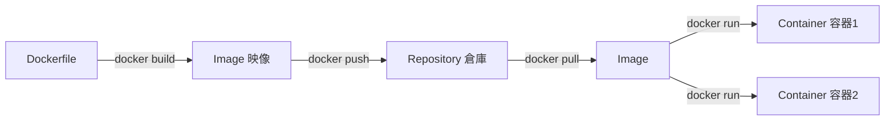
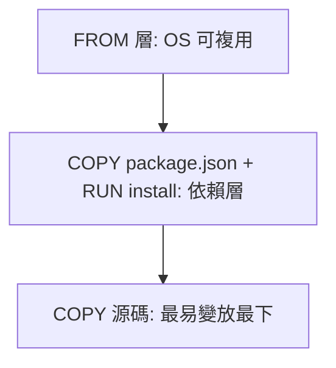

# 7.2 Docker 三要素：Image / Container / Repository

## 從淘寶部署痛點出發

7.1 節知道容器很輕，但新問題來了：上千台機器，如何保證每個容器跑的「東西」一模一樣？靠人工 `scp` jar 包加 shell 腳本，遲早有人漏裝一個 `.so`。

Docker 的答案是三要素：**Image（模板）、Container（實例）、Repository（倉庫）**，正好對應「類別、物件、Maven 中央倉庫」的關係。



## Image：唯讀模板，分層疊出來

映像是唯讀模板，由多個層（Layer）疊成。每一條 `RUN`、`COPY` 指令產生一層，內容用雜湊定址、跨映像共用。

```bash
# 拉一個映像，觀察它的分層
docker pull nginx:1.25-alpine
docker images nginx:1.25-alpine
docker history nginx:1.25-alpine
docker inspect nginx:1.25-alpine | grep -A 5 RootFS
```

分層的最大好處是**增量傳輸**：更新一行程式碼，只需推送頂上幾 MB，而非整個 GB 映像。

## Container：可寫的執行實例

容器 = 映像 + 一層可寫層 + namespace / cgroups 隔離。刪除容器，可寫層跟著消失——這就是「容器無狀態」忠告的由來（持久化見 8.2 節）。

```bash
# 容器的完整生命週期，一次跑通
docker run -d --name demo -p 8080:80 nginx:1.25-alpine
docker ps
docker exec demo ls /usr/share/nginx/html
docker stop demo
docker start demo
docker rm -f demo
```

| 狀態命令 | 用途 |
|----------|------|
| `docker ps / ps -a` | 查看運行中 / 全部容器 |
| `docker logs -f demo` | 追蹤標準輸出日誌 |
| `docker exec -it demo sh` | 進入容器除錯 |
| `docker cp demo:/etc/nginx .` | 拷出檔案比對 |

## Repository：團隊的中央倉庫

沒有倉庫，映像只能困在本機。Harbor（自建）與 Docker Hub / 阿里雲 ACR（公有雲）就是映像的 GitHub。

```bash
# 推到自己的倉庫（以本地 registry 示範，可直接執行）
docker run -d -p 5000:5000 --name registry registry:2
docker tag nginx:1.25-alpine localhost:5000/shop-nginx:v1
docker push localhost:5000/shop-nginx:v1
# 換台機器只需 pull，環境完全一致
docker pull localhost:5000/shop-nginx:v1
docker stop registry && docker rm registry
```

| 倉庫類型 | 代表 | 適用場景 |
|----------|------|----------|
| 公有 | Docker Hub | 開源基礎映像 |
| 雲託管 | 阿里雲 ACR、AWS ECR | 生產，含掃描與權限 |
| 自建 | Harbor | 金融合規、內網隔離 |

## 分層緩存：Docker 飛快構建的祕密

構建時 Docker 逐層計算雜湊，命中緩存就直接跳過。**把最不常變的指令放最上面**，是第一鐵律。

```bash
# 實驗：改一行程式碼，只重建頂層
docker build -t shop:v1 -f- . <<'EOF'
FROM nginx:1.25-alpine
COPY html/v1/index.html /usr/share/nginx/html/index.html
EOF
docker build -t shop:v2 -f- . <<'EOF'
FROM nginx:1.25-alpine
COPY html/v2/index.html /usr/share/nginx/html/index.html
EOF
# 第二次構建會複用 FROM 層，只執行 COPY
docker history shop:v2
```

> 反模式：`COPY . .` 放在 `RUN npm install` 之前，任何檔案抖動都讓依賴層失效，構建從 10 秒變 10 分鐘。正確順序見 7.3 節。



## 本章小結

- 三要素：Image 是類別、Container 是物件、Repository 是中央倉庫
- 映像唯讀分層、容器加一層可寫層，刪容器即丟可寫數據
- 倉庫解決「千機一致」：build 一次、處處 pull run
- 分層緩存鐵律：不常變的放上面，易變的源碼放最下
- 常用命令：run / ps / logs / exec / history / tag / push / pull

## 想一想

1. 為什麼映像要設計成「唯讀分層」而非單一壓縮包？從傳輸與共用角度回答。
2. 容器刪掉後數據會消失，這對「無狀態微服務 + 有狀態資料庫」各意味什麼？
3. 你的團隊該選公有雲 ACR 還是自建 Harbor？列出安全與成本的權衡。
