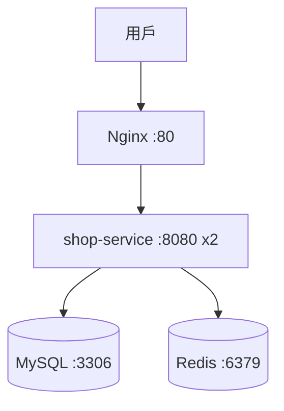

# 7.4 Docker Compose 實戰：一鍵啟動 微服務 + Redis + MySQL + Nginx

## 單個容器不夠：電商最小閉環要四個角色

7.3 節把一個微服務裝進映像，但淘寶最小可用單元至少四件套：**微服務（業務）+ MySQL（持久）+ Redis（快取）+ Nginx（入口）**。逐個 `docker run` 再手工連網，順序錯一步就連不上。

Compose 的定位：**用一個 YAML 聲明整個單機系統**，`up` 一鍵拉起、`down` 一鍵銷毀。



## 完整 yaml：可直接執行的最小閉環

```yaml
# compose.yaml：與本書目錄同級存放，直接 docker compose up 可跑
services:
  app:
    build: ./shop-service
    image: shop-service:v2
    environment:
      SPRING_DATASOURCE_URL: jdbc:mysql://db:3306/shop?useSSL=false&serverTimezone=UTC
      SPRING_DATASOURCE_USERNAME: shop
      SPRING_DATASOURCE_PASSWORD: shop123
      SPRING_DATA_REDIS_HOST: redis
    depends_on:
      db:
        condition: service_healthy
      redis:
        condition: service_started
    networks: [shopnet]

  db:
    image: mysql:8.0
    command: --default-authentication-plugin=mysql_native_password
    environment:
      MYSQL_DATABASE: shop
      MYSQL_USER: shop
      MYSQL_PASSWORD: shop123
      MYSQL_ROOT_PASSWORD: root123
    volumes: [db-data:/var/lib/mysql]
    healthcheck:
      test: ["CMD", "mysqladmin", "ping", "-h", "localhost"]
      interval: 5s
      retries: 10
    networks: [shopnet]

  redis:
    image: redis:7-alpine
    command: redis-server --appendonly yes
    volumes: [redis-data:/data]
    networks: [shopnet]

  nginx:
    image: nginx:1.25-alpine
    ports: ["80:80"]
    volumes: ["./nginx.conf:/etc/nginx/conf.d/default.conf:ro"]
    depends_on: [app]
    networks: [shopnet]

volumes:
  db-data:
  redis-data:

networks:
  shopnet:
```

```text
# nginx.conf：與 compose.yaml 同目錄
upstream shop { server app:8080; }
server { listen 80; location / { proxy_pass http://shop; } }
```

## 操作步驟：從零到驗證

```bash
# 1. 啟動（首次會自動 build app）
docker compose up -d --build
# 2. 看狀態與依賴順序
docker compose ps
docker compose logs -f app
# 3. 擴縮微服務實例
docker compose up -d --scale app=3
docker compose ps app
# 4. 驗證全鏈路
curl localhost/api/products
docker exec -it $(docker compose ps -q db) mysql -ushop -pshop123 -e "SHOW TABLES;" shop
docker exec -it $(docker compose ps -q redis) redis-cli ping
# 5. 銷毀（-v 連數據卷一起清，慎用於生產）
docker compose down -v
```

## 常見坑與排查

| 現象 | 原因 | 修法 |
|------|------|------|
| app 連不上 db | 用了 `localhost:3306`，容器內 localhost 是自己 | 改用服務名 `db:3306` |
| db 還沒好 app 就崩 | `depends_on` 預設只等啟動不等健康 | 加 `condition: service_healthy` |
| 改了代碼沒生效 | 忘了 `--build`，用的舊映像 | `up -d --build` |
| 端口衝突 | 本機 80 已被佔用 | 改 `ports: ["8088:80"]` |

```bash
# 除錯三板斧，可直接執行
docker compose config
docker network inspect $(basename $PWD)_shopnet
docker compose logs --tail=50 db
```

## 本章小結

- Compose 是單機編排：一個 YAML 描述微服務 + 中介軟體 + 入口
- 服務名即 DNS：容器間用 `db`、`redis`、`app` 互連，不用 IP
- `depends_on + healthcheck` 保證啟動順序，`volumes` 保證數據不丟
- 全流程：`up -d --build` → `ps/logs` → `curl` 驗證 → `down`
- 極限伏筆：Compose 只管單機，多機、故障自癒管不了（見 8.3 節）

## 想一想

1. 為什麼容器間要用服務名 `db:3306` 而非 `localhost`？畫出網路命名空間解釋。
2. `depends_on` 不加健康檢查會有什麼競態？雙十一高併發啟動會放大什麼後果？
3. Compose 的 `scale app=3` 與 Nginx 負載均衡，能替代 K8s 嗎？缺了哪三個能力？
