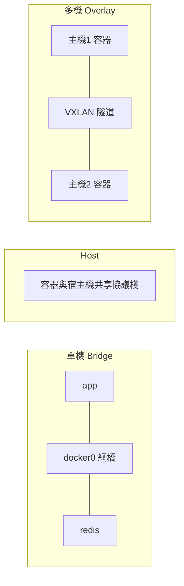
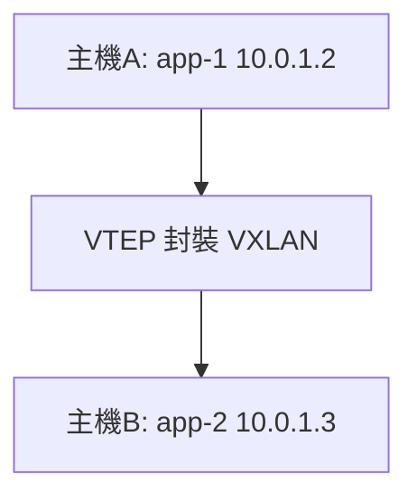

# 8.1 Docker 網路模型：Bridge / Host / Overlay

## 容器有 IP，為什麼預設 ping 不通？

7.4 節用服務名連通了四個容器，但換個姿勢就翻車：容器 IP 重啟就變、跨宿主機直接失聯、發布到公網還要端口映射。這都是網路模型沒選對。

Docker 把網路抽象成**驅動（Driver）**：同一套 `docker run`，掛到不同網路就是不同連通語義。



## Bridge：單機預設，開發主力

每個容器從 `docker0` 網橋拿一個私有 IP（如 `172.17.0.2`），出外網經 NAT，進內網靠服務名 DNS。

```bash
# 親手看透 Bridge，可直接執行
docker network ls
docker network inspect bridge | grep -A 3 Subnet
docker run -d --name web1 nginx:1.25-alpine
docker run -d --name web2 alpine sleep 3600
docker exec web2 ping -c 2 web1
# 自建網段才能用 DNS，預設 bridge 只能用 IP
docker network create --driver bridge shopnet
docker network connect shopnet web1
docker network connect shopnet web2
docker exec web2 ping -c 2 web1
docker rm -f web1 web2
docker network rm shopnet
```

| 場景 | 做法 |
|------|------|
| 容器互連 | 自建 bridge + 服務名，勿用 `--link`（已廢棄） |
| 發布給外部 | `-p 宿主機:容器`，如 `-p 8080:80` |
| 只給本機 | `-p 127.0.0.1:8080:80`，公網掃不到 |

## Host：去掉 NAT，效能拉滿

`--network host` 讓容器與宿主機共享協議棧：無 NAT、無端口映射，延遲最低，常用於高吞吐網關與監控採集。

```bash
# Host 模式：容器端口即宿主機端口
docker run -d --network host --name host-nginx nginx:1.25-alpine
curl localhost:80
docker rm -f host-nginx
```

| 優點 | 代價 |
|------|------|
| 零 NAT 開銷，效能最接近裸機 | 端口直接衝突，一機只能跑一個 :80 |
| 可抓宿主機網卡包，監控方便 | 隔離最弱，容器能看到宿主機網路 |
| 配置最簡單 | 僅 Linux 有效，Mac / Win Docker Desktop 不支援 |

## Overlay：跨主機通信，Swarm / K8s 前身

單機 Bridge 出了宿主機就失效。Overlay 用 VXLAN 在多主機間建虛擬二層網，讓不同機器的容器像在同一 LAN。

```bash
# 單機模擬 Overlay 語義（生產需 Swarm 或 K8s，見第九章）
docker network create --driver overlay --attachable multi-host-net || true
docker network ls --filter driver=overlay
# Swarm 初始化後，服務名跨主機自動解析
docker swarm init 2>/dev/null || true
docker service create --name demo --network multi-host-net nginx:1.25-alpine || true
docker service rm demo 2>/dev/null || true
docker swarm leave --force 2>/dev/null || true
```



| 模型 | 範圍 | 適用 |
|------|------|------|
| Bridge | 單機 | 開發、Compose 全棧 |
| Host | 單機 | 高效能網關、監控 |
| Overlay | 多機 | 跨主機容器互連、向 K8s 過渡 |
| None / Macvlan | 特殊 | 完全隔離 / 容器拿實體 IP |

## 端口映射與 DNS 速查

```bash
# 端口映射三種寫法
docker run -d -p 8080:80 nginx:1.25-alpine
docker run -d -p 127.0.0.1:8080:80 nginx:1.25-alpine
docker run -d -P nginx:1.25-alpine
docker ps --format '{{.Names}} {{.Ports}}'
# 清理實驗容器
docker rm -f $(docker ps -aq --filter ancestor=nginx:1.25-alpine) 2>/dev/null || true
```

> 鐵律：容器 IP 是臨時的，**永遠用服務名 + 內部端口通信**，只在邊界（Nginx）做 `-p` 映射。

## 本章小結

- Bridge 是單機預設：自建網路 + 服務名 DNS，不用 IP 硬編碼
- Host 換效能：去 NAT 但丟隔離，一機一端口，僅 Linux
- Overlay 管跨主機：VXLAN 虛擬大二層，是 K8s 網路的前身
- 對外只暴露 Nginx，內部全用服務名，這是生產第一規範
- 下一節：網路通了，數據重啟就丟怎麼辦（Volume 登場）

## 想一想

1. 為什麼預設 bridge 用 IP 能通、用名字不通？自建網路多了什麼 DNS 機制？
2. Host 模式效能最高，為何生產微服務預設不用它？從端口衝突與隔離回答。
3. Overlay 的 VXLAN 封裝帶來什麼開銷？什麼時候該直接上 K8s 的 CNI？
