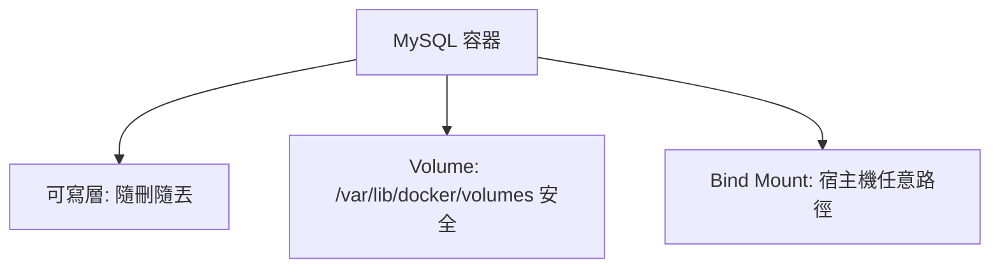

# 8.2 數據持久化：Volume 與 Bind Mount

## 容器刪了，MySQL 數據怎麼辦？

8.1 節網路通了，但 7.2 節埋的雷爆了：容器可寫層隨容器刪除而消失。7.4 節若 `docker compose down -v`，MySQL 裡的訂單全沒——這在雙十一等於災難。

解法是把數據**跳出容器的生命周期**：Volume（Docker 管）與 Bind Mount（你管）。



## Volume：生產首選，Docker 全權管理

Volume 由 Docker 在 `/var/lib/docker/volumes` 統一管理，備份、遷移、權限最省心，跨容器共用也最安全。

```bash
# 具名 Volume：MySQL 數據跳出容器生命周期
docker volume create db-data
docker run -d --name mysql -e MYSQL_ROOT_PASSWORD=root123 \
  -v db-data:/var/lib/mysql mysql:8.0
docker exec mysql mysql -uroot -proot123 -e "CREATE DATABASE shop;"
# 刪容器、重建，數據還在
docker rm -f mysql
docker run -d --name mysql2 -e MYSQL_ROOT_PASSWORD=root123 \
  -v db-data:/var/lib/mysql mysql:8.0
docker exec mysql2 mysql -uroot -proot123 -e "SHOW DATABASES;"
docker rm -f mysql2
docker volume inspect db-data
```

| 命令 | 用途 |
|------|------|
| `docker volume ls` | 列出所有卷 |
| `docker volume inspect db-data` | 看掛載點與驅動 |
| `docker volume prune` | 清理無主卷（生產慎用） |

## Bind Mount：開發調試神器

直接把宿主機路徑掛進容器，改宿主機檔案容器即時生效，適合掛配置與源碼熱重載。

```bash
# Bind Mount：改本地 nginx.conf，容器即時生效
mkdir -p ./demo-html && echo "hello volume" > ./demo-html/index.html
docker run -d --name web -p 8080:80 \
  -v $(pwd)/demo-html:/usr/share/nginx/html nginx:1.25-alpine
curl localhost:8080
echo "hot reload" > ./demo-html/index.html
curl localhost:8080
docker rm -f web
```

| 維度 | Volume | Bind Mount |
|------|--------|------------|
| 管理者 | Docker 統一管理 | 人工指定宿主機路徑 |
| 可攜性 | 高，跨主機遷移方便 | 低，依賴宿主機目錄結構 |
| 效能 | Linux 上最優 | Mac / Win 有檔案同步開銷 |
| 適用 | 資料庫數據、生產數據 | 配置、源碼、本地調試 |
| 權限坑 | 少 | 多（SELinux、UID 映射） |

> 還有第三種 `tmpfs`：純記憶體掛載，重啟即空，適合快取與臨時會話。

## 備份與遷移：可直接執行的三招

```bash
# 招1：備份具名卷（用一次性容器打包）
docker run --rm -v db-data:/data -v $(pwd):/backup \
  alpine tar czf /backup/db-data.tar.gz -C /data .
ls -lh db-data.tar.gz
# 招2：還原到新卷
docker volume create db-data-new
docker run --rm -v db-data-new:/data -v $(pwd):/backup \
  alpine sh -c "tar xzf /backup/db-data.tar.gz -C /data"
# 招3：MySQL 邏輯備份（跨版本遷移最穩）
docker exec mysql2 mysqldump -uroot -proot123 --all-databases > all.sql || true
ls -lh all.sql db-data.tar.gz 2>/dev/null || true
docker volume rm db-data db-data-new || true
rm -rf ./demo-html db-data.tar.gz all.sql
```


生產忠告：單機 Volume 只是起點，**多機高可用要用 NFS / 雲盤 / CSI（見 10.4 節）**，否則宿主機一壞數據全丟。

## 本章小結

- 容器可寫層 ephemeral：刪容器即丟數據，無狀態才可裸奔
- Volume 是生產預設：具名卷掛資料庫目錄，刪容器不丟數
- Bind Mount 是開發預設：掛配置與源碼，熱重載最快
- 備份三招：卷打包 tar、還原到新卷、mysqldump 邏輯備份
- 單機卷不抗主機故障，高可用必須上共享儲存

## 想一想

1. 為什麼資料庫必須用 Volume 而不能裸用可寫層？從 `down -v` 與升級兩個場景說明。
2. Bind Mount 在 Mac 上效能差、在 Linux 上有 UID 權限坑，各舉一例並給解法。
3. 宿主機整台損壞時，單機 Volume 為何救不了你？下一步該用什麼儲存？
