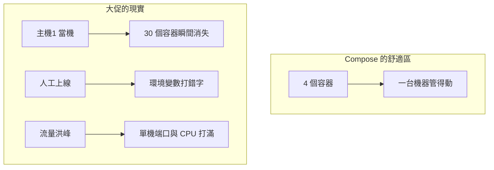
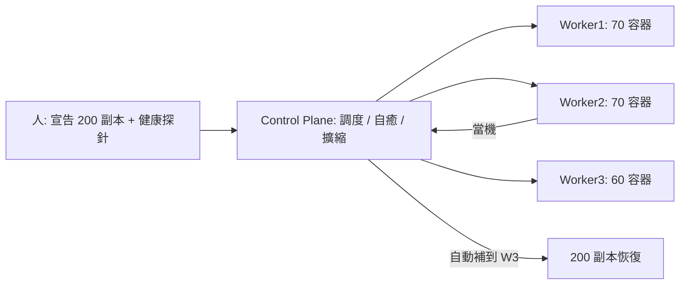

# 8.3 單機容器的極限：成百上千容器誰來管

## 雙十一前夜：從 4 個容器到 4000 個

7.4 節用 Compose 拉起 4 個容器很爽，但把時鐘撥到雙十一零點：流量漲 100 倍，需要 200 個 `app` 副本分散在 20 台機器上。此刻有人下班前 `docker run` 錯一個環境變數，有台宿主機突然當機——誰來發現、誰來補、誰來分流？

Compose 的答案是沉默：它只懂單機，不懂集群。這就是單機容器的天花板。



## 單機極限三連擊

**1. 調度：容器該跑在哪台機器？**

人工挑機器 = 裝箱難題。A 機 CPU 空但記憶體滿，B 機反之，新容器放哪？還要考慮親和性（app 要靠近 db）與反親和性（兩副本別擠同機）。

```bash
# 單機視角：只能看一台機器的資源
docker stats --no-stream
docker ps | wc -l
# 20 台機器時，你要 SSH 20 次再人肉決策——這就是痛點
```

**2. 自癒：掛了誰來補？**

Docker 自帶 `--restart always` 只能救「本機容器退出」，救不了「整台宿主機失聯」。

```bash
# 本機自癒的天花板，可直接執行驗證
docker run -d --restart always --name fragile alpine sh -c "sleep 5; exit 1"
docker ps -a --filter name=fragile
sleep 7 && docker ps -a --filter name=fragile
docker rm -f fragile
# 但若整台宿主機斷電，這條策略跟著一起葬身火海
```

**3. 發現與流量：IP 會變，入口怎麼辦？**

8.1 節說過容器 IP 是臨時的。10 個 app 副本此起彼伏，Nginx 的 `upstream` 手工改到天亮也改不完，更別說滾動升級時「先起新版、再摘舊版」的優雅切換。

| 單機 Docker 有的 | 大促真正要的 |
|------------------|--------------|
| 手動 `run / scale` | 宣告式：我要 200 副本，系統湊齊 |
| 本機重啟策略 | 跨主機自癒：機器掛了自動遷移 |
| 靜態 Nginx 配置 | 服務發現 + 自動負載均衡 |
| 人工看 `ps` | 健康探針 + 自動摘除壞實例 |
| 單機 Volume | 跨主機共享儲存與配置中心 |

## 引出 K8s：把「期望狀態」交給機器

所有痛點指向同一個解法：**人只聲明「想要什麼狀態」，由控制迴路持續把現實掰向期望**——這正是第九章 Kubernetes 的開場。



```bash
# 從 Compose 語言平移到 K8s 語言（第九章會逐行實操）
# Compose: replicas: 2        ->  K8s: Deployment.spec.replicas: 200
# Compose: healthcheck         ->  K8s: livenessProbe / readinessProbe
# Compose: shopnet + 服務名    ->  K8s: Service 自動 DNS + 負載均衡
# Compose: volumes             ->  K8s: PV / PVC + StorageClass
kubectl version --client 2>/dev/null || echo "K8s 實戰見第九章，先裝 kind/minikube（附錄 A.1）"
```

> 一句話預告：**Docker 解決「一個容器如何跑」，K8s 解決「一千個容器如何不亂」。** 第四篇到此收束，第五篇開船。

## 本章小結

- Compose 的舒適區是單機：4 個容器很爽，4000 個直接崩
- 三大極限：跨機調度、自癒遷移、服務發現與流量入口
- `--restart always` 救不了宿主機當機，手動 upstream 追不上副本漂移
- 解法範式轉換：從命令式 `run` 到宣告式「期望狀態 + 控制迴路」
- 下一篇：K8s 登場——Pod / Deployment / Service 如何接管這一切

## 想一想

1. 用 Compose 管 20 台機器、200 個副本，會在哪三個環節先崩潰？各舉一個深夜故障場景。
2. 「宣告期望狀態」與「逐台敲 docker run」有何本質區別？誰在半夜幫你補容器？
3. 若你是淘寶架構師，會用哪三個指標證明「現在必須上 K8s」？（提示：部署頻率、故障恢復時間、資源利用率）
