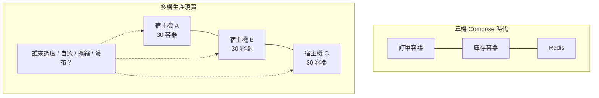
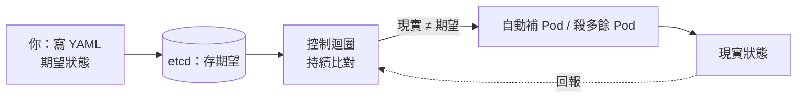

# 9.1 為什麼需要容器編排

> 雙十一零點，訂單服務要從 20 台擴到 200 台。靠人工 `docker run` 一台台敲？你需要的是「指揮官」，不是更多的手。

## 單機容器的極限

在 8.3 節，我們把「訂單服務 + Redis + MySQL + Nginx」用 Docker Compose 一鍵啟動。這在單機很美好，但淘寶演進到微服務之後，現實是殘酷的：

- **數量爆炸**：幾十個微服務 × 每個多副本 × 多機房 = 成百上千個容器。
- **機器會壞**：半夜某台宿主機當機，上面的 30 個容器誰來搬家？
- **流量會抖**：大促流量 10 倍起跳，誰來決定何時擴、何時縮？
- **部署會錯**：一次同時更新 50 個容器，怎麼保證不斷服、能回滾？



人工運維在這個規模下必然崩潰。這正是 6.4 節「微服務運維地獄」的續集：**容器解決了「打包」，但沒解決「指揮」**。

## 從 Compose 到 Kubernetes

Docker Compose 是「單機編排」：在一台機器上描述多容器關係。

```yaml
# docker-compose.yml：只懂單機
services:
  order:
    image: taobao/order:v1
    ports: ["8080:8080"]
    deploy:
      replicas: 2   # 還是同一台機器上跑 2 個
```

Kubernetes 是「集群編排」：在幾十上百台機器組成的集群上，指揮容器去哪裡跑、跑幾個、怎麼更新。

| 面向 | Docker Compose | Kubernetes |
|------|---------------|------------|
| 作用範圍 | 單機 | 多機集群 |
| 副本管理 | 靜態數量 | 自動維持、故障自癒 |
| 服務發現 | 單機 DNS | 集群級 Service + DNS |
| 擴縮 | 手動改數 | HPA 自動擴縮（11.2 節） |
| 滾動更新 | 需手寫腳本 | 內建滾動更新與回滾 |
| 適用 | 開發、教學 | 生產、大促 |

一句話：**Compose 是便條紙，Kubernetes 是作戰指揮系統**。

## 聲明式 vs 命令式：思維的轉換

學 K8s 最大的門檻不是 YAML，而是思維切換：

- **命令式（Imperative）**：告訴電腦「怎麼做」。如 `docker run -d --name order taobao/order:v1`。
- **聲明式（Declarative）**：告訴電腦「要什麼結果」。如「我希望訂單服務永遠有 3 個副本在跑」。

```yaml
# deployment.yaml：聲明「期望狀態」
apiVersion: apps/v1
kind: Deployment
metadata:
  name: order
spec:
  replicas: 3   # 期望：永遠 3 個，怎麼做不用你管
  selector:
    matchLabels: { app: order }
  template:
    metadata:
      labels: { app: order }
    spec:
      containers:
      - name: order
        image: taobao/order:v1
```

```bash
# 你只做兩件事：聲明 + 提交
kubectl apply -f deployment.yaml
kubectl get pods   # K8s 負責把現實拉向期望
```



這種「控制迴圈（Reconciliation Loop）」正是 K8s 的靈魂：機器故障、流量變化、誤刪 Pod，它都不抱怨，只是默默把世界修回你聲明的樣子。

## 與前篇的呼應

- 3.1 節的 Nginx 靠人工改 upstream；K8s 的 Service 會自動維護後端列表。
- 5.3 節的 Zookeeper 要自己搭集群做服務發現；K8s 內建 DNS 與服務註冊。
- 6.4 節的部署地獄，終點就是這裡：**用聲明式編排，把運維知識寫成程式碼**。

## 本章小結

- 單機容器不夠用：多機的調度、自癒、擴縮、發布需要編排器。
- Compose 管單機，Kubernetes 管集群，兩者定位不同。
- 核心思維：從命令式「怎麼做」轉為聲明式「要什麼」。
- K8s 靠控制迴圈持續把現實拉向期望，這是自癒與彈性的基礎。
- 本節是第九章的入口：後面逐一拆解架構與物件。

## 想一想

1. 為什麼說「容器解決打包、編排解決指揮」？各舉一個 Compose 做不到、K8s 擅長的場景。
2. 聲明式的好處是什麼？如果 Pod 被你手動 `kubectl delete` 掉，會發生什麼？為什麼？
3. 回顧 6.4 節的運維地獄：哪些痛點是 Docker 解決的，哪些必須等 Kubernetes 才解決？
