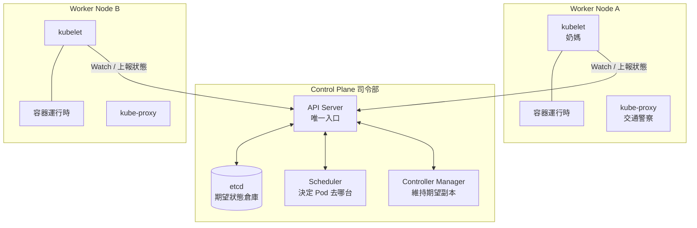
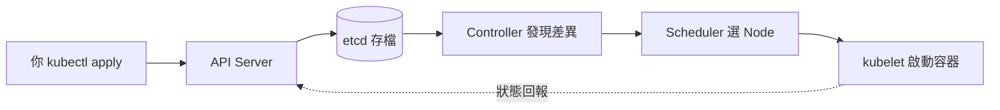

# 9.2 K8s 架構解密：Control Plane 與 Worker Node

> 如果 Kubernetes 是一支軍隊，Control Plane 是司令部，Worker Node 是前線部隊，etcd 是作戰地圖。

## 一張圖看懂集群



記住一條鐵律：**所有組件只跟 API Server 說話**，彼此不直連。這讓架構鬆耦合，也讓 `kubectl` 其實只是 API Server 的客戶端。

## Control Plane：四位司令

| 組件 | 角色比喻 | 職責 |
|------|---------|------|
| **API Server** | 司令部大門 | 所有請求的唯一入口，鑑權、校驗、寫入 etcd |
| **etcd** | 作戰地圖 | 高可用的鍵值儲存，保存整個集群的期望與現實狀態 |
| **Scheduler** | 參謀 | 決定新 Pod 該調度到哪台 Node（看資源、親和性，見 11.4 節） |
| **Controller Manager** | 糾察隊 | 內含多個控制器，用控制迴圈維持期望（如 Deployment 控制器） |

典型流程：你 `kubectl apply` 一個 Deployment → API Server 寫入 etcd → Controller 發現「需要 3 個 Pod」→ Scheduler 選 Node → 對應 Node 的 kubelet 真正啟動容器。

```bash
# 觀察司令部（以 kind / minikube 為例）
kubectl get nodes
kubectl get pods -n kube-system   # etcd、scheduler、controller 都在這裡
kubectl cluster-info
```

## Worker Node：三位前線兵

| 組件 | 職責 |
|------|------|
| **kubelet** | 每台 Node 的「奶媽」：接收 Pod 任務，呼叫容器運行時啟動容器，上報心跳與狀態 |
| **容器運行時** | 真正跑容器的工人：containerd / CRI-O（Docker 已退居幕後） |
| **kube-proxy** | 「交通警察」：為 Service 維護轉發規則（iptables / IPVS，見 10.1 節） |

```bash
# 觀察前線
kubectl describe node kind-worker | head -n 40
kubectl get pods -o wide   # 看 Pod 分佈在哪台 Node
```

Node 出故障時：kubelet 心跳停止 → Controller 發現超時 → 在健康 Node 上重建 Pod。這就是自癒的底層機制（11.1 節會再展開）。

## 為什麼要拆成這樣？

- **高可用**：司令部可多副本（etcd 3 節點），前線可任意增減，權責分明。
- **可擴展**：Scheduler、Controller 都是可插拔的控制迴圈，雲廠商可自定（如 ACK 的彈性調度）。
- **聲明式落地**：etcd 存期望、kubelet 報現實、控制器負責彌合，呼應 9.1 節的控制迴圈。



## 與淘寶演進的對照

- 單機 Tomcat 時代：應用與機器綁死，一台掛全掛。
- LVS + Nginx 時代（3.3 節）：流量有人管，但應用進程仍要人工管。
- K8s 時代：**機器只是資源池**，Pod 漂浮其上，壞了就搬家。這正是異地多活（11.4 節）的前提。

## 本章小結

- 集群 = Control Plane（大腦）+ Worker Node（手腳）。
- Control Plane 四件套：API Server、etcd、Scheduler、Controller Manager。
- Worker Node 三件套：kubelet、容器運行時、kube-proxy。
- 所有通訊經 API Server；etcd 是唯一真相來源。
- 調度 → 啟動 → 上報 → 糾偏，構成完整的控制迴圈。

## 想一想

1. 為什麼所有組件只跟 API Server 通訊？如果 kubelet 直連 Scheduler 會有什麼問題？
2. etcd 資料丟失會發生什麼？這說明了它在架構中的什麼地位？
3. kubelet 心跳停止後，集群會做什麼？這與傳統「SSH 上去重啟服務」有何本質不同？
