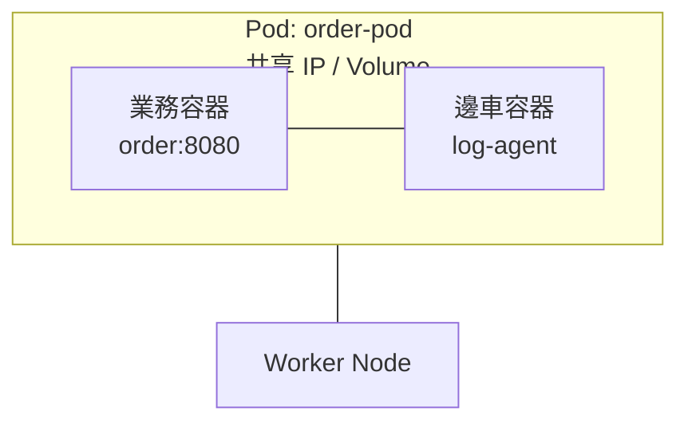
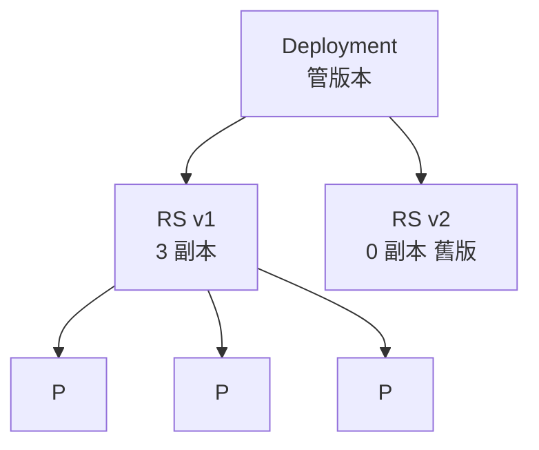

# 9.3 核心物件入門：Pod / ReplicaSet / Deployment

> Pod 是「一家人」，ReplicaSet 是「保母」，Deployment 是「管家」。你平常只跟管家說話。

## Pod：最小調度單位

K8s 不直接管容器，管的是 **Pod**：一組共享網路與儲存、會被一起調度到同一台 Node 的容器。

為什麼多此一舉？想想淘寶的邊車場景：業務容器 + 日誌收集容器 + 代理容器，必須同生共死、共享 `localhost`。Pod 正是為此而生。



```yaml
# pod.yaml：通常只用於學習，生產用 Deployment
apiVersion: v1
kind: Pod
metadata:
  name: order-pod
  labels: { app: order }
spec:
  containers:
  - name: order
    image: taobao/order:v1
    ports: [{ containerPort: 8080 }]
  - name: log-agent
    image: taobao/log-agent:v2
```

```bash
kubectl apply -f pod.yaml
kubectl get pods -o wide
kubectl logs order-pod -c order        # 指定容器看日誌
kubectl exec -it order-pod -c order -- sh
```

注意：Pod 是「一次性」的，死了不會自己回來。需要有人看著它。

## ReplicaSet：維持副本數的保母

**ReplicaSet（RS）** 的唯一工作：確保「標籤為 `app=order` 的 Pod 永遠有 N 個」。

```yaml
# rs.yaml：一般不手寫，由 Deployment 自動產生
apiVersion: apps/v1
kind: ReplicaSet
metadata:
  name: order-rs
spec:
  replicas: 3
  selector:
    matchLabels: { app: order }
  template:
    metadata:
      labels: { app: order }
    spec:
      containers:
      - name: order
        image: taobao/order:v1
        ports: [{ containerPort: 8080 }]
```

```bash
kubectl apply -f rs.yaml
kubectl get rs
# 做個實驗：刪掉一個 Pod，看它是否自動補上
kubectl delete pod <pod-name>
kubectl get pods -w
```

RS 解決了「自癒與擴縮」，但不會做「版本更新」。

## Deployment：生產的標準入口

**Deployment** 是 RS 的上層封裝，加上版本管理與滾動更新（細節見 9.4 節）。生產環境永遠用 Deployment。

```yaml
# deployment.yaml：可直接 apply
apiVersion: apps/v1
kind: Deployment
metadata:
  name: order
  labels: { app: order }
spec:
  replicas: 3
  selector:
    matchLabels: { app: order }
  template:
    metadata:
      labels: { app: order }
    spec:
      containers:
      - name: order
        image: taobao/order:v1
        ports:
        - containerPort: 8080
        resources:
          requests: { cpu: "100m", memory: "128Mi" }
          limits: { cpu: "500m", memory: "512Mi" }
```

```bash
# 完整操作三件套
kubectl apply -f deployment.yaml
kubectl get deploy,rs,pods -l app=order
kubectl scale deployment order --replicas=5   # 擴縮
kubectl rollout status deployment/order       # 看發布狀態
kubectl delete -f deployment.yaml             # 清理
```



三層關係一句話：**Deployment 管 RS，RS 管 Pod，Pod 管容器**。

## 常見坑

- `selector` 與 `template.labels` 必須一致；直接改 Pod 會被 RS 糾正，要改就改 Deployment。
- 映像別用 `latest`：回滾分不清版本，9.4 節示範正確做法。

## 本章小結

- Pod 是最小單位，一組共生容器，共享網路與儲存。
- ReplicaSet 保證副本數，提供自癒與擴縮。
- Deployment 是生產入口，提供版本與更新策略。
- 命令三件套：`apply`、`scale`、`rollout status`；resources 欄位預告 11.3 節資源治理。

## 想一想

1. 為什麼 K8s 要發明 Pod，而不是直接調度容器？邊車模式解決了什麼問題？
2. 手動刪除一個被 RS 管理的 Pod 會發生什麼？這體現了什麼設計哲學？
3. 什麼時候可以直接用 Pod？為什麼生產環境堅持用 Deployment？
