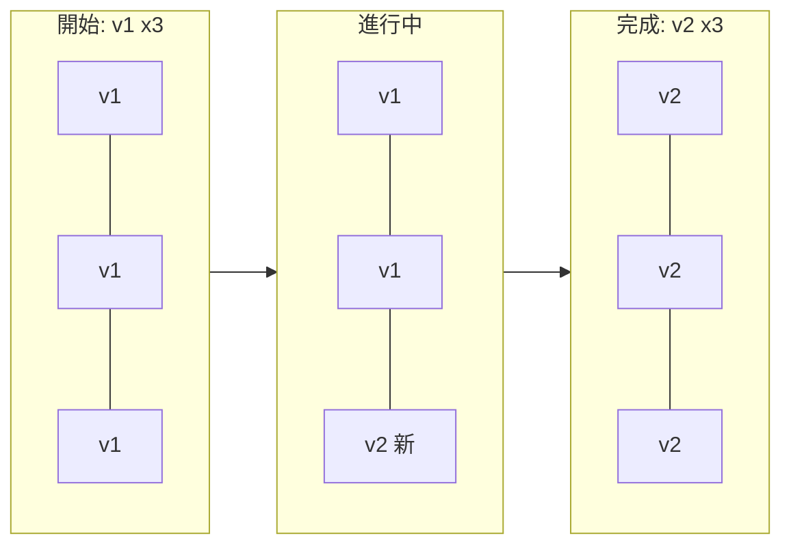
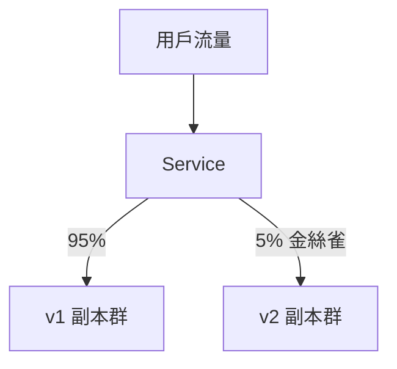

# 9.4 重新定義部署：滾動更新與版本回滾

> 以前發布是「半夜停機、全體祈禱」。現在發布是「新舊並存、灰度放量、一鍵回滾」。

## 滾動更新：像換輪胎的賽車

Deployment 預設策略是 **RollingUpdate**：逐個用新版 Pod 替換舊版，服務不中斷。



```yaml
# deployment-v2.yaml：只改 image，其餘不變
apiVersion: apps/v1
kind: Deployment
metadata:
  name: order
spec:
  replicas: 4
  strategy:
    type: RollingUpdate
    rollingUpdate:
      maxUnavailable: 1   # 最多同時不可用 1 個
      maxSurge: 1         # 最多額外多出 1 個
  selector:
    matchLabels: { app: order }
  template:
    metadata:
      labels: { app: order }
    spec:
      containers:
      - name: order
        image: taobao/order:v2   # v1 -> v2，唯一改動
        ports: [{ containerPort: 8080 }]
        readinessProbe:          # 就緒才接入流量，見 11.1 節
          httpGet: { path: /health, port: 8080 }
          initialDelaySeconds: 5
          periodSeconds: 5
```

```bash
kubectl apply -f deployment-v2.yaml
kubectl rollout status deployment/order
kubectl get pods -w   # 觀察新舊交替
```

`maxUnavailable: 1` 保證大促期間至少 3 個可用；`maxSurge: 1` 保證節點資源夠用。兩者的取捨見本節末表格。

## 回滾：一鍵反悔

每次更新，Deployment 會保留舊 RS，`revision` 遞增。

```bash
kubectl rollout history deployment/order
kubectl rollout history deployment/order --revision=2
# 發現 v2 有 Bug，秒級回滾
kubectl rollout undo deployment/order
kubectl rollout undo deployment/order --to-revision=1
kubectl rollout status deployment/order
```

生產建議：映像永遠用不可變標籤（`v2.3.1` 而非 `latest`），並在 CI 中記錄 `change-cause`：

```bash
kubectl annotate deployment/order kubernetes.io/change-cause="雙十一備戰：v2.3.1 修復庫存扣減 Bug" --overwrite
```

## Readiness 與發布的配合

沒有探針的滾動更新是危險的：新 Pod 還沒啟動完成就接入流量，用戶收到 500。9.3 節 YAML 中的 `readinessProbe` 保證：**沒就緒，不進 Service 端點**。完整探針體系見 11.1 節。

| 參數 | 調大 | 調小 | 建議 |
|------|------|------|------|
| maxUnavailable | 發布快，但風險高 | 更安全，但更慢 | 大促時設 0 或 1 |
| maxSurge | 資源消耗多 | 節省資源 | 資源緊張時設 0 |

## 藍綠與金絲雀（進階）

- **藍綠**：v1（藍）與 v2（綠）各一套，用 Service 一次切換，適合支付等關鍵鏈路。
- **金絲雀**：先放 5% 流量給 v2，觀察無誤再全量，Istio 的 VirtualService（10.3 節）最擅長此道。



## 本章小結

- RollingUpdate 逐個替換，靠 maxUnavailable / maxSurge 控制節奏。
- 每次發布自動留檔，`rollout undo` 秒級回滾。
- readinessProbe 是不斷服的關鍵：未就緒不接流量。
- 藍綠適合關鍵鏈路，金絲雀適合灰度驗證。
- 版本標籤不可變 + change-cause，是生產的基本修養。

## 想一想

1. maxUnavailable=0、maxSurge=1 與 maxUnavailable=1、maxSurge=0 各適合什麼場景？
2. 為什麼回滾必須依賴不可變的映像標籤？用 latest 會有什麼災難？
3. 如果沒有 readinessProbe，滾動更新可能出現什麼故障？畫出時序說明。
