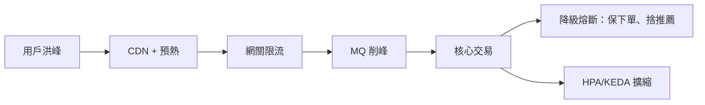

# B.2 雙十一大促案例：預熱、削峰、降級與彈性擴縮

以雙十一零點洪峰為場景，把 Ch 2、Ch 5、Ch 6、Ch 11 的招式串成一條全鏈路。記住一句話：**預熱保開局，削峰保寫入，降級保核心，擴縮保成本**。

## 全鏈路复盤圖



## 四招對照表

| 環節 | 手段 | 對應章節 | 關鍵命令/配置 |
|------|------|---------|--------------|
| 預熱 | CDN 預熱、快取預熱、JVM 預熱 | Ch 2.3、Ch 3.4 | `curl` 批量預熱、Redis 預載入 |
| 削峰 | RocketMQ/Kafka 異步排隊 | Ch 6.2 | 順序消息 + 批量消費 |
| 降級熔斷 | 限流、熔斷、降級開關 | Ch 5.4、Ch 10.3 | Sentinel 規則、Istio 熔斷 |
| 擴縮 | HPA + KEDA + Cluster Autoscaler | Ch 11.2 | `kubectl get hpa` |

```bash
# 大促當晚值班三命令
kubectl get hpa -w                        # 盯擴縮
kubectl top pods --sort-by=cpu            # 找熱點
kubectl logs -f deploy/shop --tail=200    # 看錯誤率
```

## 時間線复盤（T 為零點）

| 時間 | 動作 | 目的 |
|------|------|------|
| T-7 天 | 全鏈路壓測、定容量 | 算出 replicas 與 HPA 上限 |
| T-1 天 | 快取預熱、CDN 預熱 | 防開局雪崩（Ch 2.3） |
| T-1 小時 | 擴容到 80%、MQ 擴分區 | 留 20% 給 HPA 應變 |
| T+0 | 網關限流 + 降級非核心 | 保下單鏈路 |
| T+1 小時 | 按 HPA/KEDA 縮容 | 省成本（FinOps，Ch 13.3） |

## 失敗反模式（每年必踩其一）

| 反模式 | 後果 | 對策 |
|-------|------|------|
| 沒預熱直接開賣 | 冷快取 + 冷 JVM，開局即雪崩 | T-1 天批量預熱，JVM 預熱流量 10% |
| MQ 分區不足 | 削峰變堵峰，消費延遲破表 | T-1 小時擴分區，監控堆積量 |
| 該降的不降 | 非核心拖死核心，下單超時 | 降級開關預演：捨推薦、捨評價 |
| HPA 上限設太低 | 想擴擴不上去，CPU 打滿 | 壓測定 maxReplicas，留 20% 緩衝 |

```bash
# 復盤驗收：四個數字講清今年大促
kubectl get hpa shop -o yaml | grep -E "minReplicas|maxReplicas"
kubectl top pods --sort-by=cpu | head -5
kubectl logs -l app=shop --tail=200 | grep -c ERROR
```

## 本章小結

- 預熱防「冷啟動雪崩」，削峰把「瞬時寫」變「排隊寫」。
- 降級是主動捨車保帥；擴縮是自動加減機器，兩者缺一不可。
- 值班只看三處：HPA 水位、Top 熱點、錯誤日誌。

## 想一想

1. 為什麼 T-1 小時只擴到 80% 而不是 100%？留給 HPA 的 20% 有什麼用？
2. 削峰用 MQ 排隊會增加延遲，為什麼大促時「慢一點」反而是正確的？
3. 若推薦服務掛了，降級開關應該保「下單」還是保「推薦」？你的判斷標準是什麼？
