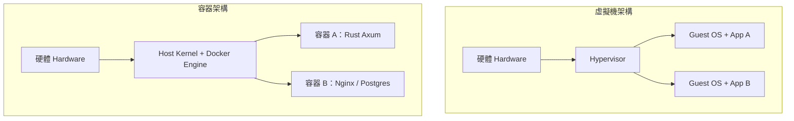
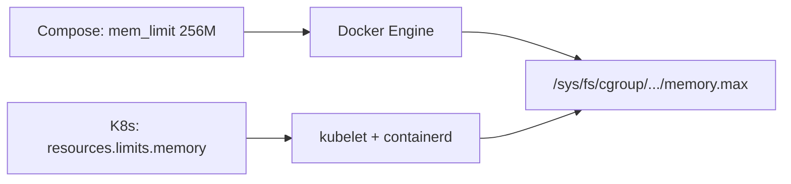

# 1.1 虛擬機 vs 容器：從 Namespace 與 Cgroups 理解隔離本質

## 從一個問題開始

同樣是「把 Rust 後端丟上伺服器執行」，為什麼虛擬機（Virtual Machine, VM）開機要幾分鐘、映像檔動輒數 GB，而容器（Container）卻能在毫秒級啟動、映像檔只有數十 MB？如果你只把 Docker 當成「輕量 VM」，很快就會在除錯網路、檔案系統與資源限制時吃虧。

本節帶你直搗核心：容器不是虛擬化硬體，而是 Linux 核心（Kernel）提供的兩大機制——命名空間（Namespaces）負責「看見什麼」，控制群組（Control Groups, Cgroups）負責「能用多少」。理解這兩者，你就理解了全書後續所有 Dockerfile、Compose 與 Kubernetes 設計的出發點。

## 虛擬機 vs 容器：架構對照

虛擬機靠 Hypervisor（虛擬機監視器）模擬出一整台電腦，每台 VM 自帶 Guest OS（客體作業系統）；容器則共用 Host Kernel（宿主核心），只隔離行程（Process）的視角與資源用量。

| | 虛擬機（VM） | 容器（Container） |
|---|---|---|
| **隔離層級** | 硬體層（Hardware-level），經 Hypervisor 模擬 CPU / 記憶體 / 磁碟 | 作業系統層（OS-level），經 Namespace + Cgroups 隔離 |
| **作業系統** | 每台自帶完整 Guest OS，數 GB 起跳 | 共用 Host Kernel，映像檔可小至 5 MB |
| **啟動速度** | 分鐘級（要開機、載入核心） | 毫秒～秒級（只是啟動一個行程） |
| **密度** | 單機跑數十台即吃力 | 單機可跑數百至上千個容器 |
| **安全性** | 強隔離，逃逸難度高 | 共用核心，需配合 Seccomp / AppArmor / gVisor 補強 |
| **可攜性** | 需相容 Hypervisor 格式（AMI / VMDK） | OCI（Open Container Initiative）映像檔跨平台流通 |
| **典型用途** | 強隔離、多 OS 混跑、遺留系統 | 微服務（Microservices）、CI/CD、K8s 調度單元 |



一句話記憶：**VM 是「一人一棟房」，容器是「一人一間套房、共用大樓水電」。**

## Namespace（命名空間）：你能看見什麼

Linux 提供 8 種 Namespace，每種負責隔離一種全域資源。可用 `lsns` 與 `unshare` 親手驗證。

| Namespace | 隔離對象（Isolation Target） | 容器用途實例 |
|---|---|---|
| `pid` | 行程編號（Process ID） | 容器內 PID 1 是你的 Rust 主行程，看不見宿主行程 |
| `net` | 網路堆疊（Network Stack） | 每個容器有獨立 eth0、IP、iptables |
| `mnt` | 掛載點（Mount Points） | 容器根目錄 `/` 來自映像檔層（Layer） |
| `uts` | 主機名稱（Hostname） | `hostname myapp` 只影響容器內 |
| `ipc` | 行程間通訊（IPC） | 訊息佇列、共享記憶體互不可見 |
| `user` | 使用者 ID（UID/GID） | 容器內 root 對應宿主普通 UID（Rootless 模式） |
| `cgroup` | Cgroup 視角 | 容器只看到自己的資源限制 |
| `time` | 系統時間（Time Namespace） | 容器可有獨立時鐘偏移 |

以下是最精簡、可實際運行的隔離實驗（Linux 宿主或 Docker Desktop 的 Linux VM 內執行）：

```bash
# 1. 觀察宿主的行程與主機名
ps aux | head -n 5
hostname

# 2. 用 unshare 建立 pid + uts + mount 隔離的新環境
sudo unshare --pid --uts --mount --fork --pidfile /tmp/unshare.pid bash

# 3. 在新環境內：改主機名、掛載獨立 proc，只看到自己
hostname container-demo
mount -t proc proc /proc
ps aux        # 只看到 bash 與 ps 本身
hostname      # 顯示 container-demo，宿主不受影響
exit
cat /tmp/unshare.pid
```

> 在 macOS 上 `unshare` 無法直接執行，請進入 Docker 容器實驗：`docker run --rm -it ubuntu bash`，再於容器內執行 `ps aux` 與 `hostname` 對比宿主，即可體會 `pid` 與 `uts` 隔離。

## Cgroups（控制群組）：你能用多少

Namespace 管「可見性」，Cgroups 管「配額（Quota）」。v2 版本以單一階層管理 cpu、memory、io、pids 四大控制器（Controller）。

```bash
# 查看 Cgroups v2 掛載與控制器
mount | grep cgroup
cat /sys/fs/cgroup/cgroup.controllers

# 用 Docker 驗證 memory 限制：限制 128MB，超過即 OOMKilled
docker run --rm --memory 128m --name mem-demo ubuntu \
  bash -c "cat /sys/fs/cgroup/memory.max; free -m"

# 用 Docker 驗證 CPU 限制：0.5 顆 CPU
docker run --rm --cpus 0.5 --name cpu-demo ubuntu \
  bash -c "cat /sys/fs/cgroup/cpu.max"
```

對應到本書後續章節：Compose 的 `deploy.resources.limits`（3.x / 4.x 語法）與 Kubernetes 的 `resources.requests/limits`，底層最終都轉譯為這兩個檔案的數值。



## 動手做：一個 Rust 行程的隔離視角

```rust
// src/main.rs：編譯後分別在宿主與容器執行，觀察差異
use std::fs;

fn main() {
    let stat = fs::read_to_string("/proc/1/comm").unwrap_or("unknown".into());
    println!("PID 1 comm: {}", stat.trim());
    // 2. 觀察 hostname（uts namespace）
    let hostname = fs::read_to_string("/etc/hostname").unwrap_or("unknown".into());
    println!("hostname file: {}", hostname.trim());
    // 3. 觀察 memory 上限（cgroup）
    let mem_max = fs::read_to_string("/sys/fs/cgroup/memory.max")
        .unwrap_or("no-cgroup-v2".into());
    println!("memory.max: {}", mem_max.trim());
}
```

```bash
# 本機執行 vs 容器執行對照
cargo run
docker build -t ns-demo -f- . <<'EOF'
FROM rust:1.78-bookworm AS build
WORKDIR /app
COPY src ./src
COPY Cargo.toml ./
RUN cargo build --release
FROM debian:bookworm-slim
COPY --from=build /app/target/release/ns-demo /usr/local/bin/ns-demo
CMD ["ns-demo"]
EOF
docker run --rm --hostname rust-in-box --memory 256m ns-demo
```

## 本節小結

- **VM 虛擬硬體、容器隔離行程**：前者靠 Hypervisor，後者靠 Namespace + Cgroups
- **Namespace（命名空間）** 決定「看見什麼」：pid、net、mnt、uts、ipc、user、cgroup、time
- **Cgroups（控制群組）** 決定「能用多少」：cpu、memory、io、pids，v2 統一階層
- `unshare`、`lsns`、`/sys/fs/cgroup` 是驗證隔離最直接的三把刀
- 後續 Compose / K8s 的所有資源欄位，都只是這層核心機制的宣告式封裝

## 想一想

1. 既然容器共用 Host Kernel，為什麼 `FROM ubuntu` 的容器能在任何 Linux 發行版宿主上跑？那 `FROM scratch` 的 musl 靜態 Rust 二進位檔又為何連作業系統都不需要？
2. 容器內看到的 `free -m` 總量常常是宿主總量而非限制值，這會對 JVM、Node.js 等依總記憶體自動調優的 Runtime 造成什麼誤判？Rust 為何相對免疫？
3. 如果攻擊者從容器逃逸（Container Escape）到宿主，他最可能利用的是 Namespace 還是 Kernel 漏洞？Seccomp 與 Rootless 模式分別堵住了哪一層？
