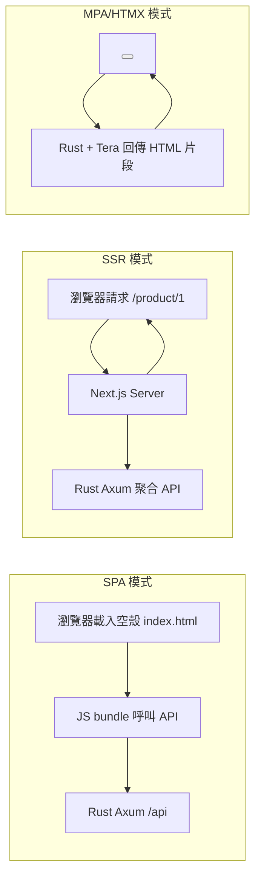
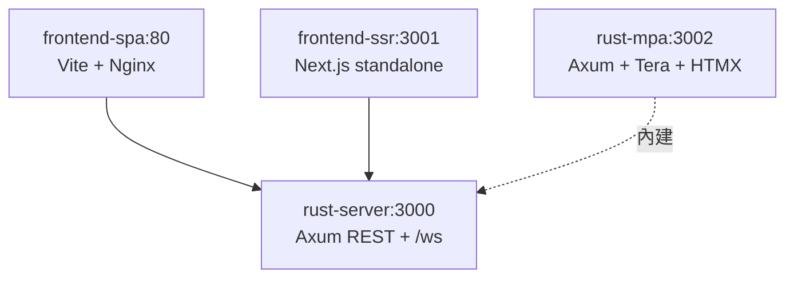

# 1.2 技術棧選型：Rust 高併發核心 × 多樣化 Web 前端

## 從一個問題開始

本書要同時處理三種 Web 架構——單頁應用（Single-Page Application, SPA）、伺服器端渲染（Server-Side Rendering, SSR）、多頁應用（Multi-Page Application, MPA）——後端卻只選一種語言：Rust。這是偏執還是深思熟慮？

答案藏在兩個現實裡：第一，現代前端沒有銀彈，後台系統要 SPA、行銷官網要 SSR/SEO、內部工具要 MPA/HTMX 快打快收；第二，無論前端怎麼變，後端都要面對 WebSocket（全雙工長連線）推送、SSR 的高頻 API 聚合、以及容器化後的嚴苛記憶體限制。Rust 的非同步執行期（Async Runtime）與零成本抽象（Zero-Cost Abstraction），恰好是同時吃下這三者的最小公約數。

## 後端為何選 Rust：Axum vs Actix

| 考量（Concern） | Rust + Tokio 生態 | Node.js（Node） | Go |
|---|---|---|---|
| **長連線併發** | 單執行緒可撐數萬 WebSocket 連線，記憶體每連線僅 KB 級 | 事件迴圈（Event Loop）強，但 CPU 密集易阻塞 | Goroutine（協程）輕量，但每連線記憶體高於 Rust |
| **記憶體佔用** | 無 GC（Garbage Collector），RSS 常駐 < 20 MB | V8 堆積 + GC 暫停，基準即上百 MB | GC + Runtime，基準數十 MB |
| **型別安全** | 所有權（Ownership）+  Send/Sync 在編譯期擋住資料競爭 | any + 執行期錯誤，需靠測試補 | 有 GC 但缺乏泛型約束的嚴格性（已改善） |
| **容器映像檔** | musl 靜態編譯可 < 10 MB，`FROM scratch` | 需 Node Runtime，基準 > 100 MB | 靜態編譯約 15–30 MB |
| **學習曲線** | 陡峭（借用檢查器 Borrow Checker） | 平緩 | 平緩 |

本書以後端框架二選一為主：

| | Axum | Actix Web（Actix） |
|---|---|---|
| **背書** | Tokio 官方團隊維護，與 Tower 中介層（Middleware）生態整合 | 歷史最久、生態最大，TechEmpower 常年霸榜 |
| **風格** | 函式式路由 + Extractor（提取器），型別推導優雅 | Actor（演員模型）+ 巨集路由，效能極致 |
| **適合誰** | 新專案、要接 Tower-HTTP、OpenAPI、WebSocket | 已有 Actix 生態、追求裸機吞吐 |
| **本書立場** | 預設範例用 Axum，效能對照組給 Actix | 第 4 章 Compose 範例兩者可互換 |

可運行的最小 Axum 後端（含 WebSocket 升級）：

```rust
// Cargo.toml: axum = "0.7", tokio = { version = "1", features = ["full"] }
use axum::{Router, routing::get, extract::ws::{WebSocketUpgrade, WebSocket, Message}};

async fn ws_handler(ws: WebSocketUpgrade) -> impl axum::response::IntoResponse {
    ws.on_upgrade(|mut socket: WebSocket| async move {
        while let Some(Ok(Message::Text(t))) = socket.recv().await {
            let _ = socket.send(Message::Text(format!("echo: {t}"))).await;
        }
    })
}

#[tokio::main]
async fn main() {
    let app = Router::new()
        .route("/health", get(|| async { "ok" }))
        .route("/ws", get(ws_handler));
    let listener = tokio::net::TcpListener::bind("0.0.0.0:3000").await.unwrap();
    axum::serve(listener, app).await.unwrap();
}
```

```bash
cargo run &
curl -s localhost:3000/health  # 應回 ok
```

## 前端三條路：SPA vs SSR vs MPA/HTMX

| | SPA（React + Vite） | SSR/Fullstack（Next.js / Remix） | MPA + HTMX（Rust Tera 樣板） |
|---|---|---|---|
| **渲染位置** | 瀏覽器端（Client-Side Rendering） | 伺服器端首屏渲染 + 水合（Hydration） | 伺服器端樣板直出 HTML（Server-Rendered HTML） |
| **SEO** | 弱（需預渲染 Prerendering） | 強，天生適合行銷頁 | 強，純 HTML |
| **互動複雜度** | 高（Dashboard、編輯器） | 中高（電商、BBS） | 低中（CRUD、內部工具） |
| **後端依賴** | 純靜態檔，可丟 CDN + Nginx | 需 Node Runtime 常駐，記憶體敏感 | 無需 Node，Rust 直出，映像檔最小 |
| **容器形態** | `nginx:alpine` 託管 dist（約 25 MB） | `node:20-slim` 跑 standalone（約 150 MB） | `scratch` 跑 Rust 二進位檔（約 8 MB） |
| **代表指令** | `vite build` | `next build && next start` | `cargo build --release` |



## 何時選誰：決策表（Decision Matrix）

| 情境 | 推薦 | 理由 |
|---|---|---|
| 內部管理後台、高互動 Dashboard | SPA + Rust API | 前後端分離部署，Nginx 快取靜態檔，Rust 專心做 API 與 WebSocket |
| 行銷官網、電商、需 SEO 與首屏秒開 | SSR（Next.js standalone） | 首屏由 Node 直出，Rust 做 BFF（Backend for Frontend）聚合層 |
| CRUD 內部工具、MVP 兩週上線 | MPA + HTMX + Tera | 零 Node 依賴、零建置步驟，一個 Rust 二進位檔即全站 |
| 萬人聊天室、即時看板推播 | Rust WebSocket 中心 + 任意前端 | Tokio 單機數萬連線，Node/Go 同規格成本高 3–10 倍 |
| 記憶體限制 < 128 MB 的邊緣節點 | MPA 或 SPA，避開 SSR | Next.js 基準即 150–300 MB，Rust + Nginx 可壓在 30 MB 內 |

Rust 高併發長連線優勢一瞥（概念性基準，實測以 TechEmpower 為準）：單 Pod 1 vCPU / 512 MB 可維持約 3 萬條閒置 WebSocket 連線仍可正常廣播，而同規格 Node 約在 8 千–1.2 萬連線後 GC 暫停明顯拉高 p99 延遲。這正是第 3.3 節敢用「一個 Rust 行程扛全站」做 MPA 的底氣。

## 本書約定：一個後端、三種前端



全書 Compose（4.2 節）會同時啟動這四個服務，讓你用 `http://localhost:8080`（SPA）、`:8081`（SSR）、`:8082`（MPA）親手比較差異，而後端永遠是同一個 Rust 映像檔。

## 本節小結

- **後端統一 Rust**：Axum 預設、Actix 對照，換取無 GC、低記憶體、強長連線能力
- **前端三轨並行**：SPA 重互動、SSR 重 SEO 首屏、MPA/HTMX 重交付速度與體積
- **決策看三軸**：互動複雜度、SEO/首屏需求、記憶體與維運預算
- 全書以「同一 Rust API 配三種前端」貫穿，容器化差異即教學主線

## 想一想

1. 如果你的團隊只有兩人、兩週要交付一個有登入與報表的內部系統，你會選 SPA、SSR 還是 HTMX？各自的建置與部署成本差在哪？
2. 為什麼 SSR 節點的記憶體限制（memory limits）要比 Rust API 寬鬆 5–10 倍？這對 Kubernetes 的 requests/limits 設計有何啟示？
3. WebSocket 連線是有狀態（Stateful）的，這會給後面的 Kubernetes 水平擴展（Horizontal Scaling）帶來什麼麻煩？Stadeless API 與 Stateful 連線該如何分開部署？
