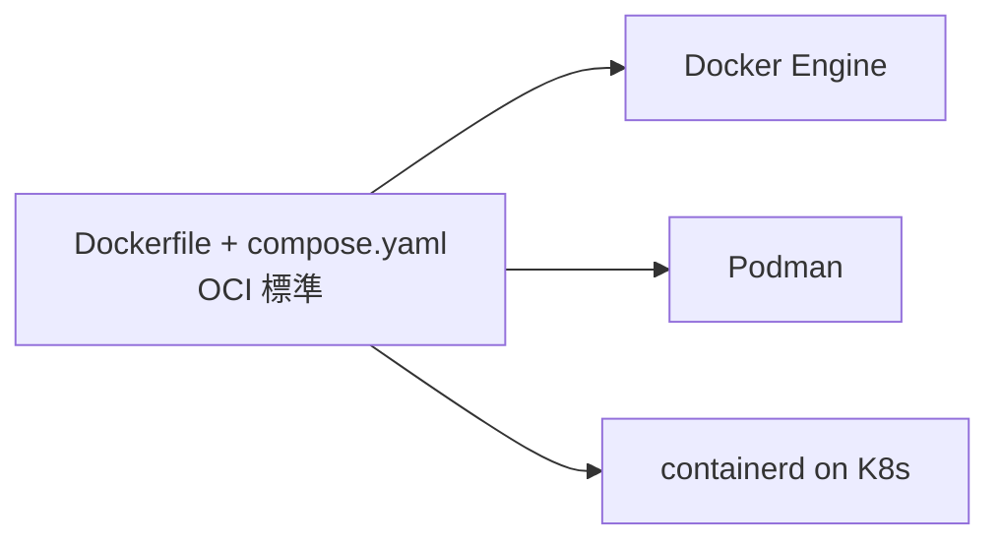
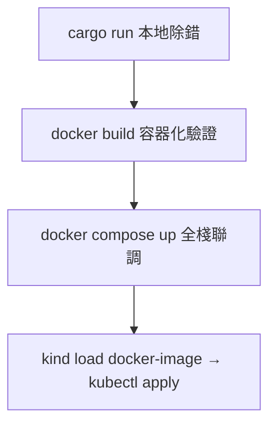

# 1.3 開發環境：Docker Desktop、Podman 與 CLI 工具鏈

## 從一個問題開始

新手第一天最常卡住的不是 Rust 語法，而是：「Docker Desktop 一直轉圈圈」「M1/M2 拉的映像檔在伺服器上跑不起來」「到底要裝 Docker 還是 Podman？」本節一次把開發環境講定：給出一條全書通用的工具鏈（Toolchain），並讓你在 10 分鐘內驗證 `docker buildx`、`kind` 與 `cargo` 全數可用。

## Docker Desktop vs Podman：對照與選擇

| | Docker Desktop | Podman（+ Podman Desktop） |
|---|---|---|
| **架構** | Client–Daemon（需 dockerd 常駐，macOS/Windows 跑 Linux VM） | Daemonless（無守護行程，直接 fork/exec，相容 Docker CLI） |
| **授權** | 大型企業需付費訂閱 | 全開源（Apache-2.0），企業友善 |
| **相容性** | 原生 `docker compose`、`buildx`、`Extensions` 生態最齊 | `alias docker=podman` 大多可用，Compose 經 `podman-compose` 或 Podman v4 內建 |
| **Kubernetes 整合** | 內建單節點 K8s（One-Node K8s），開關一鍵 | 需搭配 kind / minikube / OpenShift |
| **本書建議** | 個人學習、macOS/Windows 首選，開箱即用 | Linux 伺服器、CI Runner、授權敏感企業首選 |
| **切換成本** | 低：OCI 標準下 Dockerfile / compose.yaml 通用 | 低：`podman run nginx` 與 Docker 語法幾乎一致 |



一句話：**學標準（OCI / Compose Spec），不綁工具**。本書指令以 `docker` 示範，Podman 用戶把 `docker` 換成 `podman` 即可，差異處會特別註明。

## 一次裝好：各平台最小工具鏈

| 工具 | 版本要求 | 用途 | 驗證指令 |
|---|---|---|---|
| Docker Desktop / Podman | ≥ 4.x / ≥ 4.9 | 建置與執行容器 | `docker version && docker info` |
| Buildx（多架構建置） | 隨 Docker 附帶 | 建 `linux/amd64` + `arm64` 映像檔 | `docker buildx version` |
| Compose | v2.x（`docker compose` 無橫線） | 本地全棧編排（第 4 章） | `docker compose version` |
| Rust（rustup） | stable ≥ 1.78 | 後端編譯 | `cargo --version && rustc --version` |
| Node.js | LTS 20.x | SPA/SSR 前端建置 | `node -v && npm -v` |
| kind / kubectl | kind ≥ 0.22 | 本地 K8s（第 5 章起） | `kind version && kubectl version --client` |

```bash
# macOS（Homebrew）一鍵安裝
brew install --cask docker
brew install rustup node@20 kind kubectl
rustup-init -y && source "$HOME/.cargo/env"

# Ubuntu / Debian
sudo apt-get update && sudo apt-get install -y docker.io docker-compose-plugin
curl --proto '=https' --tlsv1.2 -sSf https://sh.rustup.rs | sh -s -- -y
# Podman 替代方案（Ubuntu 22.04+）
sudo apt-get install -y podman podman-compose

# 驗證全鏈路（全部應回傳版本號）
docker version && docker compose version && docker buildx version
cargo --version && node -v && kind version
```

## 第一個可運行驗證：Rust + Nginx 同時跑起來

```bash
# 1. Rust 後端連通性
cargo new --bin hello-rust && cd hello-rust
cargo run &                                  # 預設 8080 或自訂
curl -s localhost:8080 || echo "cargo ok, 自訂埠請改"

# 2. 容器引擎連通性（含多架構與 Compose）
docker run --rm hello-world                  # 引擎正常即印 Hello from Docker!
docker buildx ls                             # 應列出 default builder
docker compose version                       # v2.x 即後續章節可用
```

若 `hello-world` 在 Apple Silicon 上出現 `exec format error`，代表拉到錯誤架構（Architecture），解法是顯式指定平台（Platform）：

```bash
docker run --rm --platform linux/arm64 hello-world
docker buildx build --platform linux/amd64,linux/arm64 -t demo:multiarch .
```

## CLI 日常：本書高頻指令速查

```bash
# 建置與除錯
docker build -t rust-server:dev -f Dockerfile .
docker run --rm -it -p 3000:3000 rust-server:dev sh
docker logs -f <container>          # 追日誌
docker exec -it <container> sh      # 進容器開刀

# Compose（第 4 章主戰場）
docker compose up -d --build        # 背景啟動全棧
docker compose ps && docker compose logs -f api
docker compose down -v              # 停機並清 Volume（小心資料）

# 清理磁碟（Rust 建置快取很肥，定期執行）
docker system df
docker builder prune -f
```

> Podman 對應：`podman machine init && podman machine start`（macOS 需先啟 VM），其餘把 `docker` 換字即可；`docker compose` 對應 `podman-compose up` 或 `podman compose`（v4.7+）。



## 本節小結

- **綁標準不綁工具**：Dockerfile / OCI / Compose 通吃 Docker 與 Podman
- **最小工具鏈六件套**：Docker（Buildx+Compose）、Rust、Node、kind/kubectl，版本先對齊再開工
- **多架構意識**：Apple Silicon 開發、linux/amd64 上線是常態，`--platform` 與 buildx 是必修
- 高頻指令只有三組：`run/exec/logs` 單容器、`compose up/ps/down` 全棧、`builder prune` 清磁碟

## 想一想

1. 為什麼 Docker Desktop 在 macOS 上一定要跑一個 Linux VM？這對檔案掛載（Bind Mount）效能與 `inotify` 熱重載有什麼影響？
2. 你的 CI Runner 若同時要編 Rust 又要建多架構映像檔，應該選 Docker-in-Docker（DinD）還是 Podman？安全與快取層面各有什麼代價？
3. `docker compose up` 與 `kind + kubectl apply` 的界線在哪？什麼時候該從 Compose 畢業、切到本地 K8s 聯調？
