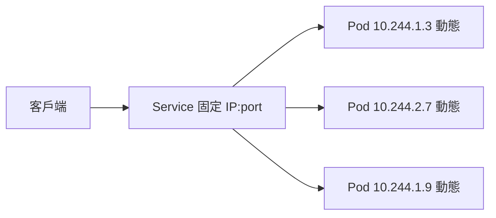
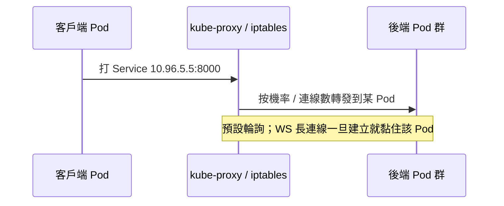

# 10.1 Service 模型：ClusterIP、NodePort、LoadBalancer

Ingress 之前，先把 Kubernetes 三種 Service 模型一次搞懂：它們解決的是「Pod 會死、IP 會變，客戶端要打哪裡」的問題。

## 核心抽象：穩定的虛擬 IP



Pod 重建 IP 就變，Service 用 label selector 維護一份動態 Endpoints 清單，對外永遠同一個入口。

| 類型 | 可達範圍 | 實作 | 本書用途 |
|---|---|---|---|
| ClusterIP | 僅叢集內 | kube-proxy 虛擬 IP | 預設：Backend、SSR、SPA、DB 全用它 |
| NodePort | 叢集外經 `節點IP:30000+` | 每節點開同一個高位埠轉 ClusterIP | 除錯、Kind 無 Ingress 時的逃生門 |
| LoadBalancer | 叢集外經雲端 LB | 雲供應商配公網 LB 指回 NodePort | 正式環境；Kind 不支援（需 MetalLB） |

```yaml
apiVersion: v1
kind: Service
metadata:
  name: ws-backend
spec:
  type: ClusterIP        # 預設值，可省略
  selector: { app: ws-backend }
  ports:
    - port: 8000         # Service 自己的埠
      targetPort: 8000   # Pod 容器的埠
---
apiVersion: v1
kind: Service
metadata:
  name: ws-debug
spec:
  type: NodePort
  selector: { app: ws-backend }
  ports:
    - port: 8000
      targetPort: 8000
      nodePort: 30080    # 30000–32767，需經 worker 節點 IP 進入
```

## kube-proxy 做了什麼



注意：Service 層的負載均衡只在**建連瞬間**生效。WebSocket 握手後 TCP 長駐同一 Pod——這就是 10.2 節要用 sticky session（affinity）的原因，也是 11.2 節 HPA 難做的原因。

## 選擇決策表

| 情境 | 選誰 | 理由 |
|---|---|---|
| Pod 互叫（Backend→Redis） | ClusterIP | 內網最便宜、最安全 |
| 本書對外統一入口 | Ingress + ClusterIP | 一個 80/443 進，按 Host/Path 路由 |
| Kind 無 Ingress 臨時除錯 | NodePort | 不用裝 Controller 也能從外打進 |
| 雲端正式對外 | LoadBalancer 或 Ingress | 需公網 IP 與 TLS 終止 |

```bash
kubectl get svc
kubectl get endpoints ws-backend  # 看 Service 背後實際 Pod IP 清單
kubectl describe svc ws-backend
```

## 本節小結

- Service 是「動態 Pod 群的穩定門面」，三類型差在**可達範圍**。
- 本書一律 ClusterIP 對內，統一由 Ingress 對外；NodePort 只作除錯。
- Service 只均衡**建連瞬間**，WS 長連線的黏性問題留給 Ingress affinity。

## 想一想

1. Pod 重建後 IP 變了，正在連線的客戶端會怎樣？Service 能幫上忙嗎？
2. NodePort 的埠範圍為何限在 30000–32767？這帶來什麼使用限制？
3. 在 Kind 裡建 LoadBalancer 類型會發生什麼？為什麼需要 MetalLB 這類外掛？
