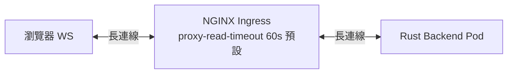

# 10.2 Ingress 超時與 WebSocket 支持（核心節）

這是全書最重要的流量治理節：NGINX Ingress 預設 60 秒無流量就斷代理連線，WebSocket 閒置聊天室會集體斷線。本節給出可直接套用的實戰 YAML。

## 斷線案發現場

症狀：WS 連上後約 60 秒準時 `1006 Abnormal Closure`，短輪詢正常，SSR 頁面正常。原因鏈：



瀏覽器↔Ingress、Ingress↔Pod 是**兩段獨立 TCP**。任一段超時，整條 WS 即斷。預設值：

| 參數 | 預設 | 對 WS 的意義 |
|---|---|---|
| `proxy-connect-timeout` | 5s | 建連握手容忍，WS 可不動 |
| `proxy-send-timeout` | 60s | Ingress→Pod 寫超時，閒置即殺 |
| `proxy-read-timeout` | 60s | Pod→Ingress 讀超時，**主兇** |
| 後端 keepalive | 常被忽略 | 無心跳的閒房必死 |

## NGINX 實戰 YAML：超時 + WS 升級 + 黏性

```yaml
apiVersion: networking.k8s.io/v1
kind: Ingress
metadata:
  name: ws-app
  annotations:
    nginx.ingress.kubernetes.io/proxy-read-timeout: "3600"
    nginx.ingress.kubernetes.io/proxy-send-timeout: "3600"
    nginx.ingress.kubernetes.io/proxy-connect-timeout: "10"
    # WebSocket 升級頭（新版 Controller 內建，但顯式寫出最穩）
    nginx.ingress.kubernetes.io/proxy-http-version: "1.1"
    nginx.ingress.kubernetes.io/configuration-snippet: |
      proxy_set_header Upgrade $http_upgrade;
      proxy_set_header Connection "upgrade";
    # 多副本 WS 必備：同一客戶端黏同一 Pod（見 11.2 討論）
    nginx.ingress.kubernetes.io/affinity: "cookie"
    nginx.ingress.kubernetes.io/session-cookie-name: "ws-route"
    nginx.ingress.kubernetes.io/session-cookie-expires: "3600"
    nginx.ingress.kubernetes.io/session-cookie-max-age: "3600"
spec:
  ingressClassName: nginx
  rules:
    - host: ws.local
      http:
        paths:
          - path: /ws
            pathType: Prefix
            backend:
              service: { name: ws-backend, port: { number: 8000 } }
          - path: /
            pathType: Prefix
            backend:
              service: { name: spa, port: { number: 80 } }
```

驗證三步：

```bash
kubectl describe ingress ws-app
# 用 wscat 掛 90 秒不發話，應不斷
npx wscat -c ws://ws.local:8080/ws --header "Host: ws.local"
kubectl logs -n ingress-nginx deploy/ingress-nginx-controller | grep -i timeout
```

## Envoy（Istio / Contour）對照：idle_timeout

若用 Envoy 系閘道，對應旋鈕是 `idle_timeout`（預設 1h 但常被 Helm chart 改小）與 `stream_idle_timeout`：

```yaml
# 以 Istio VirtualService + EnvoyFilter 概念示意
apiVersion: networking.istio.io/v1beta1
kind: VirtualService
metadata:
  name: ws-route
spec:
  hosts: ["ws.local"]
  http:
    - match: [{ uri: { prefix: /ws } }]
      timeout: 0s              # 0 = 永不因路由超時斷流
      route:
        - destination: { host: ws-backend }
---
# Envoy 原生：HTTP 連線管理器
# http_connection_manager:
#   stream_idle_timeout: 0s    # WS 隧道要關掉空閒斷流
#   idle_timeout: 3600s
```

| 閘道 | 旋鈕 | 建議值 | 備註 |
|---|---|---|---|
| NGINX Ingress | proxy-read/send-timeout | 3600s | 本書預設方案 |
| Envoy / Istio | stream_idle_timeout | 0s（關閉） | 隧道型 WS 專用 |
| 應用層心跳 | ping/pong 25–30s | 見 7.1 | 即使超時調大也要有 |

> 治本組合：**閘道超時調大 + 應用層 ping/pong（7.1 節）+ 多副本 affinity**。只調大超時不加心跳，中間 NAT 仍會靜默丟連線。

## 本節小結

- 60 秒斷線主兇是 `proxy-read/send-timeout` 預設，WS 閒房首當其衝。
- NGINX 解法：超時調 3600s + 顯式 Upgrade 頭 + cookie affinity。
- Envoy 解法：`stream_idle_timeout: 0s`；任何閘道都要配應用層心跳才算治本。

## 想一想

1. 為何調大超時後仍建議 25 秒 ping 一次？NAT 與 LB 的空閒回收如何思考？
2. cookie affinity 解決了什麼問題，又帶來什麼擴縮容代價（呼應 11.2）？
3. 若 `/ws` 與 `/` 共用一個 Ingress，超時註解會誤傷短請求嗎？如何拆分？
