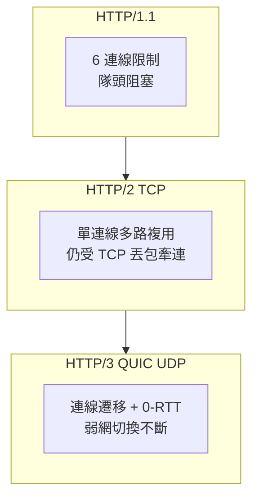
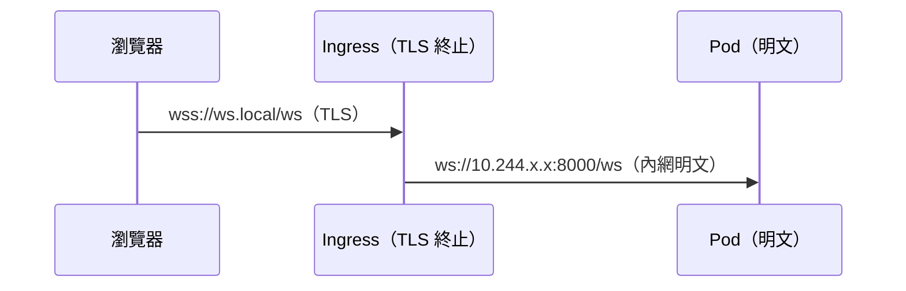

# 10.3 CORS、HTTP/2 與 HTTP/3 QUIC 實踐

流量進了 Ingress，還有三道現代 Web 門檻：跨域（CORS）、多路複用（h2）、與 UDP 新貴（h3/QUIC）。本節把它們與 `wss` 的關係一次釐清。

## CORS：誰該負責擋

瀏覽器同源政策擋的是 **fetch/XHR**，由後端回 `Access-Control-Allow-Origin` 放行；WebSocket 握手雖是 HTTP Upgrade，但**不受 CORS 預檢約束**（要靠後端自行驗 `Origin`）。

| 情境 | 機制 | 配置位置 |
|---|---|---|
| SPA `fetch(api.local)` | CORS 預檢 OPTIONS | Rust 後端或 Ingress annotation |
| WS `new WebSocket()` | 無預檢，後端驗 Origin | axum `Origin` 檢查中介層 |
| SSR 同源代理 | 無跨域（server 端轉發） | SSR server 內 `API_BASE` 直連 ClusterIP |

```yaml
# 若選 Ingress 統一加 CORS（簡單場景）
apiVersion: networking.k8s.io/v1
kind: Ingress
metadata:
  name: api
  annotations:
    nginx.ingress.kubernetes.io/enable-cors: "true"
    nginx.ingress.kubernetes.io/cors-allow-origin: "https://spa.local"
    nginx.ingress.kubernetes.io/cors-allow-methods: "GET, POST, OPTIONS"
    nginx.ingress.kubernetes.io/cors-allow-credentials: "true"
spec:
  ingressClassName: nginx
  rules:
    - host: api.local
      http:
        paths:
          - path: /
            pathType: Prefix
            backend:
              service: { name: ws-backend, port: { number: 8000 } }
```

Rust 端 Origin 自驗概念（tower 中介層）：只允許 `https://spa.local`、`https://ws.local` 發起 `/ws` 升級。

## HTTP/2 與 HTTP/3 QUIC



| 版本 | 傳輸 | 對本書的意義 |
|---|---|---|
| h1 | TCP | WS 跑在 h1 Upgrade 上，最成熟 |
| h2 | TCP 多路複用 | SSR 大量小資源加速；**h2 不直接載 WS**（RFC 8441 擴展少見） |
| h3/QUIC | UDP | 行動弱網體驗好；Ingress 需開 UDP 443，Kind 實驗可先關 |

NGINX Ingress 開 h2 很簡單（預設多半已開），h3 則需額外 UDP 映射——Kind 實驗建議先掌握 h2 即可：

```yaml
# kind worker 追加工 UDP 映射（h3 用，選配）
# extraPortMappings:
#   - containerPort: 443
#     hostPort: 8443
#     protocol: UDP
```

## wss 與 TLS 的關係

| 問題 | 答案 |
|---|---|
| `ws://` vs `wss://` | 差在有無 TLS；`wss` = WS over TLS，預設 443 |
| TLS 在哪終止 | 本書在 Ingress 終止，Ingress→Pod 走明文 ClusterIP |
| h2/h3 需要 TLS 嗎 | 瀏覽器實作上 h2/h3 幾乎強制 TLS（h2c 除外） |
| 證書 | Kind 用自簽或 mkcert；正式用 cert-manager + Let's Encrypt |



## 本節小結

- CORS 管 fetch，不直接管 WS；WS 安全靠後端驗 `Origin`。
- SSR 吃 h2 紅利最大；WS 主流仍跑 h1 Upgrade；h3/QUIC 是弱網未來。
- `wss` 即 TLS 上的 WS，本書在 Ingress 終止 TLS，內網保持明文高效。

## 想一想

1. 為何 WebSocket 握手沒有 CORS 預檢？這是安全漏洞嗎？後端該怎麼補？
2. 你的 SSR 頁面有 50 個小資源，h2 相對 h1 快在哪裡？
3. 在 Kind 裡開 h3 需要動哪幾層（worker UDP 映射、Controller 參數、瀏覽器）？
