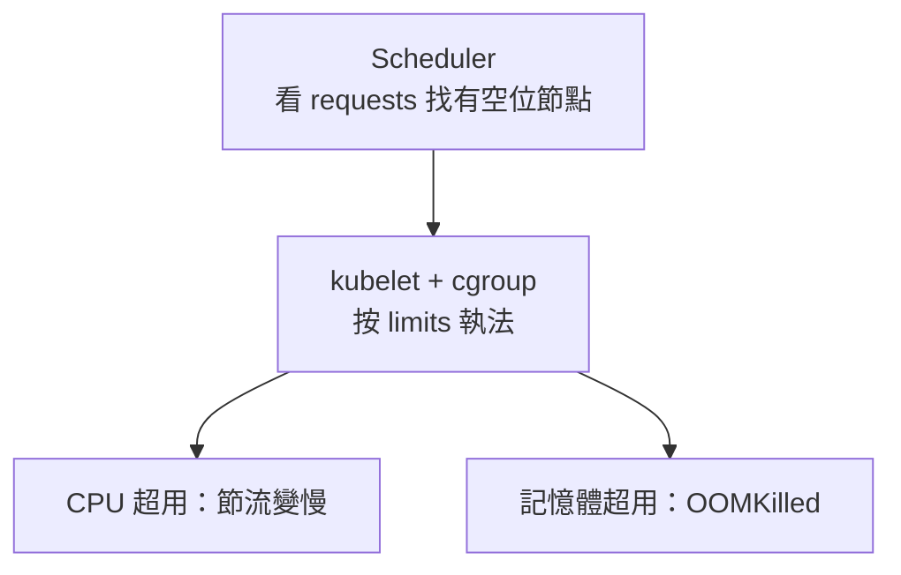

# 11.1 Requests / Limits 與 QoS：別讓 SSR 吃掉整台 Worker

資源不設限的叢集，就是第一個爆記憶體的 Pod 拖全機下水的叢集。本節講 `requests/limits` 與 QoS，並警告 SSR 的高記憶體特性。

## requests vs limits

| 欄位 | 語義 | 排程用 | 超用後果 |
|---|---|---|---|
| `requests` | 保證額度，排程依據 | 是 | — |
| `limits` | 上限，cgroup 硬牆 | 否 | CPU 被節流；記憶體超用被 OOMKilled |

```yaml
resources:
  requests: { cpu: "250m", memory: "512Mi" }
  limits: { cpu: "1000m", memory: "1Gi" }
```

- CPU 是**可壓縮資源**：超用只變慢（throttle）。
- 記憶體是**不可壓縮資源**：超用直接殺進程，毫無商量。



## QoS 三等級

| QoS | 條件 | 記憶體壓力時誰先死 |
|---|---|---|
| Guaranteed | 每容器 request == limit（含全設） | 最後死 |
| Burstable | 部分設、或 request < limit | 中間 |
| BestEffort | 全不設 | 第一個死 |

```bash
kubectl describe pod ssr-frontend-xxx | grep -A 3 QoS
kubectl top pods  # 需 metrics-server，Kind 可另裝
```

本書建議：**Backend/SSR 一律 Burstable 起跳並給 memory limit；DB 給 Guaranteed；BestEffort 只留給一次性 Job**。

## SSR 高記憶體配額警示表

Node SSR 每請求都在 heap 裡渲染整頁，以下是本書實驗建議（Kind 單 worker 約 4GB 可用）：

| 應用 | requests | limits | 警示 |
|---|---|---|---|
| Rust Backend | cpu 100m / mem 128Mi | cpu 500m / mem 256Mi | 靜態二進位，極省 |
| SPA nginx | cpu 50m / mem 64Mi | cpu 200m / mem 128Mi | 純靜態 floor 價 |
| SSR Node ⚠️ | cpu 250m / mem 512Mi | cpu 1000m / mem 1Gi | 高併發渲染易膨脹，**limit 必設** |
| PostgreSQL | cpu 250m / mem 512Mi | 同 request（Guaranteed） | 避免被鄰居擠死 |
| Redis | cpu 100m / mem 256Mi | cpu 500m / mem 512Mi | maxmemory 另在 redis.conf 限 |

> 真實事故：SSR 未設 limit，某慢查詢頁把 heap 撐到 3GB，worker 記憶體耗盡，kubelet 連殺 Backend 與 CoreDNS——整叢集陪葬。設 limit 讓它只死自己，重啟即恢復。

## OOMKilled 診斷三步

```bash
kubectl describe pod ssr-frontend-xxx | grep -i -A 2 oom
kubectl get events --sort-by=.lastTimestamp | grep -i oom
kubectl top pods  # 對照 requests 看誰是兇手
```

| 訊號 | 含義 | 下一步 |
|---|---|---|
| exit 137 + OOMKilled | 超過 memory limit | 先查 heap / 慢頁，再考慮調大 limit |
| Evicted + 記憶體壓力 | 節點被擠爆，QoS 低者先死 | 補 requests/limits，把關鍵服務升 Guaranteed |
| CPUThrottle 高 | CPU 被節流 | 放寬 cpu limit 或加副本分攤 |

```yaml
# 除錯期暫時放寬並加探針（找到 leak 後記得收回）
resources:
  requests: { memory: "512Mi", cpu: "250m" }
  limits: { memory: "2Gi", cpu: "1000m" }
env:
  - name: NODE_OPTIONS
    value: "--max-old-space-size=1536"
```

## 本節小結

- `requests` 決定排到哪，`limits` 決定怎麼死；記憶體超用即 OOMKilled。
- QoS 決定驅逐順序：重要服務要 Guaranteed/Burstable，拒絕 BestEffort 上正式。
- SSR Node 是記憶體大戶，limit 是保命符，不是選配。

## 想一想

1. CPU 超用與記憶體超用的後果有何本質不同？為什麼這樣設計？
2. 你的 SSR Pod 一直 `OOMKilled`（exit 137），你會先調大 limit 還是先查 leak？依據是什麼？
3. 為何建議資料庫用 Guaranteed？它被驅逐與 Web 被驅逐的代價差在哪？
