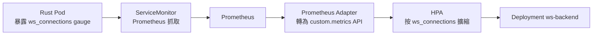

# 11.2 WebSocket 擴縮容瓶頸：基於 Active 連線數的 Custom Metrics HPA

WebSocket 是長連線：連上後 CPU 幾乎為零、記憶體只多幾 KB。預設 CPU/Memory HPA 對它完全無感——10k 閒置連線與 100 條活躍連線看起來一樣「閒」。本節改用連線數擴縮。

## 為何 CPU/Memory HPA 失靈

| 指標 | WS 閒置房行為 | 結果 |
|---|---|---|
| CPU | 0–5%，無訊息就不動 | 永遠不觸發擴容，真爆時已來不及 |
| Memory | 每連線數 KB 緩增 | 閾值難設，設低誤殺、設高不動 |
| **Active 連線數** | 線性反映負載真相 | **正確訊號**，每 Pod 上限如 2k 即擴 |



## Rust 暴露 gauge（概念碼）

用 `prometheus` crate 註冊一個 Gauge，握手成功 `inc()`、斷開 `dec()`：

```rust
use prometheus::{register_int_gauge, IntGauge};
use std::sync::LazyLock;

static WS_CONNECTIONS: LazyLock<IntGauge> =
    LazyLock::new(|| register_int_gauge!(
        "ws_connections", "current active websocket connections"
    ).unwrap());

// axum WS 升級成功後：
// WS_CONNECTIONS.inc();
// 連線結束（Drop / close 幀）：
// WS_CONNECTIONS.dec();

/// 給 Prometheus 抓的端點，與業務埠分開最乾淨
async fn metrics_handler() -> String {
    use prometheus::Encoder;
    let encoder = prometheus::TextEncoder::new();
    let families = prometheus::gather();
    let mut buf = Vec::new();
    encoder.encode(&families, &mut buf).unwrap();
    String::from_utf8(buf).unwrap()
}
```

```yaml
# ServiceMonitor：告訴 Prometheus 去抓 /metrics
apiVersion: monitoring.coreos.com/v1
kind: ServiceMonitor
metadata:
  name: ws-backend
spec:
  selector:
    matchLabels: { app: ws-backend }
  endpoints:
    - port: metrics   # Service 需另開 9090 埠名 metrics
      path: /metrics
      interval: 15s
```

## HPA YAML 骨架（custom metrics）

```yaml
apiVersion: autoscaling/v2
kind: HorizontalPodAutoscaler
metadata:
  name: ws-backend
spec:
  scaleTargetRef:
    apiVersion: apps/v1
    kind: Deployment
    name: ws-backend
  minReplicas: 2
  maxReplicas: 10
  metrics:
    - type: Pods
      pods:
        metric:
          name: ws_connections   # 經 Adapter 暴露的自訂指標
        target:
          type: AverageValue
          averageValue: "1500"   # 每 Pod 平均 1500 連線即擴
  behavior:
    scaleDown:
      stabilizationWindowSeconds: 300  # WS 縮容要慢，避免抖動踢人
```

| 參數 | 建議 | 理由 |
|---|---|---|
| target 1500–2000/Pod | 壓測定（見下） | 留 headroom 給突發與滾動 |
| scaleDown 穩定窗 300s | 保守 | 縮容即斷連（除非 11.3 遷移），寧慢勿快 |
| 仍保留 CPU HPA 並列 | 可選 | 防「連線少但訊息洪峰」的廣播風暴 |

壓測定目標：用 k6 / locust 灌 WS，觀察單 Pod 在 P99 延遲惡化前的連線數，打 7 折即 target。

## 本節小結

- WS 長連線讓 CPU/Memory HPA 失明，**Active 連線數才是真相**。
- 鏈路：Rust gauge → ServiceMonitor → Prometheus → Adapter → HPA。
- 縮容要保守（300s 穩定窗），目標值用壓測打折取得。

## 想一想

1. 一個 Pod 掛著 5k 閒置連線但 CPU 2%，HPA 該擴嗎？為什麼？
2. `ws_connections` 用 Gauge 而非 Counter 的理由是什麼？斷線沒 `dec()` 會怎樣？
3. 縮容刪除 Pod 時，既有連線會怎樣？這與 11.3 節有何關聯？
