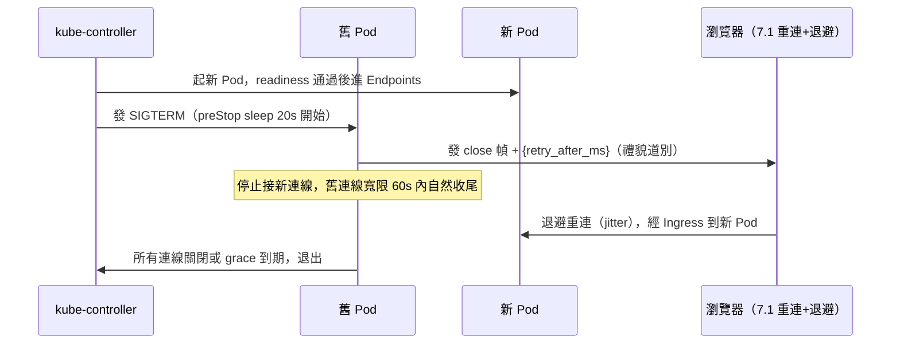

# 11.3 Rolling Update 與長連線平滑遷移

Deployment 預設滾動更新對短請求無感，對 WebSocket 卻是「逐個殺連線」。本節讓更新殺人不眨眼變成優雅交接。

## 滾動參數：一次換多少

```yaml
apiVersion: apps/v1
kind: Deployment
metadata:
  name: ws-backend
spec:
  replicas: 3
  strategy:
    type: RollingUpdate
    rollingUpdate:
      maxSurge: 1          # 最多比期望多 1 個（先起新再殺舊）
      maxUnavailable: 0    # 更新期間一個都不能少（WS 必備）
  template:
    spec:
      terminationGracePeriodSeconds: 60  # 給舊 Pod 60 秒送別
      containers:
        - name: backend
          image: rust-ws-backend:v2
          ports:
            - containerPort: 8000
          readinessProbe:    # 新 Pod 真能接 WS 才進 Service
            httpGet: { path: /healthz, port: 8000 }
            periodSeconds: 5
          lifecycle:
            preStop:
              exec:
                command: ["/bin/sh", "-c", "sleep 20"]  # 先等 20s，讓 Ingress 摘掉自己
```

| 參數 | 值 | 作用 |
|---|---|---|
| maxSurge 1 | 先起後殺 | 舊連線有地方去 |
| maxUnavailable 0 | 零中斷 | 任何時刻容量不縮水 |
| preStop sleep 20 | 延遲 SIGTERM 後的自殺 | 等 Endpoints 摘除 + 通知客戶端 |
| grace 60s | 送別上限 | 超時即 SIGKILL，不可無限 |

## 完整遷移時序（配合 7.1 重連）



Rust 舊 Pod 收到 SIGTERM 後的三件事（tokio signal）：

```rust
// 概念：axum 優雅關機骨架
// 1. 停止 listener 接新連線
// 2. 對既有 WS 發 close 幀（帶上重連提示）
// 3. tokio::select! 等待全關或 50s 超時後強制結束
```

```bash
kubectl rollout status deploy/ws-backend
kubectl rollout history deploy/ws-backend
kubectl rollout undo deploy/ws-backend --to-revision=1  # 出事回滾
```

## 上線檢查清單

| 檢查 | 方法 |
|---|---|
| 更新期間零失敗 | k6 掛 500 條 WS 做 rolling，看 1006 數是否≈0（應為禮貌 close + 秒級重連） |
| 舊 Pod 真的等了 | `kubectl get events` 看 Killing 時間差 ≈ preStop + draining |
| 新版 Readiness 有效 | 故意推壞映像 `:bad`，看 rollout 是否卡住而非全滅 |
| 回滾演練 | 每月做一次 `rollout undo`，確認 run-book 可用 |

## 本節小結

- WS 的滾動更新要 `maxUnavailable: 0` + `preStop sleep` + `grace 60s` 三件套。
- 舊 Pod 要主動發 close 禮貌道別，客戶端靠 7.1 重連秒回新 Pod。
- 沒演練過回滾的更新策略，等於沒有策略。

## 想一想

1. `maxUnavailable: 0` 配 `maxSurge: 0` 會怎樣？滾動還動得起來嗎？
2. preStop 的 sleep 若比 Ingress 摘除 Endpoints 還短，會發生什麼 race？
3. 客戶端沒有 7.1 重連機制時，服務端再優雅又如何？誰是真正的最後一哩？
