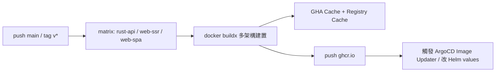

# 12.1 GitHub Actions 自動建置 Rust 與多前端鏡像並推送至 Registry

## 從一個問題開始

全端專案有三種產物：Rust 後端、SSR 前端、SPA/MPA 前端。每次手動 `docker build && docker push`，遲早會推錯 tag、漏架構、忘記加速。本節用一條 GitHub Actions（GHA）管線一次解決。

## 鏡像矩陣（Matrix）設計

| 產物 | Context | Dockerfile | 產出鏡像 |
|---|---|---|---|
| `rust-api` | `./backend` | `Dockerfile.backend` | `ghcr.io/<org>/rust-api` |
| `web-ssr` | `./frontend-ssr` | `Dockerfile.ssr` | `ghcr.io/<org>/web-ssr` |
| `web-spa` | `./frontend-spa` | `Dockerfile.spa` | `ghcr.io/<org>/web-spa` |



## Tag 策略

| 事件 | Tag | 用途 |
|---|---|---|
| `push main` | `edge`、`sha-<short>` | 開發驗證、ArgoCD 追蹤 |
| `tag v1.2.3` | `v1.2.3`、`v1.2`、`v1`、`latest` | 正式發版、回滾錨點 |
| PR | 不 push，只 build（或推 `pr-<num>` 到測試 Registry） | 避免污染正式鏡像 |

## 完整 workflow 骨架

```yaml
# .github/workflows/build-push.yml
name: build-push
on:
  push:
    branches: [main]
    tags: ['v*.*.*']
  pull_request:

env:
  REGISTRY: ghcr.io
  ORG: myorg

jobs:
  build:
    runs-on: ubuntu-latest
    permissions:
      contents: read
      packages: write
    strategy:
      fail-fast: false
      matrix:
        include:
          - name: rust-api
            context: ./backend
            dockerfile: ./backend/Dockerfile.backend
            image: ghcr.io/myorg/rust-api
          - name: web-ssr
            context: ./frontend-ssr
            dockerfile: ./frontend-ssr/Dockerfile.ssr
            image: ghcr.io/myorg/web-ssr
          - name: web-spa
            context: ./frontend-spa
            dockerfile: ./frontend-spa/Dockerfile.spa
            image: ghcr.io/myorg/web-spa
    steps:
      - uses: actions/checkout@v4

      - name: Set up QEMU
        uses: docker/setup-qemu-action@v3

      - name: Set up Buildx
        uses: docker/setup-buildx-action@v3

      - name: Login Registry
        if: github.event_name != 'pull_request'
        uses: docker/login-action@v3
        with:
          registry: ghcr.io
          username: ${{ github.actor }}
          password: ${{ secrets.GITHUB_TOKEN }}

      - name: Docker metadata（tag 策略）
        id: meta
        uses: docker/metadata-action@v5
        with:
          images: ${{ matrix.image }}
          tags: |
            type=edge,branch=main
            type=sha,prefix=sha-
            type=semver,pattern={{version}}
            type=semver,pattern={{major}}.{{minor}}
            type=semver,pattern={{major}}

      - name: Build and push
        uses: docker/build-push-action@v6
        with:
          context: ${{ matrix.context }}
          file: ${{ matrix.dockerfile }}
          platforms: linux/amd64,linux/arm64
          push: ${{ github.event_name != 'pull_request' }}
          tags: ${{ steps.meta.outputs.tags }}
          labels: ${{ steps.meta.outputs.labels }}
          cache-from: type=gha
          cache-to: type=gha,mode=max
          build-args: |
            CARGO_PROFILE=release
```

## Rust 鏡像加速關鍵

```dockerfile
# backend/Dockerfile.backend（多階段骨架）
FROM rust:1.80-slim AS chef
RUN cargo install cargo-chef
WORKDIR /app
FROM chef AS planner
COPY . .
RUN cargo chef prepare --recipe-path recipe.json
FROM chef AS builder
COPY --from=planner /app/recipe.json recipe.json
RUN cargo chef cook --release --recipe-path recipe.json
COPY . .
RUN cargo build --release
FROM debian:bookworm-slim
COPY --from=builder /app/target/release/api /usr/local/bin/api
CMD ["api"]
```

> 要點：`cargo-chef` 分層快取依賴；GHA 上再疊 `cache-from/to: type=gha`；WS/SSR 專案另加 `--target` 快取卷在本機加速。

## 本章小結

- 一條 workflow 用 `matrix` 同時建 `rust-api` / `web-ssr` / `web-spa` 三鏡像
- Tag 策略區分 `edge`、`sha-`、`semver`，PR 只建不推
- `buildx + QEMU` 做多架構，`type=gha` 做層快取，Rust 側用 `cargo-chef` 拆依賴層

## 想一想

1. 為什麼 PR 預設只 build 不 push？若要預覽環境，該推到哪裡、怎麼清理？
2. `edge` 與 `sha-<short>` 各適合 ArgoCD 的哪種同步策略？
3. Rust 依賴層很少變、業務碼常變，Dockerfile 層順序該怎麼排才能最大化快取命中？
