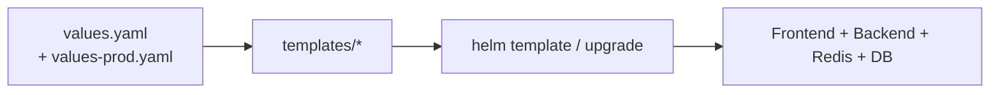

# 12.2 Helm 模組化打包全端：Frontend + Backend + Redis + DB

## 從一個問題開始

`kubectl apply -f` 丟出十幾個 YAML 之後，第二個環境（staging）要改域名、副本數、DB 密碼，難道再複製一份？Helm 把「模板 + 值」分開，一份 chart 部署多環境。

## Chart 結構

```text
fullstack/
  Chart.yaml
  values.yaml            # 預設值（dev）
  values-staging.yaml    # staging 覆寫
  values-prod.yaml       # prod 覆寫
  charts/                # 子 chart（redis、postgres 可用 Bitnami）
  templates/
    frontend-deploy.yaml
    frontend-svc.yaml
    backend-deploy.yaml
    backend-svc.yaml
    ingress.yaml
    _helpers.tpl
```

```yaml
# Chart.yaml 骨架
apiVersion: v2
name: fullstack
version: 0.1.0
dependencies:
  - name: redis
    version: 19.x.x
    repository: https://charts.bitnami.com/bitnami
    condition: redis.enabled
  - name: postgresql
    version: 15.x.x
    repository: https://charts.bitnami.com/bitnami
    condition: postgresql.enabled
```

## values.yaml 骨架

```yaml
global:
  registry: ghcr.io/myorg
  tag: edge

frontend:
  replicaCount: 2
  image: web-ssr
  service:
    port: 3000

backend:
  replicaCount: 2
  image: rust-api
  env:
    DATABASE_URL: postgres://app@app-postgres:5432/app
    REDIS_URL: redis://app-redis-master:6379/0
    WS_PUBLIC_ORIGIN: https://app.example.com

redis:
  enabled: true
postgresql:
  enabled: true
  auth:
    database: app

ingress:
  enabled: true
  host: app.example.com
  # /api + /ws 導向 backend，/ 導向 frontend（SSR/SPA）
```

```yaml
# templates/backend-deploy.yaml（節錄）
apiVersion: apps/v1
kind: Deployment
metadata:
  name: {{ .Release.Name }}-backend
spec:
  replicas: {{ .Values.backend.replicaCount }}
  template:
    spec:
      containers:
        - name: api
          image: "{{ .Values.global.registry }}/{{ .Values.backend.image }}:{{ .Values.global.tag }}"
          env:
            - name: DATABASE_URL
              value: {{ .Values.backend.env.DATABASE_URL | quote }}
```

## 常用指令表

| 目的 | 指令 |
|---|---|
| 安裝 dev | `helm install app ./fullstack` |
| 升級 prod | `helm upgrade app ./fullstack -f values-prod.yaml --set global.tag=v1.2.3` |
| 只渲染看結果 | `helm template app ./fullstack -f values-staging.yaml` |
| 回滾上一版 | `helm rollback app 1` |
| 看發版歷史 | `helm history app` |
| 打包依賴 | `helm dependency update ./fullstack` |



## 本章小結

- 一個 chart 同時管 Frontend、Backend，並以 `condition` 開關 Redis/DB 子 chart
- 環境差異只放在 `values-<env>.yaml` 與 `--set global.tag`，模板不分叉
- `helm template` 先看渲染結果，再 `upgrade`；出事用 `rollback`

## 想一想

1. DB 密碼該放在 values.yaml 明文，還是改用 External Secrets / Sealed Secrets？為什麼？
2. SSR 需要 `WS_PUBLIC_ORIGIN`，SPA 需要 `VITE_API_BASE`，這類建置期 vs 執行期變數在 Helm 裡該怎麼區分？
3. 什麼情況下該把 frontend/backend 拆成兩個獨立 chart，而不是一個 fullstack chart？
