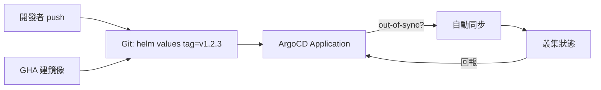

# 12.3 ArgoCD GitOps 自動同步

## 從一個問題開始

12.1 建好鏡像、12.2 打包好 Helm 之後，誰把「新版」送上叢集？GitOps 的答案是：**Git 是唯一事實來源**，ArgoCD 持續比對 Git 與叢集，不一致就自動同步。

## 核心迴圈



| 角色 | 做什麼 | 不做什麼 |
|---|---|---|
| GHA | 建鏡像、更新 Git 上的 tag | 不直接 `kubectl apply` |
| Git | 保存期望狀態（含 Helm values） | 不執行 |
| ArgoCD | 監看 Git、同步到叢集 | 不建鏡像 |

## Application YAML 骨架

```yaml
# argocd/app-fullstack.yaml
apiVersion: argoproj.io/v1alpha1
kind: Application
metadata:
  name: fullstack-prod
  namespace: argocd
spec:
  project: default
  source:
    repoURL: https://github.com/myorg/gitops.git
    targetRevision: HEAD
    path: envs/prod/fullstack
    helm:
      valueFiles:
        - values-prod.yaml
  destination:
    server: https://kubernetes.default.svc
    namespace: prod
  syncPolicy:
    automated:
      prune: true      # Git 刪掉的資源自動刪除
      selfHeal: true    # 手動 kubectl 改壞自動修回
    syncOptions:
      - CreateNamespace=true
```

```yaml
# envs/prod/fullstack/values-prod.yaml（GitOps 倉庫）
global:
  tag: v1.2.3   # GHA 發版後由 Image Updater 或 PR 更新此行
```

## 目錄式 vs Image Updater

| 策略 | 做法 | 適合 |
|---|---|---|
| Git PR 更新 tag | GHA 開 PR 改 `global.tag`，審核後合併 | 正式環境、可審計 |
| Image Updater 自動改 | ArgoCD Image Updater 偵測 Registry 新 tag 自動寫回 Git | staging、`edge` 追蹤 |

## 本章小結

- 期望狀態只寫在 Git，ArgoCD 負責把叢集「拉回」一致
- `prune + selfHeal` 是 GitOps 的靈魂：刪了會清、改壞會修
- prod 用 PR 審核改 tag，staging 可用 Image Updater 追 `edge`

## 想一想

1. 如果有人緊急 `kubectl scale` 救火，`selfHeal: true` 會發生什麼事？該怎麼設計例外流程？
2. 同一個 chart 要部署 dev/staging/prod，該用一個 Application 加多 values，還是三個 Application？
3. WebSocket 長連線的 Pod 在同步時被重建，使用者會斷線，如何搭配滾動策略減少影響？
