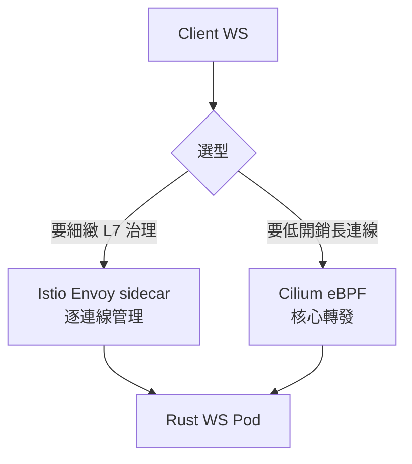

# 13.1 Istio / Cilium 在微服務 + 長連線下的選型

## 從一個問題開始

HTTP 短連線用什麼網格都差不多，但 WebSocket（WS）一連就是幾小時。選錯網格，閒置連線被砍、升級握手失敗、延遲抖動，深夜就會收到告警。

## 兩條路線

| 面向 | Istio（Sidecar） | Cilium（eBPF） |
|---|---|---|
| 機制 | 每 Pod 注入 Envoy sidecar，L7 逐包處理 | eBPF 在核心層轉發，少一跳 userspace |
| L7 能力 | 最完整：VirtualService、熔斷、重試、JWT | 近年補上 L7（Envoy + Gateway API），但生態較新 |
| WS 支援 | 成熟，需正確設 `idleTimeout` 與 upgrade | 轉發開銷小，長連線抖動低 |
| 資源開銷 | 每 Pod 多 ~50–100MB 記憶體 + CPU | 節點級 agent，均攤開銷 |
| 維運心智 | CRD 豐富但複雜（VirtualService/DestinationRule） | 與 CNI 合一，網路政策統一管理 |
| 適用 | 需要細緻 L7 治理、多叢集、mTLS 全面落地 | 追求效能、長連線量大、已用 Cilium CNI |

## WS 長連線影響對照表

| WS 生命週期 | Istio 注意點 | Cilium 注意點 |
|---|---|---|
| 握手 `Upgrade: websocket` | VirtualService 必須允許 upgrade，不可重試 `retries` | 確認 L7 policy 放行 101 Switching Protocols |
| 閒置心跳 | Envoy `idleTimeout` 預設 1h，心跳間隔須小於它（見 13.2） | conntrack/Policy idle 超時同樣要大於心跳間隔 |
| 斷線重連 | DestinationRule 開 outlierDetection 踢掉壞 Pod | eBPF LB 保持會話親和性（maglev/consistent hash） |
| 大量連線 | sidecar 記憶體隨連線數線性成長，先壓測 | 核心轉發省記憶體，但觀察 Hubble 可見性設定 |

## 選型建議

- **SSR/MPA + 標準微服務**：先用 Istio，文件與範例最多。
- **WS 密集（聊天、協作、遊戲）**：評估 Cilium，或 Istio + 調大超時 + 親和性。
- **兩者並存**：Cilium 做 CNI + Istio ambient（無 sidecar）是 2024 後的主流折衷。

## 本章小結

- 短連線看功能，長連線看**超時、開銷、抖動**
- Istio 勝在 L7 生態，Cilium 勝在 eBPF 效能
- 無論選誰，先對齊「心跳間隔 < 閒置超時」這條鐵律

## 想一想

1. 你的 WS 心跳是 30 秒，Envoy idleTimeout 設 60 秒安全嗎？還要考慮哪些抖動？
2. sidecar 記憶體隨連線數成長，如何設計 HPA：按 CPU 還是按連線數？
3. 什麼訊號出現時，你會從「純 Istio」遷移到「Cilium + ambient」？
