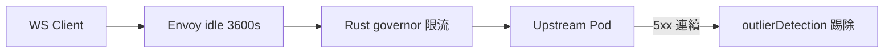

# 13.2 mTLS 加密與 WebSocket 流量治理：熔斷與限流

## 從一個問題開始

Pod 間明文傳 WS 訊息，被嗅探就是明文聊天室。開了 mTLS 又發現 WS 閒置被 Envoy 砍斷。本節一次處理：加密 + 熔斷 + 限流 + 超時地雷。

## mTLS：PeerAuthentication

```yaml
# 全命名空間強制 mTLS（STRICT）
apiVersion: security.istio.io/v1beta1
kind: PeerAuthentication
metadata:
  name: default
  namespace: prod
spec:
  mtls:
    mode: STRICT
---
# WS 入口放行明文（若經外部 LB 終止 TLS）
apiVersion: security.istio.io/v1beta1
kind: PeerAuthentication
metadata:
  name: ws-ingress
  namespace: prod
spec:
  selector:
    matchLabels:
      app: rust-ws
  mtls:
    mode: PERMISSIVE
  portLevelMtls:
    8080:
      mode: STRICT
```

## 熔斷：DestinationRule

```yaml
apiVersion: networking.istio.io/v1beta1
kind: DestinationRule
metadata:
  name: rust-ws
  namespace: prod
spec:
  host: rust-ws
  trafficPolicy:
    connectionPool:
      tcp:
        maxConnections: 1000        # WS 長連線總數上限
      http:
        http1MaxPendingRequests: 500
        maxRequestsPerConnection: 0  # 0 = 長連線不強制回收
    outlierDetection:
      consecutive5xxErrors: 5
      interval: 10s
      baseEjectionTime: 30s
```

> 注意：WS 不要開 `retries`（重試握手會造成重複連線），冪等 REST 才可重試。

## 限流：側車並行 + 網關節流對照

| 層級 | 資源 | 說明 |
|---|---|---|
| Envoy 連線池 | `maxConnections` | 單 Pod WS 上限，超過直接拒絕 |
| Gateway/Ingress | rate limit filter | 按 IP/Token 限握手頻率（如每秒 10 次） |
| Rust 應用層 | governor / tower | 按 user-id 限訊息頻率（如每秒 20 則） |

## EnvoyFilter：idle timeout 地雷

```yaml
# WS 專用：把閒置超時拉到大於心跳間隔 3 倍以上
apiVersion: networking.istio.io/v1alpha3
kind: EnvoyFilter
metadata:
  name: ws-idle
  namespace: prod
spec:
  workloadSelector:
    labels:
      app: rust-ws
  configPatches:
    - applyTo: NETWORK_FILTER
      match:
        listener:
          filterChain:
            filter:
              name: envoy.filters.network.http_connection_manager
      patch:
        operation: MERGE
        value:
          typed_config:
            '@type': type.googleapis.com/envoy.extensions.filters.network.http_connection_manager.v3.HttpConnectionManager
            stream_idle_timeout: 0s        # 0 = 關閉 stream idle（交給應用心跳）
            common_http_protocol_options:
              idle_timeout: 3600s          # 連線級閒置 1h
```



## 本章小結

- `STRICT` 全面 mTLS，WS 入口必要時 `PERMISSIVE` 過渡
- 熔斷看 `maxConnections` + `outlierDetection`，WS 不重試握手
- `idle_timeout` 必須大於心跳間隔，否則長連線被誤殺

## 想一想

1. `maxRequestsPerConnection: 0` 與預設值對 WS 長連線各有什麼影響？
2. 握手限流（Gateway）與訊息限流（Rust governor）為何要分兩層？合一會怎樣？
3. 開 STRICT 後舊客戶端連不上，如何用 PERMISSIVE 做灰階遷移？
