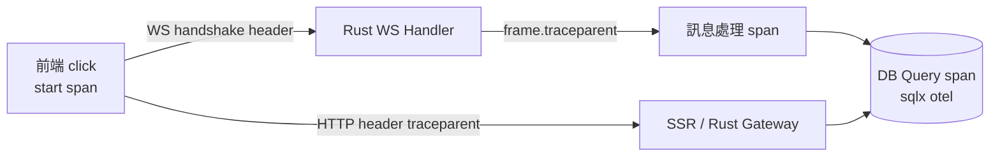

# 13.3 OpenTelemetry 全端追蹤：從前端 HTTP/WS 觸發點到 Rust DB Query

## 從一個問題開始

「前端按鈕轉圈 3 秒，是 SSR 慢、WS 卡、Rust 慢，還是 DB 慢？」沒有全鏈 trace，只能各層各說各話。OTel 把一次點擊變成一條 trace。

## traceparent 經 WebSocket 傳播技巧

HTTP 靠 header 傳 `traceparent`，但 WS 握手之後就沒有 header 了。做法：

| 階段 | 傳播方式 |
|---|---|
| WS 握手 | 照常帶 `traceparent` header（標準 W3C） |
| WS 訊息內 | 每個 JSON frame 加 `traceparent` 欄位（應用層透傳） |
| Rust 收到 | 取出 `traceparent`，`extract` 成 parent span |



## 前端程式碼片段

```typescript
// HTTP：自動注入（fetch + OTel Web SDK）
import { trace } from '@opentelemetry/api';
const tracer = trace.getTracer('web');

// WS：握手帶 header 不可行（瀏覽器限制），改走 frame 欄位
const ws = new WebSocket('wss://app.example.com/ws');
ws.onopen = () => {
  const span = tracer.startSpan('ws.send.chat');
  const ctx: Record<string, string> = {};
  // 用 propagator 注入 ctx（此處簡化為手動帶 traceparent）
  ws.send(JSON.stringify({
    type: 'chat', text: 'hi',
    traceparent: ctx['traceparent'] ?? '',
  }));
  span.end();
};
```

## Rust 程式碼片段

```rust
// axum WS handler：從 frame 取出 traceparent 還原父 span
use opentelemetry::propagation::Extractor;
use tracing_opentelemetry::OpenTelemetrySpanExt;

struct FrameExtractor(serde_json::Value);
impl Extractor for FrameExtractor {
    fn get(&self, key: &str) -> Option<&str> {
        self.0.get(key).and_then(|v| v.as_str())
    }
    fn keys(&self) -> Vec<&str> { vec!["traceparent", "tracestate"] }
}

async fn on_ws_frame(text: &str) {
    let v: serde_json::Value = serde_json::from_str(text).unwrap();
    let parent = opentelemetry::global::get_text_map_propagator()
        .extract(&FrameExtractor(v.clone()));
    let span = tracing::info_span!("ws.message", otel.kind = "server");
    span.set_parent(parent);
    let _g = span.enter();
    // ... 業務 + sqlx（啟用 otel feature 自動產生 db span）
    tracing::info!(target: "ws", "handle message");
}
```

```yaml
# OTel Collector 骨架（DaemonSet/Deployment 皆可）
receivers:
  otlp:
    protocols: { grpc: {}, http: {} }
processors: { batch: {} }
exporters:
  otlp:
    endpoint: tempo.monitoring:4317
service:
  pipelines:
    traces: { receivers: [otlp], processors: [batch], exporters: [otlp] }
```

## 本章小結

- HTTP 用 header、WS 用「握手 header + frame 欄位」雙軌傳 `traceparent`
- Rust 側用 `Extractor` 還原 parent，`sqlx` otel 自動補 DB span
- 一條 trace 從前端 click 直達 DB query，慢在哪一目了然

## 想一想

1. 瀏覽器 WebSocket 建構子不能自訂 header，如何在握手階段仍把 trace 傳進去？
2. 高流量 WS 每則訊息都開 span 會爆量，該怎麼取樣（head/tail sampling）？
3. SSR（Node/Deno）與 Rust Gateway 的 span 如何合併成同一條 trace？
