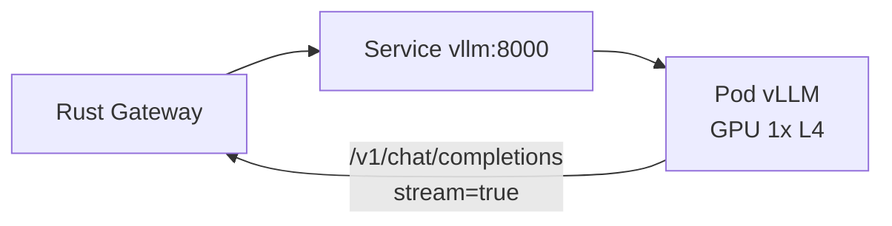

# 14.1 在 Kubernetes 上部署 vLLM 推論服務

## 從一個問題開始

GPU 很貴，vLLM 靠 PagedAttention 與 continuous batching 把吞吐拉滿。但它吃 GPU、吃記憶體、啟動慢，K8s 部署稍有不慎就會 OOMKill 或排不到卡。

## GPU YAML 骨架

```yaml
apiVersion: apps/v1
kind: Deployment
metadata:
  name: vllm-llama
  namespace: llm
spec:
  replicas: 1   # GPU 模型先 1，擴容見下表
  template:
    spec:
      runtimeClassName: nvidia   # 或由 nvidia operator 自動注入
      nodeSelector:
        nvidia.com/gpu.product: NVIDIA-L4
      containers:
        - name: vllm
          image: vllm/vllm-openai:v0.6.0
          args:
            - --model=meta-llama/Meta-Llama-3-8B-Instruct
            - --host=0.0.0.0
            - --port=8000
            - --gpu-memory-utilization=0.90
            - --max-model-len=8192
            - --enforce-eager=false
          ports:
            - containerPort: 8000
          resources:
            limits:
              nvidia.com/gpu: 1
              memory: 32Gi
            requests:
              nvidia.com/gpu: 1
              memory: 32Gi
              cpu: "4"
          readinessProbe:
            httpGet: { path: /health, port: 8000 }
            initialDelaySeconds: 120   # 模型載入慢，別太早殺
            periodSeconds: 10
          livenessProbe:
            httpGet: { path: /health, port: 8000 }
            initialDelaySeconds: 300
            periodSeconds: 30
---
apiVersion: v1
kind: Service
metadata:
  name: vllm
  namespace: llm
spec:
  selector: { app: vllm-llama }
  ports:
    - port: 8000
```



## 關鍵參數表

| 參數 / 欄位 | 建議 | 原因 |
|---|---|---|
| `gpu-memory-utilization 0.9` | 0.85–0.9 | 留給 CUDA context，避免 OOM |
| `max-model-len` | 按 VRAM 試（8B + L4 約 8k） | 越大 KV cache 越吃記憶體 |
| `replicas` | 有幾張卡開幾副本 + Service 輪詢 | vLLM 內已做 batching，HPA 看 queue 而非 CPU |
| 探針延遲 | readiness 120s+、liveness 300s+ | 模型下載 + 載入動輒數分鐘 |
| 模型權重 | 掛 PVC / ModelCache 預熱 | 避免每次重建重拉數十 GB |

## 本章小結

- vLLM Pod = 單 GPU 單副本起步，`requests == limits` 鎖卡
- 探針延遲要容忍模型載入，HPA 看佇列長度而非 CPU
- 權重用 PVC 快取，參數先對齊 VRAM 再調 `max-model-len`

## 想一想

1. 一張 L4 跑 8B 模型 `max-model-len` 從 4k 調到 16k，會發生什麼事？怎麼估算？
2. 為什麼 vLLM 不適合 CPU HPA？該暴露什麼指標給 KEDA？
3. 多副本 vLLM 前面要不要加會話親和？串流長連線與輪詢如何取捨？
