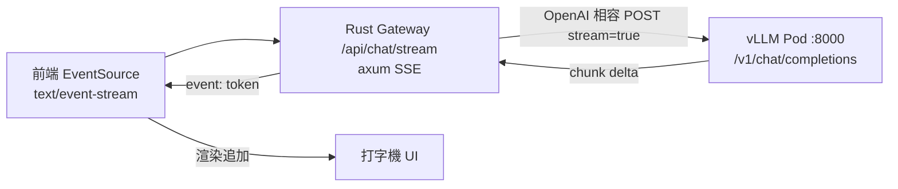

# 14.2 前端 + Rust Gateway SSE 串流 + LLM Pod 架構

## 從一個問題開始

LLM 回覆是逐 token 吐出的。輪詢太笨、WebSocket 太重，**SSE（Server-Sent Events）** 單向串流恰好夠用：前端 `EventSource` 一行接起來，Rust Gateway 只做透傳。

## 架構圖



## SSE 與 WebSocket 選型對照表

| 面向 | SSE | WebSocket |
|---|---|---|
| 方向 | 伺服器 → 客戶端單向 | 雙向 |
| 協定 | 純 HTTP（`text/event-stream`），穿透代理/網格最省事 | 需 `Upgrade` 握手，經 Istio 要特調（見 13.2） |
| 前端 | `EventSource` 內建斷線重連（`Last-Event-ID`） | 需手寫重連、心跳 |
| LLM 串流 | 完美契合（逐 token 下推） | 殺雞用牛刀，除非要雙向打斷 |
| 缺點 | 單向、瀏覽器連線數限制（HTTP/1.1 約 6 條） | 維運複雜度高 |
| 結論 | **LLM token 流首選 SSE** | 聊天室/協作/遊戲才用 WS |

## Rust SSE 轉發骨架

```rust
// backend/src/chat.rs
use axum::{response::Sse, response::sse::Event};
use futures::StreamExt;
use tokio_stream::wrappers::UnboundedReceiverStream;

async fn chat_stream(
    Json(req): Json<ChatReq>,
) -> Sse<impl tokio_stream::Stream<Item = Result<Event, axum::Error>>> {
    let (tx, rx) = tokio::mpsc::unbounded_channel();
    tokio::spawn(async move {
        // 向上游 vLLM 發 stream=true 請求，逐 chunk 轉發
        let mut upstream = reqwest::Client::new()
            .post("http://vllm.llm:8000/v1/chat/completions")
            .json(&serde_json::json!({
                "model": "meta-llama/Meta-Llama-3-8B-Instruct",
                "messages": req.messages,
                "stream": true
            }))
            .send().await.unwrap()
            .bytes_stream();
        while let Some(chunk) = upstream.next().await {
            let text = String::from_utf8_lossy(&chunk.unwrap()).to_string();
            // 解析 SSE delta 後轉發（此處簡化）
            let _ = tx.send(Ok(Event::default().event("token").data(text)));
        }
        let _ = tx.send(Ok(Event::default().event("done").data("[DONE]")));
    });
    Sse::new(UnboundedReceiverStream::new(rx)).keep_alive(Default::default())
}
```

## 前端 EventSource 渲染

```typescript
const es = new EventSource('/api/chat/stream?session=abc');
const box = document.querySelector('#answer')!;
es.addEventListener('token', (e) => {
  box.textContent += (e as MessageEvent).data; // 打字機追加
});
es.addEventListener('done', () => es.close());
es.onerror = () => {
  // EventSource 會自動重連；此處可降級顯示錯誤
};
```

## 本章小結

- LLM 串流首選 **SSE**：單向、自動重連、穿透性好
- Rust Gateway 只做「透傳 + 鑑權 + 限流」，不跑模型
- 前端 `EventSource` 監聽 `token` 逐字渲染，收到 `done` 關閉

## 想一想

1. 使用者想中途「停止生成」，單向 SSE 該怎麼實現？需要 WS 嗎？
2. Gateway 透傳時如何把 OTel trace（13.3）延續到 vLLM 的 upstream 請求？
3. HTTP/1.1 下 SSE 同域連線數上限 6 條，多會話聊天室會踩什麼坑？HTTP/2 如何緩解？
