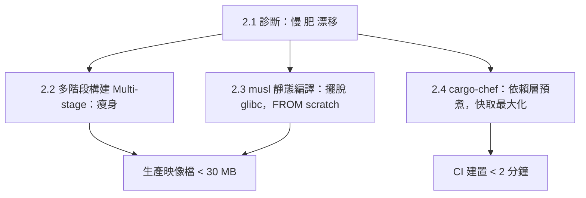

# 2.1 Rust 編譯特性與容器化挑戰

## 從一個問題開始

同樣一句 `docker build .`，Node 專案 30 秒完成，Rust 專案卻跑 8 分鐘、磁碟多出 2 GB——是 Rust 不適合容器嗎？恰好相反：Rust 編譯慢、產物快（編譯慢、執行快），而容器的價值正在於把「慢的編譯」隔離在建置期（Build-time），把「快的執行」留給運行期（Run-time）。本節先理解 Rust 工具鏈為何又大又慢，後三節再逐一拆招。

## Rust 為何編譯慢：三大根因

| 特性（Feature） | 帶來的執行期好處 | 付出的編譯期代價 |
|---|---|---|
| 單態化泛型（Monomorphization） | 零成本抽象，迭代器不輸手寫迴圈 | 每個泛型實例重複生成程式碼，LLVM 負載倍增 |
| 借用檢查（Borrow Checker）+ 龐大型別推導 | 無 GC、無資料競爭（Data Race） | 前端分析耗時，增量編譯單位大 |
| LLVM 優化（LTO / codegen-units=1） | release 二進位檔又小又快 | 連結（Linking）與優化動輒數分鐘 |
| 靜態連結（Static Linking）預設 | 執行期無依賴缺失 | 依賴圖（Dependency Graph）全量參與連結 |


一個實測體感數字（Axum + Tokio + SQLx 中型專案，M1 Pro）：`debug` 約 40 秒、`release` 約 3–6 分鐘、`target/` 約 1.5–3 GB。這三個數字就是容器化要馴服的對象。

## 容器化的四重挑戰

| 挑戰 | 症狀 | 不處理的後果 |
|---|---|---|
| **建置慢** | 每改一行就重編全量依賴 | CI 10 分鐘起跳，開發者不敢推程式碼 |
| **層快取失效** | `COPY . .` 在前、`cargo build` 在後 | 改 README 也重抓 crates.io，快取全毀 |
| **映像檔肥大** | `FROM rust:1.78` 直出（約 1.2 GB） | 推送慢、K8s 調度慢、CVE 掃描滿江紅 |
| **平台漂移** | 本機 arm64、雲端 amd64、glibc/musl 混雜 | `exec format error` 或缺 `libssl.so` 啟動即崩 |

可運行的「肥大原型」——先讓問題現形：

```dockerfile
# Dockerfile.fat：能跑，但又肥又慢（對照組，勿用於生產）
FROM rust:1.78-bookworm
WORKDIR /app
COPY . .
RUN cargo build --release
CMD ["./target/release/rust-server"]
```

```bash
docker build -f Dockerfile.fat -t rust-fat:1.0 .
docker images rust-fat:1.0        # 約 1.5–2 GB
docker history rust-fat:1.0       # 觀察 target/ 與工具鏈層佔比
time docker build -f Dockerfile.fat -t rust-fat:1.0 .  # 二次建置仍慢
```

## 挑戰全景圖：後三節的解法地圖



核心原則只有兩句：**層（Layer）是有順序的快取**——把不常變的依賴編譯放前面；**產物（Artifact）與工具鏈分離**——運行期映像檔只留二進位檔與必要 CA 證書（CA Certificates）。

## 先做一次體檢：你的專案有多「肥」

```bash
# 1. 依賴數量與特徵（Features）盤點
cargo tree --depth 1 | head -n 30
cargo bloat --release --crates 2>/dev/null | head -n 20 || echo "可選裝 cargo-bloat"

# 2. target 體積與最大產物
du -sh target/ 2>/dev/null
du -sh target/release/rust-server 2>/dev/null

# 3. 動態連結依賴（musl 化前先看清敵人）
ldd target/release/rust-server | head -n 20
```

```toml
# Cargo.toml 體檢清單：關掉不需要的預設特徵最立竿見影
[dependencies]
tokio = { version = "1", features = ["rt-multi-thread", "macros"] } # 別全開 full
sqlx = { version = "0.7", default-features = false, features = ["postgres", "runtime-tokio"] }
```

## 本節小結

- Rust「編譯慢、執行快」是設計取捨：單態化 + LLVM + 靜態連結換來無 GC 與極致效能
- 容器化四痛：建置慢、快取失效、映像檔肥、平台漂移
- 解方總綱：**依賴層前置快取、多階段分離產物、musl 靜態化、chef 預煮依賴**
- 任何優化前先量測：`docker history`、`du -sh target/`、`ldd` 是三大體檢儀

## 想一想

1. 為什麼 `COPY . .` 放在 `RUN cargo build` 之前會毀掉 Docker 層快取？如果把 `Cargo.toml` 先複製、依賴先編，會發生什麼不同的快取行為？
2. `debug` 與 `release` 的編譯产物在優化等級（Opt-level）與除錯符號（Debug Symbols）上有何差異？為什麼運行期映像檔絕不能用 debug 建置？
3. 靜態連結讓 Rust 擺脫 `libssl.so` 地獄，但 OpenSSL 本身仍需系統庫；改用 `rustls`（純 Rust TLS）對 musl 靜態編譯有何決定性幫助？
