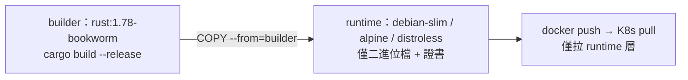

# 2.2 多階段構建到 Alpine 與 Distroless

## 從一個問題開始

2.1 節的 `Dockerfile.fat` 把編譯器（rustc）、原始碼、`target/` 全塞進同一個映像檔——就像把鷹架跟大樓一起交付給住戶。多階段構建（Multi-stage Build）要做的只有一件事：**建置階段（Build Stage）用重型工具鏈，運行階段（Runtime Stage）只留執行產物**。本節給出可直接上線的完整 Dockerfile，並比較 Alpine 與 Distroless 兩條運行路線。

## 多階段核心語法：四個關鍵字

| 語法 | 作用 | 本書用法 |
|---|---|---|
| `FROM ... AS <stage>` | 命名建置階段 | `AS chef` / `AS builder` / `AS runtime` |
| `COPY --from=<stage>` | 跨階段只搬產物 | 只搬 `target/release/rust-server` |
| `RUN --mount=type=cache` | BuildKit 快取掛載（不進層） | 快取 `~/.cargo` 與 `target/` |
| `ARG` / `TARGETPLATFORM` | 建置參數與平台感知 | 多架構、`APP_VERSION` 注入 |



## 完整 Dockerfile：Builder + Runtime（glibc 路線，最穩）

```dockerfile
# syntax=docker/dockerfile:1
ARG RUST_VERSION=1.78
ARG APP_NAME=rust-server

# ---------- Stage 1: builder ----------
FROM rust:${RUST_VERSION}-bookworm AS builder
WORKDIR /app
ARG APP_NAME
COPY Cargo.toml Cargo.lock ./
COPY src ./src
# 啟用 BuildKit 快取掛載：cargo registry 與 target 不進層、可跨次建置重用
RUN --mount=type=cache,target=/usr/local/cargo/registry \
    --mount=type=cache,target=/app/target \
    cargo build --release --bin ${APP_NAME} && \
    cp /app/target/release/${APP_NAME} /tmp/app

# ---------- Stage 2: runtime ----------
FROM debian:bookworm-slim AS runtime
RUN apt-get update && apt-get install -y --no-install-recommends ca-certificates \
    && rm -rf /var/lib/apt/lists/*
COPY --from=builder /tmp/app /usr/local/bin/app
USER 65532:65532
EXPOSE 3000
ENV RUST_LOG=info
HEALTHCHECK --interval=30s --timeout=3s CMD ["/usr/local/bin/app", "--health-check"]
ENTRYPOINT ["/usr/local/bin/app"]
```

```bash
DOCKER_BUILDKIT=1 docker build -t rust-server:slim .
docker images rust-server:slim        # 約 80–100 MB（含 debian-slim）
docker run --rm -p 3000:3000 rust-server:slim
curl -s localhost:3000/health
```

## Alpine vs Distroless：運行基底對照

| | Debian Slim（本節預設） | Alpine | Distroless（cc / base） |
|---|---|---|---|
| **大小** | 約 70 MB 基底 | 約 5 MB 基底 | 約 20 MB 基底 |
| **libc** | glibc，與 builder 一致，最無痛 | musl，需 musl 目標或靜態編譯 | glibc，但無 shell 與套件管理器 |
| **除錯** | `apt-get` + shell 齊全 | `apk add` 方便 | 無 shell，`docker exec` 進不去，需 debug 標籤 |
| **CVE 面積** | 中 | 小 | 極小（Google 維護、簽名） |
| **適用** | 預設生產選擇 | 追求極小且能處理 musl 差異時 | 安全合規最嚴、需 SLSA 供應鏈時 |

Alpine 變體（需切 musl target，詳見 2.3 節）：

```dockerfile
# Alpine runtime 片段：builder 需先 rustup target add x86_64-unknown-linux-musl
FROM alpine:3.19 AS runtime-alpine
RUN apk add --no-cache ca-certificates
COPY --from=builder /tmp/app /usr/local/bin/app
USER 65532:65532
ENTRYPOINT ["/usr/local/bin/app"]
```

Distroless 變體（無 shell，Healthcheck 改由 K8s exec 以外的探針承擔）：

```dockerfile
FROM gcr.io/distroless/cc-debian12 AS runtime-distroless
COPY --from=builder /tmp/app /app
USER 65532:65532
ENTRYPOINT ["/app"]
```

## 常見陷阱：USER、時區、CA 證書三件套

```dockerfile
# 生產 runtime 必備三行，少一行半夜就被叫醒
RUN apt-get update && apt-get install -y --no-install-recommends \
    ca-certificates tzdata && rm -rf /var/lib/apt/lists/*
USER 65532:65532   # 非 root 執行（Non-root），配合 K8s runAsNonRoot
ENV TZ=Asia/Taipei
```

```bash
# 驗證非 root 與證書
docker run --rm rust-server:slim whoami          # 應非 root（debian 有 whoami）
docker run --rm rust-server:slim ls /etc/ssl/certs/ca-certificates.crt
```

## 本節小結

- 多階段 = **builder 留工具鏈、runtime 只留二進位檔**，`COPY --from` 是唯一橋樑
- 預設選 **Debian Slim**：glibc 一致、除錯友善；要更小選 Alpine（musl）、要最安全選 Distroless
- BuildKit 的 `--mount=type=cache` 讓 cargo 快取不進層又跨次可用，是 2.4 節 chef 的前置觀念
- 生產三件套：`ca-certificates`、`USER non-root`、`HEALTHCHECK` 缺一不可

## 想一想

1. `COPY --from=builder /app/target/release/app` 與先 `cp` 到 `/tmp/app` 再搬，兩者在層快取與權限（Permissions）上有何差異？
2. Distroless 沒有 shell，`HEALTHCHECK CMD` 與 `kubectl exec` 都會失效，你該如何改用 HTTP 探針（Liveness/Readiness Probe）來取代？
3. 為什麼 `USER 65532` 要放在 `COPY` 之後？`COPY --chown` 與運行期 `USER` 的搭配如何影響 K8s 的 `fsGroup` 與 Volume 寫入權限？
