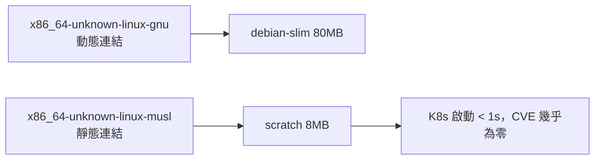
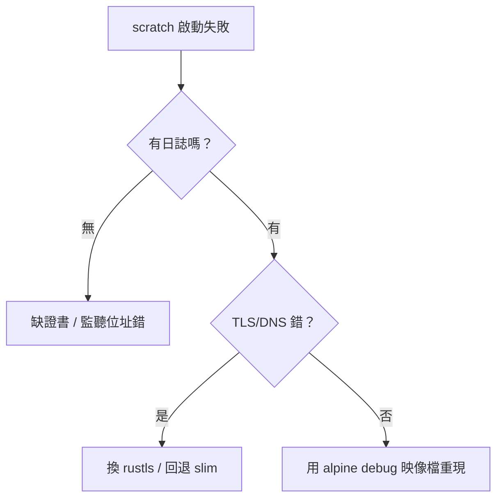

# 2.3 musl 靜態編譯：把 Rust 壓進 20 MB 以內

## 從一個問題開始

2.2 節的 Debian Slim 運行映像檔約 80–100 MB，其中 70 MB 是作業系統。能不能連作業系統都不要？可以——只要 Rust 二進位檔是**靜態連結（Statically Linked）**的，就能跑在 `FROM scratch`（空映像檔）上。本節用 musl 目標（musl Target）把 Axum 後端壓到 20 MB 以內，並講清 glibc（GNU C Library）與 musl 的取捨。

## glibc vs musl：為何需要靜態編譯

| | glibc 動態連結（預設） | musl 靜態連結 |
|---|---|---|
| **連結方式** | 執行期載入 `/lib/libc.so`，需基底 OS 提供 | 編譯期全部打包，`ldd` 顯示 `not a dynamic executable` |
| **映像檔** | 至少 debian-slim（約 80 MB） | `scratch` + 單一二進位檔（約 5–15 MB） |
| **DNS/時區坑** | 無，glibc 行為標準 | musl 的 DNS 與 jemalloc 相容性需測試 |
| **TLS 建議** | OpenSSL 可用系統庫 | 改用 `rustls`（純 Rust TLS）避開 C 依賴 |
| **效能** | malloc 經高度優化 | 預設 malloc 較慢，高併發可換 `mimalloc` |



## 完整 Dockerfile：musl + scratch（可運行）

```dockerfile
# syntax=docker/dockerfile:1
FROM rust:1.78-alpine AS builder
WORKDIR /app
# Alpine 自帶 musl 工具鏈，另裝靜態連結必備件
RUN apk add --no-cache musl-dev openssl-libs-static
RUN rustup target add x86_64-unknown-linux-musl
ARG APP_NAME=rust-server
COPY Cargo.toml Cargo.lock ./
COPY src ./src
RUN --mount=type=cache,target=/usr/local/cargo/registry \
    --mount=type=cache,target=/app/target \
    cargo build --release --target x86_64-unknown-linux-musl --bin ${APP_NAME} && \
    cp /app/target/x86_64-unknown-linux-musl/release/${APP_NAME} /tmp/app && \
    strip /tmp/app

# CA 證書需另起一階段萃取（scratch 內無 apt/apk）
FROM alpine:3.19 AS certs
RUN apk add --no-cache ca-certificates

FROM scratch
COPY --from=certs /etc/ssl/certs/ca-certificates.crt /etc/ssl/certs/
COPY --from=builder /tmp/app /app
USER 65532:65532
EXPOSE 3000
ENTRYPOINT ["/app"]
```

```bash
DOCKER_BUILDKIT=1 docker build -t rust-server:musl .
docker images rust-server:musl       # 目標 < 20 MB
docker run --rm -p 3000:3000 rust-server:musl &
curl -s localhost:3000/health
# 驗證真是靜態連結（需有 shell 的 builder 階段或本機 target 檔）
ldd target/x86_64-unknown-linux-musl/release/rust-server || echo "static ok"
```

## 體積對比：四條路線實測表

| 建置路線 | 基底 | 典型大小 | 啟動速度 | 備註 |
|---|---|---|---|---|
| `rust:bookworm` 單階段（2.1 對照組） | bookworm 全工具鏈 | 約 1.5 GB | 慢 | 僅供除錯 |
| 多階段 + debian-slim（2.2） | glibc 動態 | 約 80–100 MB | 快 | 生產預設 |
| 多階段 + alpine | musl 動態/靜態 | 約 15–30 MB | 很快 | 需測 DNS/TLS |
| musl + `scratch`（本節） | 無 OS | **約 6–15 MB** | 極快 | 最小 CVE |

再壓 20% 的三板斧（Cargo.toml / config）：

```toml
[profile.release]
strip = true            # 去除符號表（Symbols）
opt-level = "z"         # 體積優先（或 "s"）
lto = true              # 連結期優化（Link-Time Optimization）
codegen-units = 1       # 單元合併，更小但編譯更慢
panic = "abort"         # 不需要 unwind 時可省體積
```

```bash
# 本機一鍵體檢三連
ls -lh target/x86_64-unknown-linux-musl/release/rust-server
docker images --format '{{.Repository}}:{{.Tag}} {{.Size}}' | grep rust-server
dive rust-server:musl 2>/dev/null || docker history rust-server:musl
```

## 常見失敗：scratch 除錯三招

- **啟動即 exit 1 且無日誌**：多半缺 CA 證書或監聽 `127.0.0.1` 而非 `0.0.0.0`，改繫結 `0.0.0.0:3000`。
- **DNS 解析失敗**：musl resolver 行為與 glibc 不同，Alpine 階段先 `getent hosts` 驗證，必要時換回 slim。
- **無 shell 怎麼除錯**：建 `Dockerfile.debug` 改 `FROM alpine` 暫代 runtime，或用 `kubectl debug` 掛 ephemeral 容器。



## 本節小結

- musl 靜態編譯 + `scratch` 是最小體積路線：**Axum 後端可 < 20 MB，比 Node 基底小一個數量級**
- 代價是 musl 相容性測試與無 shell 除錯，需搭配 rustls 與 alpine-debug 流程
- `strip + opt-level=z + lto` 三板斧常再省 20–30%
- 選型建議：預設 slim、邊緣/Serverless 用 scratch、安全合規用 Distroless

## 想一想

1. 為什麼 `scratch` 映像檔裡連 `sh` 都沒有，卻能執行 Rust 二進位檔？動態連結與靜態連結在 `execve` 時對 `/lib` 的依賴有何根本差異？
2. `panic = "abort"` 省體積但會失去什麼除錯資訊？在 Kubernetes 中這會如何影響 `RUST_BACKTRACE` 與 crash-loop 的可觀測性？
3. 如果你的 Rust 服務依賴 `openssl-sys`（C 綁定），musl 靜態編譯會遇到什麼坑？為什麼全書推薦 `rustls + tokio-rustls`？
