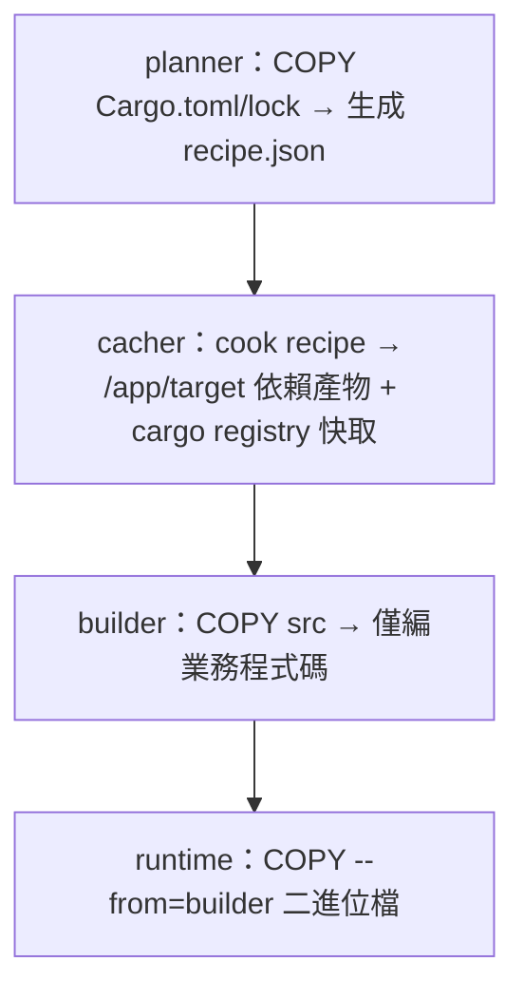
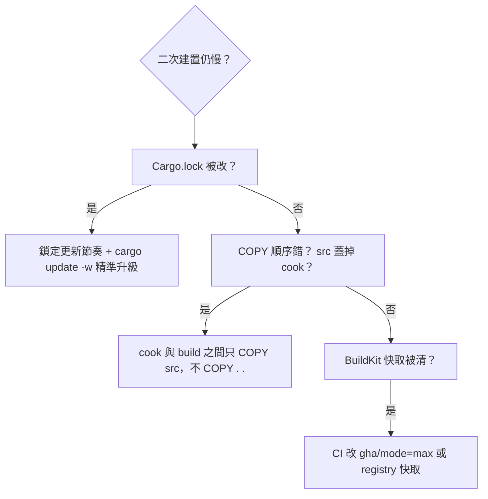

# 2.4 cargo-chef 加速 CI/CD：三段式 Dockerfile 讓重建從 8 分鐘變 1 分鐘

## 從一個問題開始

多階段解決了「肥」，卻沒解決「慢」：每次改一行業務程式碼，Docker 就重編 300 個 crates。cargo-chef 的想法很直白——把**依賴編譯（Dependencies Build）**與**業務編譯（App Build）**切成兩層，只要 `Cargo.toml`/`Cargo.lock` 沒變，依賴層就命中快取（Cache Hit）。本節給出全書標準三段式 Dockerfile，CI 直接快一個數量級。

## 原理：為何切三段就能命中快取

Docker 層快取以「指令 + 前層檔案雜湊」為鍵。傳統寫法 `COPY . .` 把原始碼變動混入依賴層；chef 把依賴清單先「煮」（cook）成可快取層。

| 階段（Stage） | 指令 | 快取失效條件 |
|---|---|---|
| `planner` | `cargo chef prepare --recipe-path recipe.json` | 依賴宣告變動時 |
| `cacher`（builder 前半） | `cargo chef cook --release --recipe-path recipe.json` | 同上；命中時跳過數分鐘編譯 |
| `builder`（後半） | `cargo build --release` | 原始碼變動時（僅重編業務 crate） |



## 三段式 Dockerfile（完整可運行，本書 CI 標準）

```dockerfile
# syntax=docker/dockerfile:1
ARG RUST_VERSION=1.78
ARG APP_NAME=rust-server
FROM rust:${RUST_VERSION}-bookworm AS chef
WORKDIR /app
RUN cargo install cargo-chef --locked

FROM chef AS planner
COPY Cargo.toml Cargo.lock ./
COPY src ./src
RUN cargo chef prepare --recipe-path recipe.json

FROM chef AS builder
ARG APP_NAME
COPY --from=planner /app/recipe.json recipe.json
# 先煮依賴：此層僅在 recipe 變動時重建
RUN --mount=type=cache,target=/usr/local/cargo/registry \
    --mount=type=cache,target=/app/target \
    cargo chef cook --release --recipe-path recipe.json
# 再編業務：日常改碼只跑這一層
COPY Cargo.toml Cargo.lock ./
COPY src ./src
RUN --mount=type=cache,target=/usr/local/cargo/registry \
    --mount=type=cache,target=/app/target \
    cargo build --release --bin ${APP_NAME} && \
    cp /app/target/release/${APP_NAME} /tmp/app

FROM debian:bookworm-slim AS runtime
RUN apt-get update && apt-get install -y --no-install-recommends ca-certificates \
    && rm -rf /var/lib/apt/lists/*
COPY --from=builder /tmp/app /usr/local/bin/app
USER 65532:65532
EXPOSE 3000
ENTRYPOINT ["/usr/local/bin/app"]
```

```bash
# 驗證快取：第一次慢、第二次改 src 後極快
DOCKER_BUILDKIT=1 time docker build -t rust-chef:1 .
echo "// touch" >> src/main.rs
DOCKER_BUILDKIT=1 time docker build -t rust-chef:2 .
docker history rust-chef:2 | head -n 15   # 觀察 cook 層顯示 CACHED
```

## CI 實戰：GitHub Actions 快取對照

| 策略 | 典型耗時（中型 Axum 專案） | 說明 |
|---|---|---|
| 無快取直編 | 約 7–10 分鐘 | 每次重抓 + 重編全量 |
| actions/cache 快取 `~/.cargo + target` | 約 3–5 分鐘 | 跨 runner 還原大 tarball，傳輸即成本 |
| chef 三段 + Buildx GHA 快取 | **約 1–2 分鐘** | 依賴層命中，只編業務增量 |
| chef + 自建 runner 快取 | 約 40–80 秒 | 最快，但需維護 runner 磁碟 |

```yaml
# .github/workflows/docker.yml 片段：Buildx GHA 快取 + 多架構
- uses: docker/setup-buildx-action@v3
- uses: docker/build-push-action@v6
  with:
    context: ./rust-server
    push: true
    tags: ghcr.io/myorg/rust-server:${{ github.sha }}
    cache-from: type=gha
    cache-to: type=gha,mode=max
    platforms: linux/amd64,linux/arm64
```

> Podman/GitLab 對應：GitLab 用 `cache: paths: [cargo-home/, target/]` 或 Kaniko `--cache=true`；概念相同——**依賴層與業務層分離，快取鍵綁 `Cargo.lock` 雜湊**。

## 失效排查：chef 不快反而慢？

```bash
# 1. 確認 recipe 是否被意外改動（Cargo.lock 抖動是頭號兇手）
git diff Cargo.lock | head -n 40
# 2. 確認 cook 層是否命中
docker build --progress=plain -t x . 2>&1 | grep -i "CACHED.*cook\|cargo chef cook"
# 3. 鎖定依賴更新節奏：Renovate/Dependabot 每週批量，而非每次推碼
```



## 本節小結

- chef 三段式 = planner 生成配方、cacher 預煮依賴、builder 只編業務，**日常改碼僅付增量成本**
- 配合 BuildKit `type=cache` 與 CI 的 GHA/Registry 快取，CI 可從 8 分鐘壓到 1–2 分鐘
- 快取鍵只有一個真理：`Cargo.lock` 沒變，依賴層就不該重建
- 本書後續所有 Rust Dockerfile 皆以此三段式為基底，僅換 runtime（slim/alpine/scratch）

## 想一想

1. 為什麼 `COPY src ./src` 在 planner 階段是必要的，但在 builder 階段 cook 之前必須避免？`recipe.json` 到底萃取了什麼資訊？
2. BuildKit 的 `type=cache` 與 Registry/GHA 的層快取（Layer Cache）有何差異？什麼時候該用前者、什麼時候該用後者？
3. 如果把 chef 用在 monorepo（含多個 bin + workspace），`recipe.json` 會如何膨脹？你會如何用 `--bin` 與 workspace `exclude` 控制 cook 粒度？
