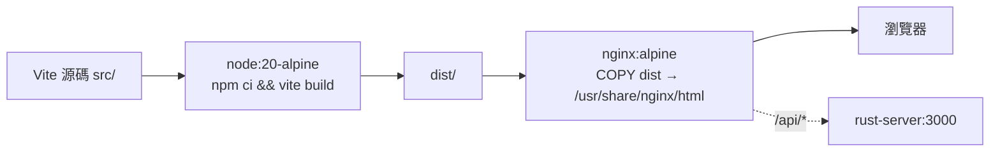

# 3.1 SPA 模式：React + Vite 建置、Nginx 託管

## 從一個問題開始

後台 Dashboard、資料看板這類高互動頁面，最適合單頁應用（SPA）：Rust 只暴露 REST/WebSocket API，前端是純靜態檔（Static Assets）。問題來了：Node 建置產物該如何進容器，才不會把 300 MB 的 `node_modules` 也搬上生產？答案是前端經典兩段式——**Node 負責建置（Build），Nginx 負責託管（Serve）**。

## SPA 容器化路線圖

| 階段 | 基底映像檔 | 產出 |
|---|---|---|
| build | `node:20-alpine` + `npm ci` + `vite build` | `dist/`（HTML/JS/CSS，約 1–5 MB） |
| runtime | `nginx:alpine`（約 25 MB） | 80 埠靜態託管 + `/api` 反向代理（Reverse Proxy） |



## 完整可運行範例

```dockerfile
# frontend-spa/Dockerfile
FROM node:20-alpine AS build
WORKDIR /web
COPY package.json package-lock.json ./
RUN npm ci
COPY vite.config.ts tsconfig.json index.html ./
COPY src ./src
COPY public ./public
ARG VITE_API_URL=/api
ENV VITE_API_URL=${VITE_API_URL}
RUN npm run build   # 產出 /web/dist

FROM nginx:alpine AS runtime
COPY nginx.conf /etc/nginx/conf.d/default.conf
COPY --from=build /web/dist /usr/share/nginx/html
EXPOSE 80
CMD ["nginx", "-g", "daemon off;"]
```

```nginx
# frontend-spa/nginx.conf
server {
    listen 80;
    root /usr/share/nginx/html;
    index index.html;
    gzip on;
    gzip_types text/css application/javascript application/json;

    # SPA fallback：前端路由一律回 index.html
    location / {
        try_files $uri $uri/ /index.html;
        add_header Cache-Control "public, max-age=31536000, immutable" always;
    }

    # API 反向代理到 Rust（Compose 內服務名解析）
    location /api/ {
        proxy_pass http://api:3000/;
        proxy_set_header Host $host;
        proxy_set_header X-Forwarded-For $proxy_add_x_forwarded_for;
    }
    location /ws/ {
        proxy_pass http://api:3000/;
        proxy_http_version 1.1;
        proxy_set_header Upgrade $http_upgrade;
        proxy_set_header Connection "upgrade";
    }
}
```

```bash
# 本地驗證（含 API 代理需配合 Compose，或先單測靜態）
docker build -t frontend-spa:1 ./frontend-spa
docker run --rm -p 8080:80 frontend-spa:1 &
curl -s -o /dev/null -w "%{http_code}\n" localhost:8080/
curl -s localhost:8080/api/health || echo "需與 api 同網段（見 4.2）"
```

## Vite 環境變數陷阱（預告 3.4 節）

| 誤區 | 真相 |
|---|---|
| `VITE_API_URL` 可在運行期改 | `Vite` 以 `VITE_` 前綴在**建置期硬編碼**進 bundle，運行期改環境變數無效 |
| 一個映像檔跑多環境 | 需改用 runtime `config.js` 或 `envsubst`（見 3.4 節），或按環境重建 |

```ts
// src/config.ts：建置期注入，寫法正確但語義是 build-time
export const API_URL = import.meta.env.VITE_API_URL ?? "/api";
```

## 本節小結

- SPA 容器 = Node 建置 + Nginx 託管，生產層僅約 30 MB，無 Node Runtime
- `try_files ... /index.html` 是 SPA 路由的靈魂；`/api` 與 `/ws` 由 Nginx 反代到 Rust
- `VITE_*` 是建置期變數，多環境部署需 runtime 注入（3.4 節解法）
- 此模式是 4.2 節 `frontend-spa` 服務的直接來源

## 想一想

1. 為什麼 `npm ci` 比 `npm install` 更適合 Docker 建置？`package-lock.json` 對層快取有何決定性影響？
2. `try_files $uri /index.html` 若漏寫，直接刷新 `/dashboard/users` 會發生什麼？Nginx 回 404 還是 Rust 回 404？
3. 靜態檔 `Cache-Control: immutable` 與 `index.html` 不可快取的搭配策略是什麼？Vite 的 hashed檔名（`app.abc123.js`）在其中扮演什麼角色？
