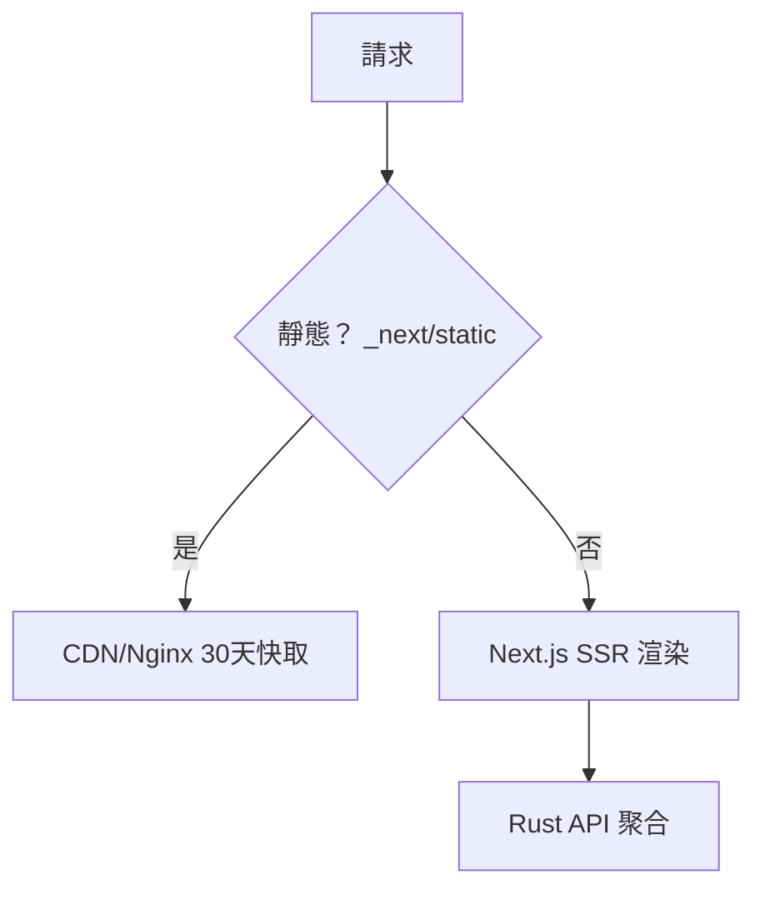

# 3.2 SSR / Fullstack 模式：Next.js standalone、靜態抽離與記憶體考量

## 從一個問題開始

行銷官網與電商需要 SEO（搜尋引擎優化）與首屏秒開，SPA 的空殼 `index.html` 不夠看——於是有了伺服器端渲染（SSR）與水合（Hydration）。代價是前端不再是靜態檔，而是一個常駐的 Node 伺服器。本節解決三件事：用 standalone 模式瘦身、用靜態資源抽離減壓、用記憶體限制（Memory Limits）避免 K8s OOM。

## SSR 容器與 SPA 容器的根本差異

| | SPA（3.1） | SSR（本節 Next.js） |
|---|---|---|
| **運行期** | Nginx 靜態，無 JS 執行 | Node Server 常駐，每請求執行 React 渲染 |
| **映像檔大小** | 約 30 MB | 約 150–250 MB（含 Node + standalone + 快取） |
| **記憶體基準** | 約 10 MB | 約 150–300 MB，流量高時上看 1 GB |
| **擴展方式** | CDN 邊緣快取即可 | 需水平擴展 + `memory limits` 精算 |
| **與 Rust 關係** | 瀏覽器直呼 Rust API | Next.js Server 先聚合 Rust API 再吐 HTML（BFF 層） |

```mermaid
flowchart LR
    B[瀏覽器] --> N["Next.js Server:3001<br/>getServerSideProps 聚合"]
    N --> R["rust-server:3000<br/>/api/products"]
    N --> B
    N -.靜態資源._-> C[CDN / Nginx 快取 _next/static]
```

## 完整 Dockerfile：standalone 模式（可運行）

```dockerfile
# frontend-ssr/Dockerfile
FROM node:20-alpine AS deps
WORKDIR /web
COPY package.json package-lock.json ./
RUN npm ci

FROM node:20-alpine AS build
WORKDIR /web
COPY --from=deps /web/node_modules ./node_modules
COPY . .
# 開啟 standalone 輸出（亦可在 next.config.js 設定 output: 'standalone'）
ENV NEXT_TELEMETRY_DISABLED=1
RUN npm run build

FROM node:20-alpine AS runtime
WORKDIR /web
ENV NODE_ENV=production NEXT_TELEMETRY_DISABLED=1
RUN addgroup -S app && adduser -S app -G app
# standalone 精簡產物：僅需 .next/standalone + static + public
COPY --from=build /web/.next/standalone ./
COPY --from=build /web/.next/static ./.next/static
COPY --from=build /web/public ./public
USER app
EXPOSE 3001
ENV PORT=3001 HOSTNAME=0.0.0.0
# Node 記憶體上限：避免無限膨脹吃掉節點（詳見下表）
CMD ["node", "--max-old-space-size=512", "server.js"]
```

```js
// next.config.js
/** @type {import('next').NextConfig} */
module.exports = {
  output: "standalone",          // 只輸出運行必需檔，體積省 50%+
  poweredByHeader: false,
  async rewrites() {             // /api 轉發 Rust，保持瀏覽器同源
    return [{ source: "/api/:path*", destination: "http://api:3000/:path*" }];
  },
};
```

```bash
docker build -t frontend-ssr:1 ./frontend-ssr
docker run --rm -p 3001:3001 --memory 768m frontend-ssr:1 &
curl -s -o /dev/null -w "%{http_code}\n" localhost:3001/
docker stats --no-stream | head -n 5
```

## 靜態資源抽離與 memory limits 精算

| 手法 | 做法 | 效果 |
|---|---|---|
| **靜態抽離** | `_next/static/*` 丟 CDN 或前置 Nginx 長快取 | SSR 節點只算動態請求，吞吐翻倍 |
| **Node 堆上限** | `--max-old-space-size=512` + 容器 `memory: 768m` | 堆外留 256 MB 給 V8 外 + 系統，避免 OOMKilled 誤判 |
| **輸出快取** | `next.config.js` 開 `compress`，前置反代快取 HTML 10–60 秒 | 行銷頁 QPS 提升一個數量級 |
| **探針** | Liveness 打 `/api/health`（Node 自身），Readiness 打首頁渲染鏈 | 避免渲染卡死時 K8s 誤殺全部副本 |

```yaml
# K8s resources 片段（對照 Compose 見 4.2）：SSR 要比 Rust 寬 5 倍
resources:
  requests: { memory: "256Mi", cpu: "250m" }
  limits:   { memory: "768Mi", cpu: "1000m" }
```



## serverRuntimeConfig vs 公開變數（銜接 3.4）

```js
// 可在運行期經環境變數改變（不需重建）：僅服務端可讀
module.exports = { serverRuntimeConfig: { rustApi: process.env.RUST_API_URL } };
// NEXT_PUBLIC_* 與 VITE_* 同理是建置期硬編碼，勿放密鑰
```

## 本節小結

- SSR 用 **standalone 模式**：只搬運行必需檔，映像檔省一半
- SSR 是**常駐 Node 服務**：必須配 `--max-old-space-size` 與 `memory limits`，基準抓 512–768 MB
- `_next/static` 抽到 CDN/反代是第一效能優化，比加副本便宜
- 與 Rust 分工：Next.js 做首屏與 BFF 聚合，Rust 做資料與 WebSocket 真源

## 想一想

1. 為什麼 SSR 節點的 `limits.memory` 建議比 Node 堆上限多留 30–50%？V8 堆外記憶體（Off-heap）與系統頁快取各吃掉多少？
2. `rewrites` 把 `/api` 轉發到 Rust，與瀏覽器直呼 Rust 跨域（CORS）方案相比，在 Cookie/Session 與快取層面各有何優劣？
3. 若首頁同時聚合 5 個 Rust API，其中一個慢 2 秒，SSR 的 p99 會如何被拖垮？你會用並行 `Promise.all`、超時（Timeout）還是邊緣快取（Stale-While-Revalidate）來解？
