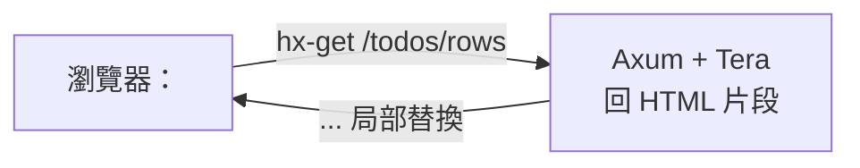

# 3.3 MPA / 樣板引擎：Rust + Tera + HTMX，一個二進位檔即全站

## 從一個問題開始

如果沒有 Node、沒有 `npm build`，網站還能做嗎？能——而且更快、更小、更好維運。多頁應用（MPA）讓 Rust 直接渲染 HTML，HTMX（高互動超文本擴充）讓 `<button hx-get>` 就能局部更新，連一行前端建置都不需要。本節給出兩種容器化路線：樣板包進二進位檔 vs 樣板掛載 Volume，並用 Tera（Rust 樣板引擎）實作完整 CRUD。

## 為何 MPA + HTMX 值得一學

| | SPA/SSR | MPA + HTMX（本節） |
|---|---|---|
| **建置鏈** | Node + Vite/Next 必備 | 零 Node，`cargo build` 即全站 |
| **映像檔** | 30 MB（SPA）/ 200 MB（SSR） | 約 8–15 MB（musl scratch） |
| **互動寫法** | React state + fetch + 路由 | `<form hx-post="/todos">` 直出 HTML 片段 |
| **SEO** | SPA 弱 / SSR 強 | 天生強（純 HTML） |
| **適合** | 高互動 Dashboard、行銷 SEO | CRUD、內部工具、MVP、邊緣節點 |
| **代價** | 需前後端兩套部署 | 複雜前端互動（拖拽、離線）不如 React |



## 可運行程式碼：Axum + Tera + HTMX 最小 CRUD

```rust
// Cargo.toml: axum = "0.7", tera = "1", tokio = { version = "1", features = ["full"] }
use axum::{Router, routing::get, response::Html};
use tera::{Tera, Context};

#[tokio::main]
async fn main() {
    let mut tera = Tera::new("templates/**/*").unwrap();
    tera.autoescape_on(vec![".html"]);
    let app = Router::new()
        .route("/", get(move || async {
            let mut ctx = Context::new();
            ctx.insert("title", "Todos (MPA)");
            Html(tera.render("index.html", &ctx).unwrap())
        }))
        .route("/health", get(|| async { "ok" }));
    let listener = tokio::net::TcpListener::bind("0.0.0.0:3002").await.unwrap();
    axum::serve(listener, app.into_make_service()).await.unwrap();
}
```

```html
<!-- templates/index.html -->
<!doctype html><html lang="zh-Hant"><head><meta charset="utf-8">
<script src="https://unpkg.com/htmx.org@1.9.10"></script></head>
<body><h1>{{ title }}</h1>
<button hx-get="/todos/rows" hx-target="#list">載入待辦</button>
<div id="list"></div></body></html>
```

```bash
cargo run --bin rust-mpa &
curl -s localhost:3002/ | head -n 12
curl -s localhost:3002/health
```

## 兩種容器化方案對照（本節核心）

| | 方案 A：包進二進位檔（推薦生產） | 方案 B：Volume 掛載（推薦開發） |
|---|---|---|
| **做法** | `rust-embed` / `include_str!` 編進 binary | 容器跑 `rust-mpa`，樣板經 `-v ./templates:/app/templates` 掛載 |
| **Dockerfile** | `scratch` 單檔，無需複製 templates | 需 `COPY templates` 或掛載，runtime 用 slim 方便除錯 |
| **更新樣板** | 需重建映像檔（不可變基礎設施 Immutable Infra） | 改 HTML 即生效，配合 Compose Watch 熱重載 |
| **體積/安全** | 最小、無路徑遍歷風險 | 靈活但需管檔案權限與掛載路徑 |
| **適用** | 生產、邊緣、GitOps | 本地開發、設計師調版式 |

```rust
// 方案 A：rust-embed（Cargo.toml: rust-embed = "8")
use rust_embed::RustEmbed;
#[derive(RustEmbed)]
#[folder = "templates/"]
struct Assets;
// 讀取：Assets::get("index.html").unwrap().data
```

```dockerfile
# 方案 A Dockerfile：scratch 單檔（templates 已編進 binary）
FROM rust:1.78-alpine AS builder
WORKDIR /app
RUN apk add --no-cache musl-dev && rustup target add x86_64-unknown-linux-musl
COPY Cargo.toml Cargo.lock ./
COPY src ./src
COPY templates ./templates
RUN cargo build --release --target x86_64-unknown-linux-musl && cp target/*/release/rust-mpa /tmp/app
FROM scratch
COPY --from=builder /tmp/app /app
EXPOSE 3002
ENTRYPOINT ["/app"]
```

```yaml
# 方案 B：開發用 Compose 掛載（4.4 節 Watch 前身）
services:
  mpa-dev:
    build: ./rust-mpa
    ports: ["3002:3002"]
    volumes: ["./rust-mpa/templates:/app/templates:ro"]
```

```bash
docker build -t rust-mpa:embed ./rust-mpa
docker images rust-mpa:embed   # 約 8–12 MB
```

## 本節小結

- MPA + HTMX = **Rust 直出 HTML、hx-* 做局部更新**，零 Node、零建置，映像檔最小
- 生產用**方案 A（embed/include_str!）**：不可變、最小、最安全；開發用**方案 B（Volume）**：改版式即生效
- Tera 記得開 `autoescape` 防 XSS（跨站腳本），HTMX 片段介面與整頁共用同一路由前綴最乾淨
- 4.2 節的 `rust-mpa:3002` 即本節產物，與 SPA/SSR 並列比較最有感

## 想一想

1. `include_str!` 與 `rust-embed` 在編譯期行為有何差異？新增一個樣板檔時，Cargo 的增量編譯與 Docker 層快取分別如何失效？
2. 方案 B 把 templates 經 Volume 掛入，若掛載路徑權限是 root 而容器以 `USER 65532` 執行，會發生什麼？`:ro` 與 `read_only: true` 又有何不同？
3. HTMX 回傳 HTML 片段 vs 回傳 JSON 由前端渲染，在快取（CDN）、可觀測性（htmx 日誌）與後端測試複雜度上各有何取捨？
