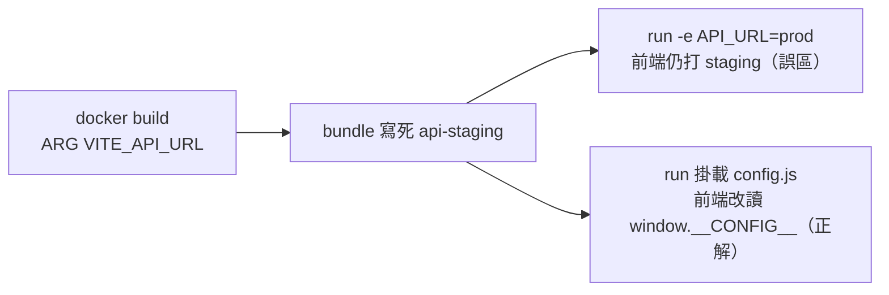

# 3.4 環境變數注入：Build-time vs Run-time，前端三模式全解

## 從一個問題開始

同一個前端映像檔，為何在測試環境呼叫 `api-staging`、上生產卻還是指向舊位址？九成是把**建置期（Build-time）**變數當成**運行期（Run-time）**變數用。本節一次釐清 Vite、SSR、Rust 三者的變數時機，給出每種前端的可運行注入方案。

## 核心觀念：一張表分清時機

| | Build-time（建置期） | Run-time（運行期） |
|---|---|---|
| **注入時刻** | `docker build` / `vite build` 當下寫死 | `docker run` / K8s Pod 啟動當下讀取 |
| **代表** | `VITE_*`、`NEXT_PUBLIC_*` | 容器 `environment:`、K8s ConfigMap/Secret、`/config.js` |
| **一個映像檔多環境？** | 不行，每環境重建 | 可以，同一映像檔跑遍 dev/staging/prod |
| **密鑰能否放？** | 絕對不行（進 bundle、可被下載） | 僅後端/SSR server 端可讀，前端公開變數仍不行 |
| **Rust 後端** | 極少（`option_env!` 編譯期版本號除外） | 主流：`std::env::var` + `dotenvy` |



## 誤區重現：Vite 硬編碼

```ts
// 誤以為運行期可改，實則建置期已寫死
const url = import.meta.env.VITE_API_URL;
```

```bash
docker build --build-arg VITE_API_URL=https://staging-api ./frontend-spa -t spa:staging
docker run -e VITE_API_URL=https://prod-api -p 8080:80 spa:staging
# 瀏覽器仍打 staging——因為 bundle 內已是字串常量，-e 無效
```

## 正解一：SPA 用 runtime config.js + envsubst

```html
<!-- dist/index.html 引入（Nginx 託管前由 envsubst 生成） -->
<script src="/config.js"></script>
<script>const API_URL = window.__CONFIG__.API_URL;</script>
```

```js
// docker-entrypoint.d/10-config.sh 生成 /usr/share/nginx/html/config.js
cat > /usr/share/nginx/html/config.js <<EOF
window.__CONFIG__ = { API_URL: "${API_URL:-/api}" };
EOF
```

```dockerfile
# frontend-spa/Dockerfile 追加運行期注入
FROM nginx:alpine AS runtime
COPY nginx.conf /etc/nginx/conf.d/default.conf
COPY --from=build /web/dist /usr/share/nginx/html
COPY docker-entrypoint.d/ /docker-entrypoint.d/
ENV API_URL=/api
EXPOSE 80
CMD ["nginx", "-g", "daemon off;"]
```

```bash
docker build -t spa:dynamic ./frontend-spa
docker run --rm -e API_URL=https://prod-api -p 8080:80 spa:dynamic &
curl -s localhost:8080/config.js   # 應見 prod-api，同一映像檔換 -e 即換環境
```

## 正解二：SSR 用 serverRuntimeConfig + 公開變數分流

| 變數型別 | 讀取位置 | 重建需求 | 放密鑰？ |
|---|---|---|---|
| `serverRuntimeConfig.rustApi` | 僅 Node 服務端（getServerSideProps） | 不需，`docker run -e RUST_API_URL` 即生效 | 可（不進 bundle） |
| `NEXT_PUBLIC_API_URL` | 瀏覽器 bundle | 需，建置期寫死 | 不可 |
| Rust `DATABASE_URL` | Rust 行程啟動時 | 不需，經 Secret/ConfigMap | 可（後端安全） |

```js
// next.config.js + pages/index.js
module.exports = { serverRuntimeConfig: { rustApi: process.env.RUST_API_URL } };
import getConfig from "next/config";
const { serverRuntimeConfig } = getConfig();
const res = await fetch(`${serverRuntimeConfig.rustApi}/products`);
```

```rust
// Rust：運行期讀取 + 啟動即校驗（fail-fast）
use std::env;
fn config() -> (String, String) {
    let database_url = env::var("DATABASE_URL").expect("DATABASE_URL must be set");
    let port = env::var("PORT").unwrap_or("3000".into());
    (database_url, port)
}
```

```yaml
# compose.yaml 同一映像檔跑兩環境（4.2 節實用技）
services:
  spa-staging: { image: spa:dynamic, environment: { API_URL: http://api-staging:3000 } }
  spa-prod:    { image: spa:dynamic, environment: { API_URL: http://api:3000 } }
```

## 本節小結

- **建置期變數寫死進 bundle**：`VITE_*`、`NEXT_PUBLIC_*` 每環境需重建，絕不放密鑰
- **運行期變數才是多環境正解**：SPA 用 `config.js`/`envsubst`，SSR 用 `serverRuntimeConfig`，Rust 用 `env::var`
- 同一映像檔跑遍所有環境是容器化的基本素養，`docker run -e` 即驗收標準
- 密鑰一律走 K8s Secret / 雲端 Secret Manager，永不進映像檔層（`docker history` 可見即洩漏）

## 想一想

1. `ARG VITE_API_URL` 會留在 `docker history` 與建置快取中，這對密鑰洩漏與供應鏈（Supply Chain）安全意味著什麼？該用什麼替代？
2. SSR 的 `serverRuntimeConfig` 為何能運行期讀取而 `NEXT_PUBLIC_*` 不行？兩者在 `standalone/server.js` 與瀏覽器 bundle 中的存放位置有何差異？
3. Rust 後端用 `expect("DATABASE_URL must be set")` 在啟動時崩潰（Fail-fast），與啟動後延遲報錯相比，對 K8s 的 CrashLoopBackOff 與 Compose 的 `depends_on` 健康閘門有何好處？
