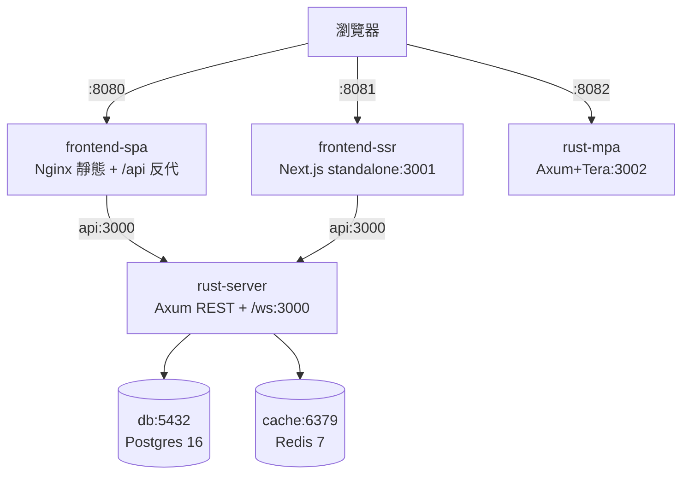

# 4.2 本地全棧：Rust Server + 雙前端 + PostgreSQL + Redis

## 從一個問題開始

1.2 節承諾「同一個 Rust API 配三種前端」，4.1 節學會 Compose 語法——本節把它們焊接成可一鍵啟動的本地全棧：Rust API（Axum）、SPA（Vite+Nginx）、SSR（Next.js standalone）、MPA（Tera/HTMX），外加 PostgreSQL 與 Redis。`docker compose up` 之後，三種前端同時可點，差異親手可測。

## 架構總覽



| 服務（Service） | 對外埠 | 鏡像來源 | 記憶體建議 |
|---|---|---|---|
| `api`（Rust Axum） | 3000 | 本地 chef 建置（2.4） | 256 MB |
| `frontend-spa` | 8080→80 | Node 建置 + Nginx（3.1） | 64 MB |
| `frontend-ssr` | 8081→3001 | standalone（3.2） | 768 MB |
| `rust-mpa` | 8082→3002 | embed scratch（3.3） | 64 MB |
| `db` | 5432（可不發布） | postgres:16-alpine | 512 MB |
| `cache` | 6379（可不發布） | redis:7-alpine | 128 MB |

## 完整 compose.yaml（可運行，本書標準全棧）

```yaml
services:
  api:
    build: { context: ./rust-server }
    image: rust-server:dev
    ports: ["3000:3000"]
    environment:
      DATABASE_URL: postgres://app:secret@db:5432/app
      REDIS_URL: redis://cache:6379
      RUST_LOG: info
    depends_on:
      db: { condition: service_healthy }
      cache: { condition: service_started }
    networks: [front, back]
    healthcheck:
      test: ["CMD-SHELL", "wget -qO- http://localhost:3000/health || exit 1"]
      interval: 10s
      retries: 5
    deploy:
      resources: { limits: { memory: 256M } }

  frontend-spa:
    build:
      context: ./frontend-spa
      args: { VITE_API_URL: /api }
    ports: ["8080:80"]
    environment: { API_URL: http://api:3000 }
    depends_on: [api]
    networks: [front]

  frontend-ssr:
    build: { context: ./frontend-ssr }
    ports: ["8081:3001"]
    environment:
      RUST_API_URL: http://api:3000
      PORT: "3001"
    depends_on:
      api: { condition: service_healthy }
    networks: [front]
    deploy:
      resources: { limits: { memory: 768M } }

  rust-mpa:
    build: { context: ./rust-mpa }
    ports: ["8082:3002"]
    environment: { DATABASE_URL: postgres://app:secret@db:5432/app }
    depends_on:
      db: { condition: service_healthy }
    networks: [front, back]

  db:
    image: postgres:16-alpine
    environment: { POSTGRES_USER: app, POSTGRES_PASSWORD: secret, POSTGRES_DB: app }
    volumes: ["pgdata:/var/lib/postgresql/data", "./db/init.sql:/docker-entrypoint-initdb.d/init.sql:ro"]
    networks: [back]
    healthcheck:
      test: ["CMD-SHELL", "pg_isready -U app"]
      interval: 5s
      retries: 10

  cache:
    image: redis:7-alpine
    command: ["redis-server", "--appendonly", "yes"]
    volumes: ["redisdata:/data"]
    networks: [back]
    healthcheck:
      test: ["CMD", "redis-cli", "ping"]
      interval: 5s
      retries: 10

networks: { front: {}, back: {} }
volumes: { pgdata: {}, redisdata: {} }
```

```bash
docker compose up -d --build
docker compose ps
curl -s localhost:3000/health        # Rust API
curl -s -o /dev/null -w "%{http_code}\n" localhost:8080/   # SPA
curl -s -o /dev/null -w "%{http_code}\n" localhost:8081/   # SSR
curl -s -o /dev/null -w "%{http_code}\n" localhost:8082/   # MPA
docker compose logs -f api db
```

## 連通驗證：三前端打同一 API

```bash
# 經 SPA 反代打 Rust（Nginx /api/ → api:3000）
curl -s localhost:8080/api/health
# SSR 經 serverRuntimeConfig 聚合（瀏覽器看 HTML 已含資料）
curl -s localhost:8081/ | grep -o "<title>.*</title>" | head -n 2
# MPA 直出 HTML（含 HTMX 標籤）
curl -s localhost:8082/ | grep -o "hx-get" | head -n 3
# 資料庫直連驗證
docker compose exec db psql -U app -c "select 1;"
docker compose exec cache redis-cli ping
```

## 本節小結

- 一個 `compose.yaml` 同時編排 **1 個 Rust API + 2 個前端服務（spa/ssr）+ 1 個 MPA + PG + Redis**，埠 8080/8081/8082 即三種架構對照實驗室
- 關鍵配線：`depends_on + healthcheck` 保順序、`front/back` 保邊界、`environment` 保多環境（銜接 3.4）
- 記憶體按 3.2 節精算：SSR 768M、Rust 256M，其餘 64–512M
- 下一節 4.3 深入容器間通訊、連接池與探針，把「能跑」變成「穩跑」

## 想一想

1. `frontend-spa` 的 `VITE_API_URL=/api` 走 Nginx 反代，而 `frontend-ssr` 的 `RUST_API_URL=http://api:3000` 走服務名直連，兩種路徑在 DNS 解析、連接池與超時設定上有何差異？
2. 為何 `db` 的 5432 可以不 `ports` 發布卻仍被 `api` 連上？什麼時候該發布、什麼時候該只留 `expose` 內網？
3. 同時啟動 6 個服務時，Apple Silicon 筆電記憶體告急，你會先降哪個服務的 limits？用 `docker stats` 如何驗證瓶頸真是 SSR 而非 Postgres？
