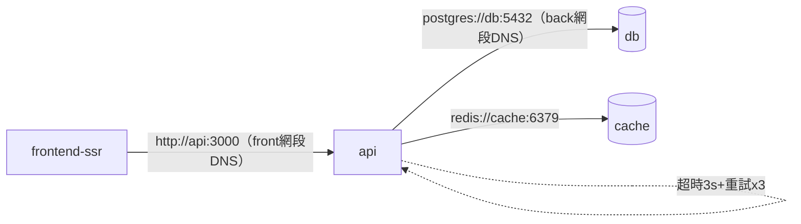

# 4.3 容器間通訊、連接池與 Healthcheck：從能跑到穩跑

## 從一個問題開始

4.2 節全棧能跑了，但壓測 100 併發就開始 `connection refused`、`too many clients`——問題不在 Rust 不夠快，而在三個被忽略的細節：容器間 DNS 與超時（Timeout）、資料庫連接池（Connection Pool） sizing、健康檢查（Healthcheck） 語義。本節把它們一次補齊。

## 容器間通訊：DNS、超時、重試三件套

Compose 內建 DNS：服務名即主機名（`db` → `db:5432`）。但 DNS 解析成功不代表連線成功，還需三層防護。

| 層級 | 設定 | 建議值 |
|---|---|---|
| **DNS/連線** | `getent hosts db` 驗證；Rust 用 `tokio::time::timeout` 包建連 | 建連超時 3–5 秒 |
| **HTTP 呼叫** | SSR→Rust 用 `fetch` + `AbortSignal.timeout(3000)` | p99 按 3 秒熔斷（Circuit Breaking） |
| **重試** | 指數退避（Exponential Backoff）+ 抖動（Jitter），僅冪等（Idempotent）GET 可重試 | 最多 3 次，寫入禁自動重試 |



```bash
# 除錯三招（在 api 容器內執行）
docker compose exec api getent hosts db cache
docker compose exec api wget -qO- --timeout=3 http://frontend-ssr:3001/api/health || echo "ssr not in back網段為正常"
docker compose exec db pg_isready -U app
```

## 連接池：公式 + 可運行 Rust 程式碼

連接池太小排隊、太大壓垮 DB。實用公式：`pool_size = (cpu_cores × 2) + disk_factor`，本地 4 核 + SSD 抓 10–20；務必設 `max_lifetime` 與 `acquire_timeout`。

```rust
// Cargo.toml: sqlx = { version = "0.7", features = ["postgres", "runtime-tokio"] }, redis = "0.24"
use sqlx::postgres::PgPoolOptions;
use std::time::Duration;

async fn pg_pool(database_url: &str) -> sqlx::PgPool {
    PgPoolOptions::new()
        .max_connections(20)          // 容器 0.5–1 CPU 時 10–20 最穩
        .min_connections(2)           // 保持暖連線，避免冷啟動雪崩
        .acquire_timeout(Duration::from_secs(3))
        .max_lifetime(Duration::from_secs(1800))
        .connect(database_url).await.expect("pg connect")
}
```

```yaml
# compose.yaml 對應：DB 端也要配 max_connections，避免被多副本打爆
services:
  db:
    image: postgres:16-alpine
    command: ["postgres", "-c", "max_connections=100"]
  api:
    environment:
      DATABASE_URL: postgres://app:secret@db:5432/app?pool_max=20
```

| 症狀 | 根因 | 解法 |
|---|---|---|
| `too many clients` | 副本數 × 池大小 > DB 上限 | 縮池或升 DB `max_connections`，K8s 用 PgBouncer |
| 首波請求全超時 | 冷池 + 健康檢查未覆蓋 DB | `min_connections` + Readiness 探針打真實查詢 `select 1` |
| Redis `timeout` 堆積 | 阻塞指令（`KEYS *`）卡連線 | 改 `SCAN` + 設 `default-timeout`，讀寫分離連線池 |

## Healthcheck：三種探針語義（銜接 K8s）

| 探針 | 問的問題 | 失敗動作 | Compose 寫法 |
|---|---|---|---|
| Liveness（存活） | 行程死鎖了嗎？ | 重啟容器 | `test: wget -qO- /health`，interval 30s |
| Readiness（就緒） | 能接流量了嗎？ | 從負載均衡摘除 | Rust 查 `select 1` + Redis `ping` 都通才 200 |
| Startup（啟動） | 啟動慢的服務給寬限 | 寬限期內不判死 | `start_period: 30s` 給 Rust 跑遷移（Migration） |

```rust
// /health（liveness：輕）與 /ready（readiness：重）分開是生產鐵律
use axum::{Router, routing::get, response::IntoResponse, http::StatusCode};
async fn health() -> &'static str { "ok" }
async fn ready(pool: sqlx::PgPool) -> impl IntoResponse {
    match sqlx::query("SELECT 1").fetch_one(&pool).await {
        Ok(_) => (StatusCode::OK, "ready"),
        Err(_) => (StatusCode::SERVICE_UNAVAILABLE, "not-ready"),
    }
}
```

```yaml
services:
  api:
    healthcheck:
      test: ["CMD-SHELL", "wget -qO- http://localhost:3000/health || exit 1"]
      interval: 10s
      timeout: 3s
      retries: 3
      start_period: 30s
```

```bash
docker compose ps            # healthy / starting / unhealthy 一目了然
docker inspect --format '{{json .State.Health}}' $(docker compose ps -q api) | head -c 600
```

## 本節小結

- 通訊看三層：**DNS 通 → 超時熔斷 → 冪等重試**，缺一即雪崩
- 連接池公式先行：**池大小 × 副本數 ≤ DB 上限**，`acquire_timeout` 與 `max_lifetime` 必設
- `/health` 與 `/ready` 分家：前者保活、後者保流量品質，`start_period` 給遷移留路
- 這些語義與 K8s Probe 一一對應，現在寫好，遷 K8s 零改寫

## 想一想

1. 為什麼 Readiness 失敗只摘流量、不重啟容器，而 Liveness 失敗要重啟？若把 DB 查 `select 1` 放在 Liveness 裡，DB 抖動時會發生什麼災難？
2. 連接池 `acquire_timeout=3s` 與 HTTP `timeout=3s` 疊加時，最壞端到端延遲是多少？該如何用超時預算（Timeout Budget）避免重試放大（Retry Amplification）？
3. Redis 做快取（Cache）與做會話（Session）儲存時，連線池與持久化（`appendonly`）策略有何不同？快取穿透（Cache Penetration）時 DB 會發生什麼？
