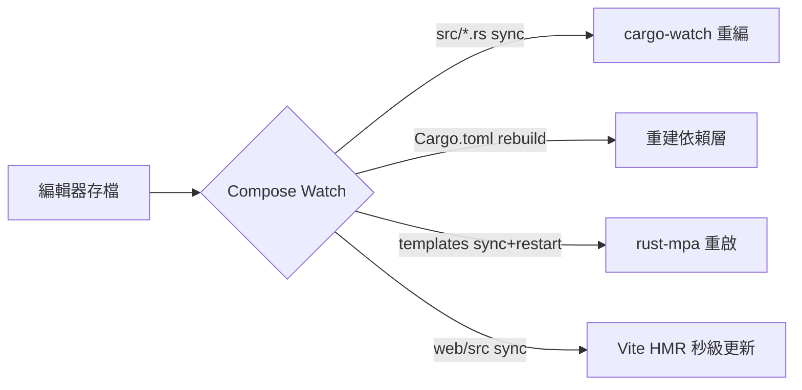

# 4.4 Compose Watch：Rust 與前端 Hot Reload，一存即同步

## 從一個問題開始

沒有熱重載（Hot Reload）的容器開發是折磨：改一行 Rust 要 `compose down && up --build` 等 3 分鐘，改一行 CSS 也要重建 Nginx。Compose Watch（`develop.watch`，Compose v2.22+）讓「宿主一存檔、容器即同步」：原始碼同步（Sync）、自動重建（Rebuild）、前端 HMR 各就各位。本節給出 Rust + 雙前端的完整 Watch 配置。

## 三種 Watch 動作對照

| 動作（Action） | 語義 | 適用 |
|---|---|---|
| `sync` | 宿主檔案即時同步進容器，不重建 | Rust `src/`（配 cargo-watch 重編）、前端靜態 |
| `rebuild` | 檔案變動即重建映像檔 | `Cargo.toml`、`package.json` 依賴變動時 |
| `sync+restart` | 同步後重啟行程 | `templates/`（MPA）、`nginx.conf`、`config.js` |



## 完整配置：rust + templates + 雙前端（可運行）

```yaml
services:
  api:
    build: { context: ./rust-server }
    ports: ["3000:3000"]
    environment: { DATABASE_URL: postgres://app:secret@db:5432/app }
    develop:
      watch:
        - { path: ./rust-server/src, target: /app/src, action: sync }
        - { path: ./rust-server/Cargo.toml, target: /app/Cargo.toml, action: rebuild }
        - { path: ./rust-server/Cargo.lock, target: /app/Cargo.lock, action: rebuild }

  rust-mpa:
    build: { context: ./rust-mpa }
    ports: ["8082:3002"]
    volumes: ["./rust-mpa/templates:/app/templates:ro"]  # 版式即時生效（銜接 3.3 方案 B）
    develop:
      watch:
        - { path: ./rust-mpa/src, target: /app/src, action: sync }
        - { path: ./rust-mpa/templates, target: /app/templates, action: sync+restart }

  frontend-spa:
    build: { context: ./frontend-spa }
    ports: ["8080:80", "5173:5173"]  # 5173 給 Vite HMR 直連
    develop:
      watch:
        - { path: ./frontend-spa/src, target: /web/src, action: sync }
        - { path: ./frontend-spa/package.json, target: /web/package.json, action: rebuild }
```

```dockerfile
# rust-server/Dockerfile.dev：開發映像檔內建 cargo-watch
FROM rust:1.78-bookworm
WORKDIR /app
RUN cargo install cargo-watch --locked
COPY Cargo.toml Cargo.lock ./
COPY src ./src
CMD ["cargo", "watch", "-x", "run"]
```

```bash
docker compose up --build --watch   # 前景啟動 Watch（另開終端看日誌）
# 改 rust-server/src/main.rs 存檔 → 觀察 cargo-watch 重編
# 改 frontend-spa/src/App.tsx 存檔 → 瀏覽器 HMR 秒更
# 改 Cargo.toml → 觀察 rebuild 自動重建
docker compose alpha ls 2>/dev/null || docker compose ps
```

## 開發 vs 生產 Dockerfile 分流

| | `Dockerfile`（生產） | `Dockerfile.dev`（開發） |
|---|---|---|
| **基底** | chef 三段 + slim/scratch（2.4） | `rust:bookworm` 全工具鏈 + cargo-watch |
| **啟動** | `/usr/local/bin/app` 二進位檔 | `cargo watch -x run` |
| **Volume** | 無原始碼，僅具名 Volume 存資料 | 綁定掛載 src + templates |
| **切換** | `compose.yaml` 預設 | `compose.override.yaml` 或 `--file compose.dev.yaml` |

```bash
# 典型分流啟動
docker compose -f compose.yaml -f compose.dev.yaml up --watch      # 開發
docker compose -f compose.yaml up -d --build                        # 類生產驗收
```

> macOS 效能提醒：大量小檔（`node_modules`、`target/`）綁定會慢，務必 `.dockerignore` + 具名 Volume 快取：`cargo-cache:/usr/local/cargo/registry`、`node-modules:/web/node_modules`。

## 本節小結

- Watch 三動作：**sync 管程式碼、rebuild 管依賴、sync+restart 管樣板與設定**
- Rust 開發映像檔裝 `cargo-watch`，前端靠 Vite HMR，MPA 靠 Volume 掛 templates
- 開發/生產 Dockerfile 分流，`compose.dev.yaml` 疊加 Watch，生產保持不可變
- 至此第 1 部分閉環：1 章原理 → 2 章瘦身加速 → 3 章三前端 → 4 章全棧聯調，下一步即進 K8s

## 想一想

1. `sync` 把宿主 `target/` 也同步進容器會發生什麼？為什麼 `.dockerignore` 與 Watch 的 `ignore` 清單必須排除 `target/` 與 `node_modules`？
2. Watch 的 `rebuild` 與 2.4 節 chef 的依賴層快取如何協作？改 `Cargo.toml` 一行會重煮全部依賴還是只增量？如何驗證？
3. `cargo watch -x run` 在容器內重編時，Liveness 探針可能誤判重啟，你會如何為開發環境放寬 `start_period`，又不讓寬鬆設定流到生產？
