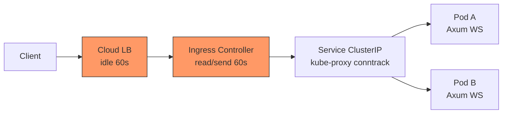

# 5.1 短連線與長連線：在 K8s 裡完全是兩種生物

## 從一個問題開始

同一個 Rust Axum 服務，在 Docker Compose 本機測試時 WebSocket 穩如泰山，一上 Kubernetes 卻每分鐘斷線一次，HTTP API 卻毫髮無傷。為什麼？

答案很殘酷：**K8s 的整條網路鏈路，都是為短連線 HTTP 設計的**。你以為的「一條 TCP 連線」，中間其實隔著 kube-proxy、Ingress Controller、Service、甚至雲端 LB，每一層都有自己的超時計時器。短連線每次請求都重建連線，根本不在乎；長連線卻要在這些「陌生人」之間活上幾小時，先天水土不服。

本章是第 2 部分的起點：先認清敵人——短連線與長連線在 K8s 中的行為差異。

## 連線生命週期對照表

| 維度 | 短連線 HTTP（REST API） | 長連線 WebSocket | SSE（Server-Sent Events） |
|---|---|---|---|
| **連線時長** | ms～秒級，用完即丟 | 分鐘～小時級，升級後常駐 | 分鐘～小時級，單向常駐 |
| **協議** | HTTP/1.1 短請求或 HTTP/2 多路復用 | HTTP 升級（Upgrade）→ TCP 全雙工幀 | 純 HTTP 長輪詢式串流 |
| **K8s 轉發成本** | 低，任意 Pod 都可接 | 高，需固定路由到同一 Pod（見 5.3） | 中，單向但仍佔連線槽 |
| **經過 LB 的感覺** | 無感，重試即可 | 敏感，idle timeout 會主動掐斷 | 敏感，需關閉 buffering |
| **擴縮容影響** | Rolling 更新幾乎無感 | Pod 縮容 = 直接斷線，需優雅停機（見 7.1） | 同左，但瀏覽器會自動重連 |
| **狀態位置** | 無狀態，JWT 即可 | 連線狀態在記憶體，需抽離（見 5.2） | 同左，較輕但仍需重播機制 |
| **可觀測性** | 每請求一條 access log | 一條連線活幾小時，傳統 RED 指標失靈 | 同左，需自訂心跳指標 |

一句話記憶：**短連線是「計程車」，上車下車乾脆俐落；長連線是「包車」，司機（Pod）一換人，整車乘客都得下車。**

## 升級握手：WS 偽裝成 HTTP 的 3 秒鐘

WebSocket 的狡猾之處在於：它一開始假裝自己是普通 HTTP，騙過中間所有設備後才「變臉」。

```mermaid
sequenceDiagram
    participant C as 瀏覽器 / React
    participant I as Ingress-NGINX
    participant P as Axum Pod
    C->>I: GET /ws HTTP/1.1<br/>Upgrade: websocket<br/>Connection: Upgrade<br/>Sec-WebSocket-Key: xxx
    I->>P: 轉發升級請求（若缺 proxy-set-header 會失敗）
    P-->>I: 101 Switching Protocols<br/>Sec-WebSocket-Accept: yyy
    I-->>C: 101 Switching Protocols
    Note over C,P: 此後升級為 TCP 全雙工幀，不再是 HTTP 語義
    C<->>P: WS Frame（text / binary / ping / pong / close）
```

關鍵細節：

1. **必須是 HTTP/1.1 的 GET**，HTTP/2 下要用 Extended CONNECT（很多舊 Ingress 不支援）。
2. 中間任何一層若不透傳 `Upgrade` / `Connection` 頭，握手直接變成 `400 Bad Request`。
3. 握手成功後，L7 的超時邏輯仍在生效——它看不懂 WS 幀，只覺得「這條 HTTP 連線 idle 好久了」。

## 60 秒超時陷阱預告

幾乎所有新手都會在 K8s 上踩到同一個坑：**什麼都不做，60 秒左右 WS 準時斷線**。兇手名單：

```yaml
# Ingress-NGINX 預設值（兇手之一）
# nginx.ingress.kubernetes.io/proxy-read-timeout: "60"
# nginx.ingress.kubernetes.io/proxy-send-timeout: "60"
# 雲端 LB（AWS ALB idle timeout 預設 60s）也是同謀
apiVersion: networking.k8s.io/v1
kind: Ingress
metadata:
  name: ws-app
  annotations:
    nginx.ingress.kubernetes.io/proxy-read-timeout: "3600"
    nginx.ingress.kubernetes.io/proxy-send-timeout: "3600"
spec:
  rules:
    - host: ws.example.com
      http:
        paths:
          - path: /ws
            pathType: Prefix
            backend:
              service:
                name: ws-svc
                port:
                  number: 80
```

為什麼 HTTP 沒事？因為它 50ms 就回應了，根本活不到 60 秒。而 WS 的 ping 間隔若設 30 秒、Pong 又被某層吃掉，LB 就會判定 idle 並發 FIN。完整的解法需要三管齊下（應用層心跳 + Ingress 超時 + Pod 優雅停機），分別在 5.2、5.3、7.1 展開。

## K8s 網路鏈路全景



每一跳都可能殺死你的長連線，而短連線因為「死得快、重建快」，反而免疫。本節的結論是：**不要把 WS 當成「比較久的 HTTP」，要把它當成「有狀態的 TCP 服務」來設計**——狀態抽離、粘性路由、心跳保活、優雅停機，一個都不能少。

## 本節小結

- 短連線無狀態、耐斷線；長連線有狀態、怕超時，K8s 預設鏈路對後者不友善
- WS 靠 HTTP Upgrade 握手起家，握手後仍受 L7 超時管制
- 60 秒斷線是 Ingress + LB 預設超時共謀的結果，不是 Rust 的錯
- 後續四節依序解決：狀態同步（5.2）、粘性路由（5.3）、優雅停機（7.1）、探針（7.2）

## 想一想

1. 為什麼同一個叢集裡 REST API 完全正常，只有 WebSocket 會定時斷線？從鏈路超時角度解釋。
2. SSE 和 WebSocket 都是長連線，如果你的需求只是「伺服器推播股價」，選哪個在 K8s 裡更省心？為什麼？
3. 如果把 Ingress 的 proxy-read-timeout 直接調成 24 小時，會有什麼副作用？有沒有比「調大超時」更好的做法？
