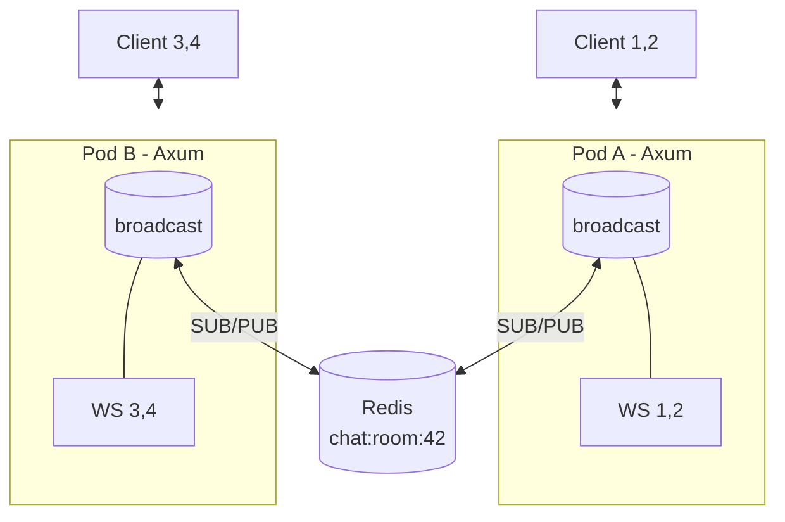

# 5.2 WebSocket 狀態抽離與廣播：從單機記憶體到跨 Pod 同步

## 從一個問題開始

本機一個 Pod 時，聊天室運作完美。上 K8s 擴到 3 個 Pod 後，A 用戶發言只有同 Pod 的人看得到，別的 Pod 一片死寂。為什麼？

因為你的 `Arc<Mutex<HashSet<Socket>>>` 只活在**單個行程的記憶體裡**。Pod A 根本不知道 Pod B 連了誰。12-Factor App 第 6 條早就警告：**行程無狀態，共享狀態一律丟到後端服務**。對 WS 而言，就是把「誰在線、訊息往哪送」抽離到 Redis Pub/Sub。

## 架構：兩層廣播



設計原則：

| 層次 | 工具 | 職責 |
|---|---|---|
| Pod 內 | `tokio::sync::broadcast` | 同 Pod 所有 WS 任務扇出，極快（記憶體複製） |
| Pod 間 | Redis Pub/Sub | 跨 Pod 同步，一發全網收到，不持久化 |
| 需持久化時 | Redis Stream / Kafka | 聊天記錄、離線重播，本節不用，只預告 |

為什麼不用 Redis 直接對每個 WS 推？因為每個 Pod 只需一條 Redis 連線訂閱，其餘用 broadcast 扇出，連線數從 O(用戶) 降到 O(Pod)。

## Rust：訂閱與發布完整程式碼

```rust
use axum::{
    extract::{ws::{Message, WebSocket, WebSocketUpgrade}, State},
    response::IntoResponse, routing::get, Router,
};
use redis::AsyncCommands;
use std::sync::Arc;
use tokio::sync::broadcast;

#[derive(Clone)]
struct AppState {
    tx: broadcast::Sender<String>, // Pod 內扇出
    redis: redis::Client,
}

// 背景任務：Redis SUB → 轉發進 broadcast（每 Pod 一條連線）
async fn redis_subscriber(redis: redis::Client, tx: broadcast::Sender<String>) {
    let mut pubsub = redis.get_async_pubsub().await.expect("pubsub");
    pubsub.subscribe("chat:room:42").await.unwrap();
    let mut stream = pubsub.on_message();
    use futures::StreamExt;
    while let Some(msg) = stream.next().await {
        let payload: String = msg.get_payload().unwrap_or_default();
        let _ = tx.send(payload);
    }
}

async fn handle_socket(mut socket: WebSocket, state: Arc<AppState>) {
    let mut rx = state.tx.subscribe();
    let redis = state.redis.clone();
    loop {
        tokio::select! {
            msg = socket.recv() => {
                match msg {
                    Some(Ok(Message::Text(t))) => {
                        let mut conn = redis.get_multiplexed_async_connection()
                            .await.unwrap();
                        let _: () = conn.publish(
                            "chat:room:42", t.as_str()).await.unwrap();
                    }
                    _ => break, // Close 或斷線即退出
                }
            }
            Ok(text) = rx.recv() => {
                if socket.send(Message::Text(text.into()))
                    .await.is_err() { break; }
            }
        }
    }
}

#[tokio::main]
async fn main() {
    let (tx, _rx) = broadcast::channel::<String>(1024);
    let redis = redis::Client::open("redis://redis:6379").unwrap();
    tokio::spawn(redis_subscriber(redis.clone(), tx.clone()));
    let state = Arc::new(AppState { tx, redis });
    let app = Router::new().route("/ws", get(
        |ws: WebSocketUpgrade, State(s): State<Arc<AppState>>|
        async move { ws.on_upgrade(|skt| handle_socket(skt, s)) }
    )).with_state(state);
    axum::Server::bind(&"0.0.0.0:3000".parse().unwrap())
        .serve(app.into_make_service()).await.unwrap();
}
```

三個實務要點：`broadcast::channel(1024)` 滿了會讓慢接收者收到 `Lagged` 錯誤（記得處理重同步）；`get_multiplexed_async_connection` 讓發布共用連線池；每個 Pod 只開一條 SUB 連線，否則 Redis 連線數爆炸。

## React 客戶端：重連留給 7.1，這裡先求能收發

```tsx
import { useEffect, useRef, useState } from "react";

export function useChatRoom(url: string) {
  const [messages, setMessages] = useState<string[]>([]);
  const wsRef = useRef<WebSocket | null>(null);
  useEffect(() => {
    const ws = new WebSocket(url);
    wsRef.current = ws;
    ws.onmessage = (e) =>
      setMessages((p) => [...p.slice(-99), e.data]);
    return () => ws.close();
  }, [url]);
  const send = (text: string) => {
    if (wsRef.current?.readyState === WebSocket.OPEN)
      wsRef.current.send(text);
  };
  return { messages, send };
}
```

前端不需要知道 Pod 拓撲——它只連 Ingress 的一個 `/ws` 端點，後端的 Redis 保證無論落到哪個 Pod，訊息都會橫向擴散。

## 常見誤區

| 誤區 | 後果 | 正解 |
|---|---|---|
| 用 `Mutex<Vec<Socket>>` 存全域連線 | 跨 Pod 失效，擴容即分裂 | Pod 內 broadcast + Pod 間 Redis |
| 每個 WS 開一條 Redis SUB | 1 萬用戶 = 1 萬 Redis 連線，直接打爆 | 每 Pod 一條 SUB，再用 broadcast 扇出 |
| 用 Redis List 當廣播 | 輪詢延遲高、語義不對 | Pub/Sub（即時）或 Stream（需重播） |

## 本節小結

- WS 連線狀態絕不能留在單 Pod 記憶體，要抽離到 Redis Pub/Sub
- 兩層扇出：Pod 內用 Tokio broadcast，Pod 間用 Redis，一發全網收
- 每 Pod 一條 SUB 連線是連線數與即時性的最佳平衡
- 下一節解決另一個橫向擴展難題：沒有粘性會話時，WS 握手與重連會漂到不同 Pod

## 想一想

1. 為什麼 Pod 內還要保留一層 Tokio broadcast，而不是讓每個 WS 直連 Redis？從連線數和延遲分析。
2. `broadcast` 滿了導致 `Lagged` 時，聊天室應該補歷史訊息還是直接跳過？什麼場景下必須換成 Redis Stream？
3. 如果 Redis 本身當機，WS 服務應該拒絕新連線還是降級為「單 Pod 模式」？ readiness 探針該怎麼配合（見 7.2）？
