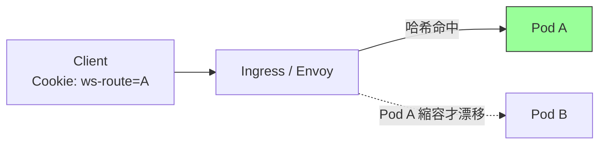
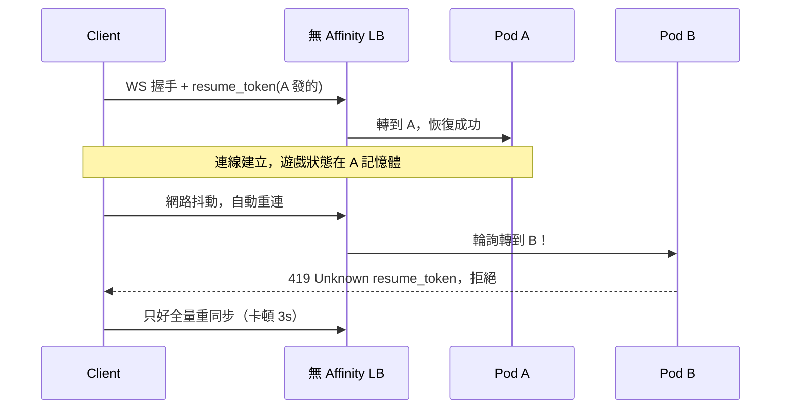

# 5.3 負載均衡與 Sticky Sessions：WS 為什麼需要粘性

## 從一個問題開始

5.2 用 Redis 解決了「廣播」問題，但還有一個更陰險的 bug：客戶端握手連上 Pod A，下一秒重連被 Round-Robin 丟到 Pod B， resume token 對不上，直接被踢下線。HTTP API 從不在乎落到哪個 Pod，為什麼 WS 這麼矯情？

因為 **WS 是有狀態的長連線**。握手時的認證、協商的房間、暫存的未確認訊息，全都綁在那條 TCP 上。HTTP 每次請求自帶 JWT 可以任意漂移；WS 一旦漂移，舊 Pod 的連線上下文就作廢了。解法就是粘性會話（Sticky Sessions / Affinity）：**同一個客戶端，盡量黏在同一個 Pod 上**。

## 要不要 Sticky？決策表

| 場景 | 需要 Sticky？ | 理由 |
|---|---|---|
| 純 REST API + JWT | 否 | 每次請求自包含，任意 Pod 可處理 |
| WS + Redis Pub/Sub（5.2 架構） | 弱需要 | 廣播已跨 Pod，但重連 resume、本地暫存仍受益 |
| WS + 記憶體暫存房間/遊戲狀態 | 強需要 | 狀態沒抽離，漂移即丟失 |
| SSE 斷線重連帶 Last-Event-ID | 建議 | 黏住可減少跨 Pod 查歷史的成本 |
| gRPC streaming / WebRTC 信令 | 強需要 | 同 WS，長連線語義 |

12-Factor 的理想是「無 sticky」，但現實是：**能把狀態全抽離當然最好，抽不乾淨時就用 affinity 爭取時間**。本書立場：5.2 的 Redis 是正道，sticky 是緩衝墊，兩者並用。

## 實務一：NGINX Ingress Affinity

```yaml
apiVersion: networking.k8s.io/v1
kind: Ingress
metadata:
  name: ws-app
  annotations:
    # 依 Cookie 黏住客戶端
    nginx.ingress.kubernetes.io/affinity: "cookie"
    nginx.ingress.kubernetes.io/session-cookie-name: "ws-route"
    nginx.ingress.kubernetes.io/session-cookie-expires: "172800"
    nginx.ingress.kubernetes.io/session-cookie-max-age: "172800"
    # WS 必備：超時調大（呼應 5.1）
    nginx.ingress.kubernetes.io/proxy-read-timeout: "3600"
    nginx.ingress.kubernetes.io/proxy-send-timeout: "3600"
    # 上游哈希備援（NGINX 內部按一致性哈希）
    nginx.ingress.kubernetes.io/upstream-hash-by: "$request_uri"
spec:
  ingressClassName: nginx
  rules:
    - host: ws.example.com
      http:
        paths:
          - path: /
            pathType: Prefix
            backend:
              service:
                name: ws-svc
                port: { number: 80 }
```

原理：第一次回應種下 `ws-route` Cookie，之後請求帶 Cookie 就被固定導向同一 Pod。注意 Service 的 `sessionAffinity: ClientIP` 是另一層（kube-proxy 層），只能按 IP 黏，NAT 後面一堆人同 IP 會失衡，一般優先用 Ingress Cookie。

## 實務二：Envoy / Istio Hash Policy

```yaml
# Istio DestinationRule：按請求頭哈希，適合 WS 帶 token 的場景
apiVersion: networking.istio.io/v1beta1
kind: DestinationRule
metadata:
  name: ws-affinity
spec:
  host: ws-svc
  trafficPolicy:
    loadBalancer:
      consistentHash:
        httpHeaderName: "x-user-id"  # 或 httpCookie: name: ws-route
        minimumRingSize: 1024
```



Envoy 的一致性哈希（maglev / ring-hash）好處是 Pod 增減時只有最少連線被搬遷，比 NGINX 預設輪詢溫柔得多。

## 沒有 Sticky 會怎樣？



這就是線上常見的「每隔幾分鐘卡一下」：不是網路差，是重連漂到陌生 Pod，被迫全量同步。開了 sticky 後，重連大概率回到老 Pod，無縫恢復。

## 本節小結

- WS 有連線上下文，漂移成本遠高於 HTTP，sticky 是務實之選
- NGINX 用 Cookie affinity，Envoy/Istio 用一致性哈希，原理都是「同客戶端→同 Pod」
- Sticky 是緩衝不是終點，最終仍要用 5.2 的狀態抽離走向無 sticky
- 縮容時 sticky 也救不了你——還得靠 7.1 的優雅停機發 Close Frame 讓客戶端體面搬家

## 想一想

1. 既然 sticky 這麼方便，為什麼 12-Factor 仍主張無狀態？sticky 在滾動更新和自動擴縮容時有什麼代價？
2. `Service.sessionAffinity: ClientIP` 和 Ingress Cookie affinity 有什麼差別？NAT 環境下哪個會失衡？
3. 如果你的 WS 已經做到 Redis 全抽離，還需要 sticky 嗎？列出「仍需要」和「不需要」的理由各一個。
