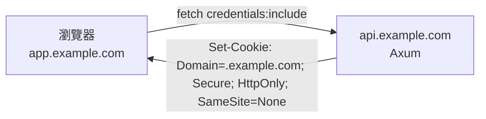

# 6.1 SPA 無狀態化：把 Session 趕出伺服器記憶體

## 從一個問題開始

React SPA + Axum 前後端分離，本機用 `MemorySession` 存登入態跑得好好的，一上 K8s 擴到兩個 Pod，用戶瘋狂「被登出」：這次請求落到 Pod A 認得你，下次落到 Pod B 說你是陌生人。

病根相同：**伺服器記憶體裡的 session 是有狀態的**。SPA 改造的第一刀，就是把認證狀態趕出伺服器——搬到客戶端（JWT）或共享後端（Redis，見 6.2）。本節先講最雲原生的路線：JWT 無狀態化。

## JWT 儲存四策略

| 策略 | 存哪裡 | XSS 風險 | CSRF 風險 | 跨域/SSR 友好度 |
|---|---|---|---|---|
| A. localStorage | JS 可讀 | 高（XSS 直接偷走） | 無 | 高，但最不安全 |
| B. SessionStorage | 分頁級 JS 可讀 | 高（同 A，關頁即失） | 無 | 中，多頁籤不共享 |
| C. JS 記憶體變數 | 變數 | 低（重整即失，需配 Refresh） | 無 | 低，重整就掉線 |
| D. HttpOnly Secure Cookie ⭐ | 瀏覽器自動帶 | 極低（JS 讀不到） | 有（需 SameSite+CSRF token） | 高，本書推薦 |

結論：**Access Token 放記憶體（短命 5～15 分鐘）+ Refresh Token 放 HttpOnly Cookie（長命 7 天）**，兼顧安全與體驗。若一定要跨域（`app.example.com` 調 `api.example.com`），就用 Cross-Domain Cookie（見下）。

## Cross-Domain Cookie 實務



```rust
// Axum：跨域 Cookie + CORS 必須同時配對
use tower_http::cors::{CorsLayer, Any};
use axum::http::{header, Method};

let cors = CorsLayer::new()
    .allow_origin("https://app.example.com".parse().unwrap())
    // credentials:include 時不能用 Any，必須明確列出
    .allow_methods([Method::GET, Method::POST])
    .allow_headers([header::AUTHORIZATION, header::CONTENT_TYPE])
    .allow_credentials(true);
```

前端每個請求都要 `credentials: "include"`，否則 Cookie 不會跨域攜帶。`SameSite=None` 必須配 `Secure`（HTTPS），本機開發記得用 `mkcert` 或退回 `SameSite=Lax` 同站測試。

## Refresh Token 旋轉（Rotation）

長命 Refresh Token 被偷是最可怕的——攻擊者可無限續命。旋轉策略：**每次用掉舊 Refresh，就發一對全新的（Access + Refresh），舊的立即作廢**，被盜用的 token 重放時會觸發「重用偵測」並全數登出。

```tsx
// React：axios 攔截 401 自動用 Refresh 續命（概念碼）
import axios from "axios";

const api = axios.create({
  baseURL: "https://api.example.com",
  withCredentials: true, // 攜帶 HttpOnly Refresh Cookie
});

let refreshing: Promise<string> | null = null;

api.interceptors.response.use(
  (r) => r,
  async (err) => {
    if (err.response?.status !== 401 || err.config._retry) throw err;
    err.config._retry = true;
    // 併發請求只刷一次 token
    refreshing ??= axios
      .post("https://api.example.com/auth/refresh",
        {}, { withCredentials: true })
      .then((r) => r.data.access_token)
      .finally(() => (refreshing = null));
    const token = await refreshing;
    err.config.headers.Authorization = `Bearer ${token}`;
    return api(err.config);
  }
);
```

## Axum JWT 驗證中介層

```rust
use axum::{extract::Request, http::{header, StatusCode},
  middleware::Next, response::Response};
use jsonwebtoken::{decode, DecodingKey, Validation, Algorithm};

#[derive(Debug, serde::Deserialize, serde::Serialize)]
struct Claims { sub: String, exp: usize }

pub async fn jwt_auth(
    req: Request, next: Next,
) -> Result<Response, StatusCode> {
    let token = req.headers()
        .get(header::AUTHORIZATION)
        .and_then(|v| v.to_str().ok())
        .and_then(|s| s.strip_prefix("Bearer "))
        .ok_or(StatusCode::UNAUTHORIZED)?;
    let data = decode::<Claims>(
        token,
        &DecodingKey::from_secret(env!("JWT_SECRET").as_ref()),
        &Validation::new(Algorithm::HS256),
    ).map_err(|_| StatusCode::UNAUTHORIZED)?;
    // 可把 Claims 插入 extensions 供 handler 使用
    Ok(next.run(req).await)
}
```

實務清單：密鑰放 K8s Secret（不是程式碼）；`exp` 設 5～15 分鐘；Refresh 的 jti 黑名單放 Redis（登出即廢）；WS 握手時 JWT 放 query 或第一幀（瀏覽器 WS 不支援自訂 header）。

## 本節小結

- SPA 上 K8s 的第一原則：伺服器不存 session，狀態交給 JWT 或 Redis
- 四策略中推薦「Access 放記憶體 + Refresh 放 HttpOnly Cookie + 旋轉」
- 跨域要同時搞定 CORS、`credentials:include`、`Domain=.example.com` 三件套
- 下一節處理不適合 JWT 的場景：SSR/MPA 需要可主動撤銷的伺服器端 Session

## 想一想

1. 為什麼 Access Token 要設 5 分鐘這麼短，而 Refresh 卻可以活 7 天？短命和旋轉分別防住了什麼攻擊？
2. localStorage 存 JWT 最方便，為什麼本書不推薦？XSS 和 CSRF 兩種攻擊分別偷的是哪種儲存？
3. WebSocket 握手時瀏覽器不能自訂 `Authorization` 頭，你會怎麼把 JWT 交給 Axum 驗證？各有什麼風險？
