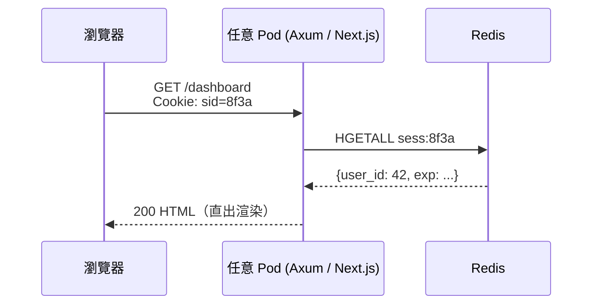
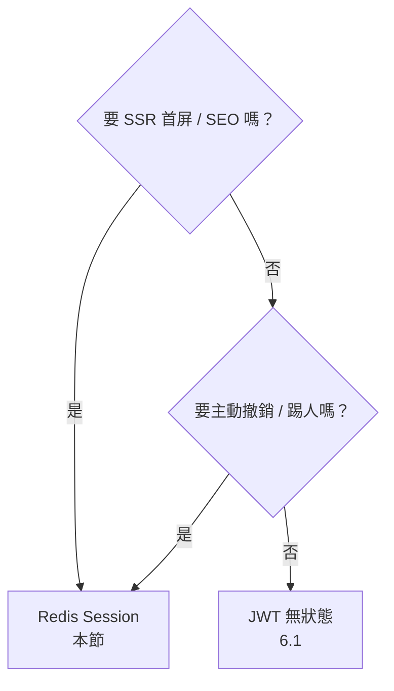

# 6.2 SSR / MPA 的伺服器端 Session：Redis 分散式 Session Store

## 從一個問題開始

6.1 的 JWT 對 SPA 很香，但換成 SSR（Next.js）或傳統 MPA（Rust 模板直出 HTML）就水土不服：每次 SSR 都要驗簽、想主動踢人下線卻發現 JWT 發出去就收不回、Html 直出時還得把 token 塞進 template。怎麼辦？

答案是走回「伺服器端 Session」的老路，但換成雲原生做法：**Session 內容放 Redis，所有 Pod 共享；瀏覽器只拿一串隨機的 session id（Cookie）**。有狀態的部分被抽到 Redis，Pod 本身依然無狀態，隨便擴縮。

## 原理：一張表就夠了

| 角色 | 存什麼 | 範例 |
|---|---|---|
| 瀏覽器 Cookie | 隨機 `session_id`（簽名防篡改） | `sid=8f3a…c1; HttpOnly; Secure; SameSite=Lax` |
| Redis Hash | `sess:<id>` → `{ user_id, csrf, exp, … }` | `HGETALL sess:8f3a…c1` |
| Pod 記憶體 | 什麼都不存 | 每次請求都查 Redis（或本地快取 5s） |



漂到哪個 Pod 都一樣，因為真相只有 Redis 知道。這正是 12-Factor「行程無狀態、狀態進後端服務」的標準姿勢。

## Rust：tower-sessions / axum-session 概念

```rust
use axum::{routing::get, Router, response::Html};
use tower_sessions::{MemoryStore, Session, SessionManagerLayer};
// 實務把 MemoryStore 換成 RedisStore（tower-sessions-redis-store）
use tower_sessions_redis_store::RedisStore;

async fn dashboard(session: Session) -> Html<String> {
    // 查 session（底層自動找 Redis）
    let user: Option<String> = session
        .get("user_id").await.unwrap_or(None);
    match user {
        Some(u) => Html(format!("<h1>Hi, {u}</h1>")),
        None => Html("<h1>請先登入</h1>".into()),
    }
}

#[tokio::main]
async fn main() {
    let pool = redis::Client::open("redis://redis:6379")
        .unwrap()
        .get_multiplexed_async_connection().await.unwrap();
    let store = RedisStore::new(pool);
    let layer = SessionManagerLayer::new(store)
        .with_secure(true)              // HTTPS 才送 Cookie
        .with_same_site_policy(
            tower_sessions::cookie::SameSite::Lax,
        );
    let app = Router::new()
        .route("/dashboard", get(dashboard))
        .layer(layer);
    axum::Server::bind(&"0.0.0.0:3000".parse().unwrap())
        .serve(app.into_make_service()).await.unwrap();
}
```

三個關鍵配置：Cookie 一律 `HttpOnly + Secure + SameSite=Lax`；Redis key 設 TTL（`EXPIRE sess:<id> 3600`，滑動續期）；登出時 `session.destroy()` 刪 Redis——這是 JWT 做不到的「主動撤銷」。

## Next.js SSR 查 Redis（概念碼）

```ts
// pages/dashboard.tsx：每次 SSR 都以 session id 查 Redis
import { GetServerSideProps } from "next";
import { createClient } from "redis";

export const getServerSideProps: GetServerSideProps = async (ctx) => {
  const sid = ctx.req.cookies["sid"];
  if (!sid) return { redirect: { destination: "/login", permanent: false } };

  const redis = createClient({ url: process.env.REDIS_URL });
  await redis.connect();
  // HGETALL sess:<sid>，命中才渲染
  const sess = await redis.hGetAll(`sess:${sid}`);
  await redis.disconnect();

  if (!sess.user_id) {
    return { redirect: { destination: "/login", permanent: false } };
  }
  return { props: { userId: sess.user_id } };
};
```

SSR 的代價是每次頁面請求多一次 Redis RTT（約 0.5ms 內網），換來的是 SEO、首屏快、模板直出。嫌慢？加 5 秒本地快取或把熱 session 推進 CDN 邊緣即可。

## JWT vs Redis Session：怎麼選？

| 維度 | JWT 無狀態（6.1） | Redis Session（本節） |
|---|---|---|
| 撤銷 | 難（要等過期或維護黑名單） | 易（刪 key 即登出） |
| 每次請求成本 | 驗簽（CPU） | 查 Redis（網路 RTT） |
| 適合 | SPA / API / WS 握手 | SSR / MPA / 需踢人、權限常變 |
| 擴縮容 | 天然無狀態 | Pod 無狀態（狀態在 Redis） |



## 本節小結

- SSR/MPA 用「Cookie 只存 sid + 內容全放 Redis Hash」，Pod 保持無狀態
- Rust 用 tower-sessions + RedisStore，Next.js 在 `getServerSideProps` 查 Redis
- 主動撤銷、權限變更頻繁時，Redis Session 完勝 JWT
- 下一節把另一種「假無狀態」趕出去：上傳檔案不進 Pod，直接 Presigned URL 丟物件儲存

## 想一想

1. Redis Session 每次請求都要查一次 Redis，會不會成為瓶頸？什麼情況下應該加本地快取，又會帶來什麼一致性問題？
2. 為什麼 session id 必須是密碼學隨機數且要簽名？如果 sid 可預測，攻擊者能做什麼？
3. 你的系統同時有 SPA（JWT）和 SSR 管理後台（Redis Session），登出時要怎麼讓兩邊一起失效？
