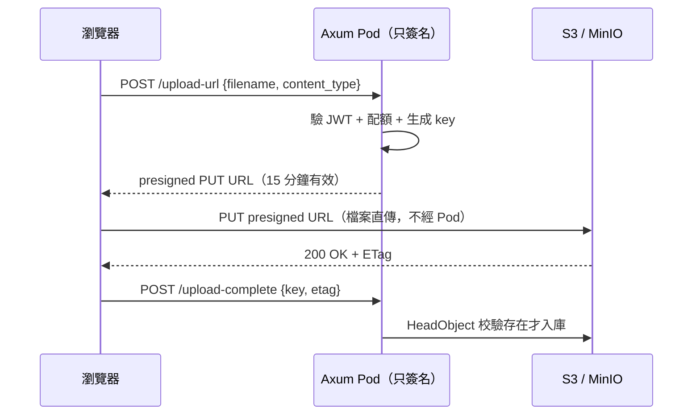

# 6.3 檔案上傳解耦：Presigned URL 直傳物件儲存

## 從一個問題開始

用戶上傳 500MB 影片，請求黏在 Pod A 慢慢收，Pod 重啟檔案就沒了；擴到 5 個 Pod，每個 Pod 的 `/tmp/uploads` 各存各的，下載時還得問「你當初傳到哪一台？」更慘的是大檔案塞滿 Pod 磁碟，liveness 探針跟著陪葬。

12-Factor 第 4 條說得很直白：**把檔案當成無狀態之外的東西，丟給專門的後端服務**。在 K8s 裡就是：Pod 不碰檔案位元組，用 **Presigned URL** 讓瀏覽器直傳 S3 / MinIO。

## 直傳流程



Pod 只做「簽名 + 校驗」，幾毫秒就結束；幾個 GB 的流量全走瀏覽器↔物件儲存，Pod 的記憶體和磁碟徹底解放。

| 舊做法（經 Pod 中轉） | 新做法（Presigned 直傳） |
|---|---|
| 大檔案佔滿 Pod 記憶體/磁碟 | Pod 零位元組經手 |
| 跨 Pod 下載要共享卷/NFS | URL 全域可定址，任意 Pod 可簽下載鏈接 |
| 滾動更新丟失 /tmp | 檔案與 Pod 生命週期脫鉤 |

## Rust：簽發 Presigned URL

```rust
use aws_sdk_s3::{Client, presigning::PresigningConfig};
use axum::{extract::State, Json};
use std::{sync::Arc, time::Duration};

#[derive(serde::Deserialize)]
struct UploadReq { filename: String, content_type: String }

#[derive(serde::Serialize)]
struct UploadRes { put_url: String, key: String }

async fn presign_upload(
    State(s3): State<Arc<Client>>,
    Json(req): Json<UploadReq>,
) -> Json<UploadRes> {
    // key 帶 user 字首隔離 + 時間戳防覆蓋
    let key = format!("uploads/user42/{}-{}",
        chrono::Utc::now().timestamp(), req.filename);
    let cfg = PresigningConfig::builder()
        .expires_in(Duration::from_secs(900)) // 15 分鐘
        .build().unwrap();
    let url = s3.put_object()
        .bucket("myapp")
        .key(&key)
        .content_type(req.content_type)
        .presigned(cfg).await.unwrap();
    Json(UploadRes { put_url: url.uri().to_string(), key })
}
```

要點：`key` 由後端生成（別信前端傳的路徑）；`expires_in` 設 5～15 分鐘；生產環境再加 `content-length-range` 條件擋超大檔；MinIO 完全相容 S3 API，只要把 endpoint 換掉即可。

## 前端直傳：一行 fetch

```tsx
// 拿到 presigned URL 後直接 PUT，中間不經後端
async function uploadDirect(file: File) {
  const { put_url, key } = await fetch("/api/upload-url", {
    method: "POST",
    headers: { "Content-Type": "application/json" },
    body: JSON.stringify({
      filename: file.name, content_type: file.type,
    }),
  }).then((r) => r.json());

  await fetch(put_url, {
    method: "PUT",
    headers: { "Content-Type": file.type },
    body: file,
  });
  // 通知後端完成（後端 HeadObject 確認後才寫 DB）
  await fetch("/api/upload-complete", {
    method: "POST",
    headers: { "Content-Type": "application/json" },
    body: JSON.stringify({ key }),
  });
}
```

大檔建議切分片（S3 Multipart + presigned part URLs），前端用 `Promise.all` 併發傳 part，斷點續傳只需重傳失敗的 part。

## MinIO Compose 片段（本機 S3）

```yaml
# docker-compose.yml：本機 MinIO，API 完全相容 S3
services:
  minio:
    image: minio/minio:latest
    command: server /data --console-address ":9001"
    environment:
      MINIO_ROOT_USER: minioadmin
      MINIO_ROOT_PASSWORD: minioadmin123
    ports: ["9000:9000", "9001:9001"]
    volumes: ["minio-data:/data"]
  # Rust 連它：endpoint http://minio:9000, region us-east-1,
  # bucket 事先 mc mb myapp/myapp
volumes:
  minio-data:
```

上 K8s 就換成雲 S3（或叢集內 MinIO Operator），Rust 程式碼一行不用改——這就是物件儲存介面統一的紅利。

## 本節小結

- Pod 不存檔：Presigned URL 讓瀏覽器直傳 S3/MinIO，Pod 只簽名校驗
- 後端生成 key、限制有效期與大小，前端 PUT 直傳、完成後回調入庫
- MinIO 本機模擬 S3，上雲零改碼
- 第 6 章至此完成無狀態化三件套：JWT（6.1）、Session 外置（6.2）、檔案外置（本節）；第 7 章進入雲原生運維：優雅停機、探針、可觀測性

## 想一想

1. 為什麼 `key` 一定要後端生成而不能信任前端？如果允許前端指定路徑，會有什麼越權或覆蓋風險？
2. 直傳後還需要 `/upload-complete` 回調嗎？如果瀏覽器傳完就關頁，後端怎麼知道哪些檔案是孤兒？
3. 10GB 影片單 PUT 會超時，你會怎麼設計分片直傳？失敗重試和秒傳（hash 去重）可以怎麼做？
